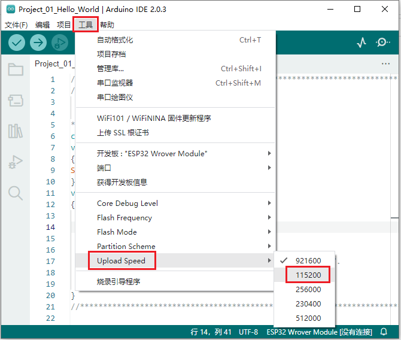

# 项目01 Hello World

## 1.项目介绍：
对于ESP32的初学者，我们将从一些简单的东西开始。在这个项目中，你只需要一个ESP32主板，USB线和电脑就可以完成“Hello World!”项目。它不仅是ESP32主板和电脑的通信测试，也是ESP32的初级项目。

## 2.项目元件：
|||
| :--: | :--: |
| ESP32*1 | USB 线*1 |

## 3.项目接线：
在本项目中，我们通过USB线将ESP32和电脑连接起来。


## 4.项目代码：
你可以打开我们提供的代码：

本项目中使用的代码保存在（即路径)：**..\Keyes ESP32 高级版学习套件\4. Arduino C 教程\1. Windows 系统\3. 项目教程\项目01 Hello World\Project_01_Hello_World**。

```
//*************************************************************************************
/*
 * 文件名 : Hello World
 * 描述 : 输入字母R，串口显示“Hello World”.
*/
char val;// 定义变量val
void setup()
{
Serial.begin(115200);// 设置波特率为115200
}
void loop()
{
  if (Serial.available() > 0) {
    val=Serial.read();// 读取并赋值给val
    if(val=='R')// 检查输入的字母“R”
    {  // 如果是这样的话,    
     Serial.println("Hello World!");// 显示“Hello World !”.
    }
  }
}
//*************************************************************************************

```
在上传项目代码到ESP32之前，点击“**工具**”→“**开发板**”，选择“**ESP32 Wrover Module**”。


选择正确的端口（COM）。(<span style="color: rgb(255, 76, 65);">注意：</span>将ESP32主板通过USB线连接到计算机后才能看到对应的端口。)


<span style="color: rgb(255, 76, 65);">注意：</span>对于macOS用户，如果上传失败，在单击之前，请设置波特率为**115200**。


单击将项目代码上传到ESP32主板上。


<span style="color: rgb(255, 76, 65);">注意：</span> 如果上传代码不成功，可以再次点击后用手按住ESP32主板上的Boot键，出现上传进度百分比数后再松开Boot键，如下图所示：


项目代码上传成功！


## 5.项目结果： 
项目代码上传成功后，单击图标进入串行监视器，设置波特率为115200，在文本框输入字母“R”，按下回车键(Enter 键)，这样串口监视器打印“Hello World!”。


