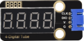
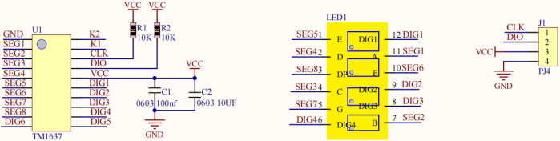
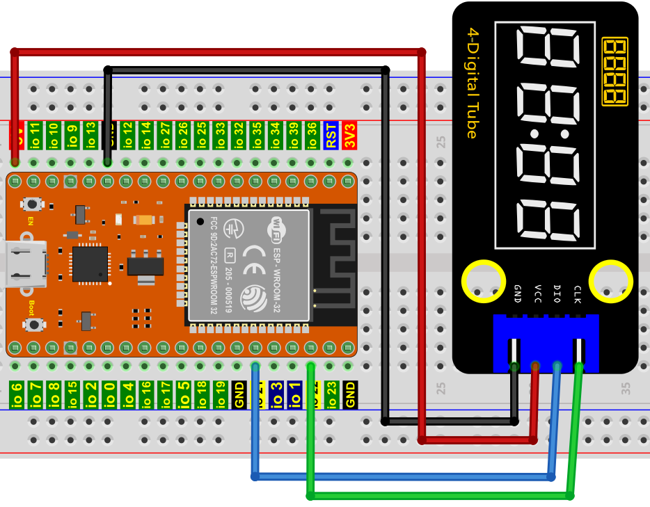

# 项目09 四位数码管

## 1.项目介绍：
四位数码管是一种非常实用的显示器件，电子时钟的显示，球场上的记分员，公园里的人数都是需要的。由于价格低廉，使用方便，越来越多的项目将使用4位数码管。在这个项目中，我们使用ESP32控制四位数码管来显示四位数字。

## 2.项目元件：
||||
| :--: | :--: | :--: |
|ESP32*1|面包板*1|四位数码管*1|
||| |
|4P转杜邦线公单*1|USB 线*1| |

## 3.元件知识：
**TM1650四位数码管：** 是一个12脚的带时钟点的四位共阴数码管（0.36英寸）的显示模块，驱动芯片为TM1650，只需2根信号线即可使单片机控制四位数码管。控制接口电平可为5V或3.3V。
G：电源负极
V：电源正极，+5V
DIO：数据IO模块，可以接任意的数字引脚
CLK：时钟引脚，可以接任意的数字引脚

**4位数码管模块规格参数：**
工作电压：DC 3.3V-5V
工作电流：≤100MA
最大功率：0.5W
数码管显示颜色：红色

**4位数码管模块原理图：**


## 4.项目接线图：


## 5.添加TM1650库：
本项目代码使用了一个名为“<span style="color: rgb(255, 76, 65);">TM1650</span>”库。如果你已经添加好了“<span style="color: rgb(255, 76, 65);">TM1650</span>”库，则跳过此步骤。如果你还没有添加，请在学习之前安装它。添加第三方库的步骤如下:

**如何安装库？**

打开Arduino IDE，单击“**项目**”→“**包含库**”→“**添加.ZIP库...**”。在弹出窗口中找到该目录下名为**Keyes ESP32 高级版学习套件\4. Arduino C 教程\1. Windows 系统\2. Arduino 库文件\TM1650.ZIP**的文件，先选中**TM1650.ZIP**文件，再单击“**打开**”。


## 6.项目代码：
<span style="color: rgb(255, 76, 65);">TM1650库</span>添加完成后，你可以打开我们提供的代码：
<br>
<br>

本项目中使用的代码保存在（即路径)：**..\Keyes ESP32 高级版学习套件\4. Arduino C 教程\1. Windows 系统\3. 项目教程\项目09 四位数码管\Project_09_Four_Digit_Digital_Tube** 。

```
//**********************************************************************
/* 
 * 文件名  : 四位数码管
 * 描述 : 四位数管显示数字从1111到9999.
*/
#include "TM1650.h"
#define CLK 22    //TM1650的引脚定义，可以更改为其他端口 
#define DIO 21
TM1650 DigitalTube(CLK,DIO);

void setup(){
  //DigitalTube.setBrightness();  //stes brightness 从0到7(默认为2)
  //DigitalTube.displayOnOFF();   // 0= off,1= on(默认 is 1)
  for(char b=1;b<5;b++){
    DigitalTube.clearBit(b);      //要清除哪位?
  }
  DigitalTube.displayDot(1,true); // 显示第一个数字
  DigitalTube.displayDot(2,true);
  DigitalTube.displayDot(3,true);
  DigitalTube.displayDot(4,true);
  DigitalTube.displayBit(3,0);    //显示哪个数字，位= 1~4, 数量= 0~9
}

void loop(){
  for(int num=0; num<10; num++){
    DigitalTube.displayBit(1,num);
    DigitalTube.displayBit(2,num);
    DigitalTube.displayBit(3,num);
    DigitalTube.displayBit(4,num);
    delay(1000);
  }  
 }
//**********************************************************************************

```
ESP32主板通过USB线连接到计算机后开始上传代码。为了避免将代码上传至ESP32主板时出现错误，必须选择与计算机连接正确的控制板和端口（COM）。

点击“**工具**”→“**开发板**”，可以查看到各种不同型号ESP32开发板，选择对应的ESP32开发板型号。

点击“**工具**”→“**端口**”，选择对应的端口（COM）。

**注意：将ESP32主板通过USB线连接到计算机后才能看到对应的端口（COM）**。

单击将代码上传到ESP32主控板。

## 6.项目现象：
代码上传成功后，利用USB线上电后，你会看到的现象是：四位数码管显示四位数字0000-9999，并在一个无限循环中重复这些动作。

<span style="color: rgb(255, 76, 65);">注意：</span> 如果上传代码不成功，可以再次点击后用手按住ESP32主板上的Boot键，出现上传进度百分比数后再松开Boot键，如下图所示：


