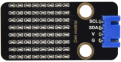
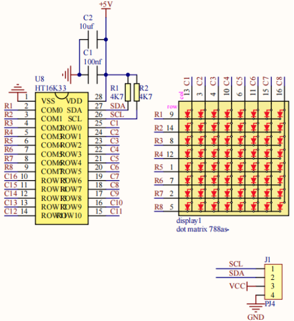
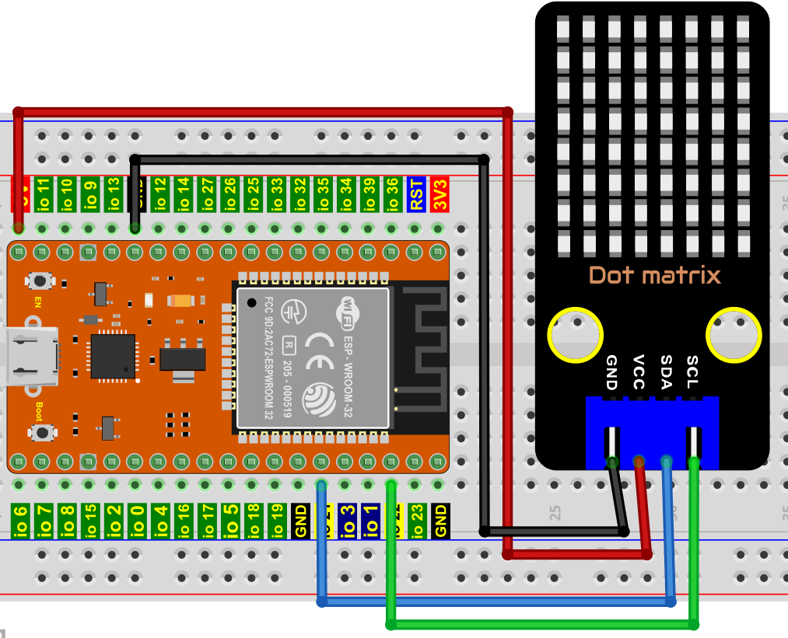
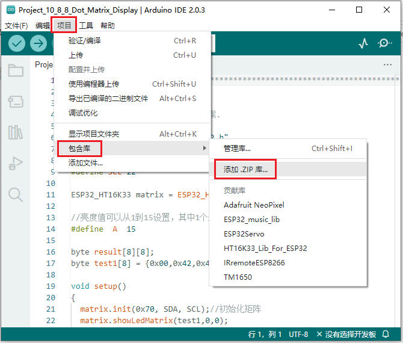
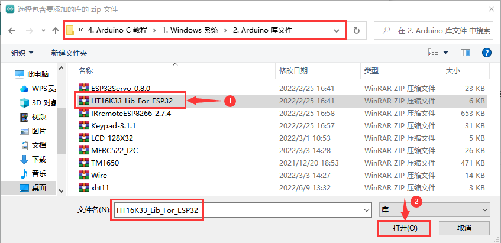

# 项目10 8×8点阵屏

## 1.项目介绍：
点阵屏是一种电子数字显示设备，可以显示机器、钟表、公共交通离场指示器和许多其他设备上的信息。在这个项目中，我们将使用ESP32控制8x8 LED点阵来显示图案。

## 2.项目元件：
||||
| :--: | :--: | :--: |
|ESP32*1|面包板*1|8×8点阵屏*1|
||| |
|4P转杜邦线公单*1|USB 线*1| |

## 3.元件知识：
**8×8点阵屏模块：** 8×8的点阵由64个LED组成，每个LED被放置在一排和一列的交叉点上。利用单片机驱动一个8×8点阵时，我们总共需要用到16个数字口，这样就极大的浪费单片机资料。为此，我们特别设计了这个模块，利用HT16K33芯片驱动1个8×8点阵，只需要利用单片机的I2C通信端口控制点阵，大大的节约了单片机资源。

**8×8点阵屏模块规格参数：**
工作电压：DC 5V
工作电流：≤200MA
最大功率：1W

**8×8点阵屏模块原理：**
如原理图所示，如果想要点亮第一行第一列的LED灯，只需要把C1置高电平，R1置低电平，它就亮了。如果我们想让第一行led全部点亮，那么我们让R1为低电平，C1~C8全部为高电平就可以了，原理非常简单。但是这样的话我们总共需要用到16个IO口，这样就极大的浪费单片机资源。为此，我们特别设计了这个模块，利用HT16K33芯片驱动1个8*8点阵，只需要利用单片机的I2C通信端口控制点阵，大大的节约了单片机资源。

有些模块上自带3个拨码开关，可以让你随意拨动开关，这是用来设置I2C通信地址的，设置方法如下表格。我们的这个模块中，模块已经固定了通信地址，A0，A1，A2全部接地，即地址为0x70。


## 4.项目接线图：


## 5.添加HT16K33_Lib_For_ESP32库：
本项目代码使用了一个名为“<span style="color: rgb(255, 76, 65);">HT16K33_Lib_For_ESP32</span>”库。如果你已经添加好了“<span style="color: rgb(255, 76, 65);">HT16K33_Lib_For_ESP32</span>”库，则跳过此步骤。如果你还没有添加它，请在学习前先添加。

**如何安装库？**

打开Arduino IDE，单击“**项目**”→“**包含库**”→“**添加.ZIP库...**”。在弹出窗口中找到该目录下名为**Keyes ESP32 高级版学习套件\4. Arduino C 教程\1. Windows 系统\2. Arduino 库文件\HT16K33_Lib_For_ESP32.ZIP**的文件，先选中**HT16K33_Lib_For_ESP32.ZIP**文件，再单击“**打开**”。



## 6.项目代码：
<span style="color: rgb(255, 76, 65);">HT16K33_Lib_For_ESP32</span>库添加完成后，你可以打开我们提供的代码：
<br>
<br>

本项目中使用的代码保存在（即路径)：**..\Keyes ESP32 高级版学习套件\4. Arduino C 教程\1. Windows 系统\3. 项目教程\项目10 8×8点阵屏\Project_10_8_8_Dot_Matrix_Display** 。

```
//**********************************************************************************
/*
 * 文件名 : 8×8 点阵屏
 * 描述 : 8x8 LED点阵显示“心”图案.
*/
#include "HT16K33_Lib_For_ESP32.h"

#define SDA 21
#define SCL 22

ESP32_HT16K33 matrix = ESP32_HT16K33();

//亮度值可以从1到15设置，其中1个最暗，15个最亮
#define  A  15

byte result[8][8];
byte test1[8] = {0x00,0x42,0x41,0x09,0x09,0x41,0x42,0x00};

void setup()
{
  matrix.init(0x70, SDA, SCL);//初始化矩阵
  matrix.showLedMatrix(test1,0,0);
  matrix.show();
}

void loop()
{
  for (int i = 0; i <= 7; i++)
  {
    matrix.setBrightness(i);
    delay(100);
  }
  for (int i = 7; i > 0; i--)
  {
    matrix.setBrightness(i);
    delay(100);
  }
}
//**********************************************************************************

```
ESP32主板通过USB线连接到计算机后开始上传代码。为了避免将代码上传至ESP32主板时出现错误，必须选择与计算机连接正确的控制板和端口（COM）。

点击“**工具**”→“**开发板**”，可以查看到各种不同型号ESP32开发板，选择对应的ESP32开发板型号。

点击“**工具**”→“**端口**”，选择对应的端口（COM）。

**注意：将ESP32主板通过USB线连接到计算机后才能看到对应的端口（COM）**。

单击将代码上传到ESP32主控板。

## 6.项目现象：
代码上传成功后，利用USB线上电，你会看到的现象是：8*8点阵屏显示“笑脸”图案。

<span style="color: rgb(255, 76, 65);">注意：</span> 如果上传代码不成功，可以再次点击后用手按住ESP32主板上的Boot键，出现上传进度百分比数后再松开Boot键，如下图所示：


