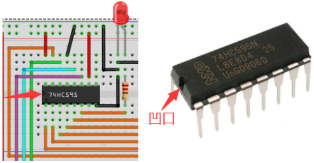

# 项目11 74HC595N控制8个LED

## 1.项目介绍：
在之前的项目中，我们已经学过了怎样点亮一个LED。
ESP32上只有32个IO端口，我们如何点亮大量的led呢? 有时可能会耗尽ESP32上的所有引脚，这时候就需要用移位寄存器扩展它。你可以使用74HC595N芯片一次控制8个输出，而只占用你的微控制器上的几个引脚。你还可以将多个寄存器连接在一起，以进一步扩展输出，在这个项目中，我们将使用ESP32，74HC595芯片和LED制作一个流水灯来了解74HC595芯片的功能。

## 2.项目元件：
|||||
| :--: | :--: | :--: | :--: |
|ESP32*1|面包板*1|74HC595N芯片*1|红色LED*8|
|| || |
|220Ω电阻*8|跳线若干|USB 线*1| |

## 3.元件知识：


**74HC595N芯片：** 简单来说就是具有8 位移位寄存器和一个存储器，以及三态输出功能。移位寄存器和存储器同步于不同的时钟，数据在移位寄存器时钟SCK的上升沿输入，在存储寄存器时钟RCK的上升沿进入的存储寄存器中去。如果两个时钟连在一起，则移位寄存器总是比存储寄存器早一个脉冲。移位寄存器有一个串行移位输入端（SI）和一个用于级联的串行输出端（SQH）,8位移位寄存器可以异步复位（低电平复位），存储寄存器有一个8位三态并行的总线输出，当输出使能（OE）被使能（低电平有效）将存储寄存器中输出至74HC595N的引脚（总线）。

**引脚说明：**
| 引脚： | 引脚说明： |
| :--: | :--: |
| 13引脚OE|	是一个输出使能引脚，用于确保锁存器的数据是否输入到Q0-Q7引脚。在低电平时，不输出高电平。在本实验中，我们直接连接GND，保持低电平输出数据。|
|14引脚SI/DS|这是74HC595接收数据的引脚，即串行数据输入端，一次只能输入一位，那么连续输入8次，就可以组成一个字节了。|
|10引脚SCLR/MR|一个初始化存储寄存器管脚的管脚。在低电平时初始化内部存储寄存器。在这个实验中，我们连接VCC以保持高水平。|
|11引脚SCK/SH_CP|移位寄存器的时钟引脚，上升沿时，移位寄存器中的数据整体后移，并接收新的数据输入。|
|12引脚RCK/ST_CP|存储寄存器的时钟输入引脚。上升沿时，数据从移位寄存器转存到存储寄存器中。这时数据就从Q0~Q7端口并行输出。|
|9引脚SQH|引脚是一个串行输出引脚，专门用于芯片级联，接下一个74HC595的SI端。|
|Q0--Q7(15引脚，1-7引脚)|八位并行输出端，可以直接控制数码管的8个段。|

## 4.项目接线图：
<span style="color: rgb(255, 76, 65);">注意：</span>需要注意74HC595N芯片插入的方向。



## 5.项目代码：
你可以打开我们提供的代码：

本项目中使用的代码保存在（即路径)：**..\Keyes ESP32 高级版学习套件\4. Arduino C 教程\1. Windows 系统\3. 项目教程\项目11 74HC595N控制8个LED\Project_11_74HC595N_Control_8_LEDs** 。

```
//**********************************************************************
/* 
 * 文件名 : 74HC595N 控制8个LED
 * 描述 : 用74HC575N驱动十个led流水灯.
*/
int dataPin = 14;   // 连接74HC595 DS的引脚(Pin14)  
int latchPin = 12;  // 74HC595的ST_CP连接引脚(Pin12)
int clockPin = 13;  // 74HC595的SH_CP连接引脚(Pin11)          

void setup() {
  // 设置引脚输出
  pinMode(latchPin, OUTPUT);
  pinMode(clockPin, OUTPUT);
  pinMode(dataPin, OUTPUT);
}

void loop() {
  // 定义一个单字节变量，用8位来表示LED柱状图的8个LED的状态。
  //该变量被赋值为0x01，即二进制00000001，表示只有一盏灯亮。
  byte x = 0x01;    // 0b 0000 0001
  for (int j = 0; j < 8; j++) { // 让led灯从右向左亮起
    writeTo595(LSBFIRST, x);
    x <<= 1; // 使变量向左移动一位，然后明亮的LED向左移动一步.
    delay(50);
  }
  delay(100);
  x = 0x80;       //0b 1000 0000
  for (int j = 0; j < 8; j++) { // 让led灯从左向右亮起
    writeTo595(LSBFIRST, x);
    x >>= 1;    
    delay(50);
  }
  delay(100);
}
void writeTo595(int order, byte _data ) {
  // 输出低电平到latchPin
  digitalWrite(latchPin, LOW);
  // 发送串行数据到74HC595
  shiftOut(dataPin, clockPin, order, _data);
  // 输出高电平到latchPin，74HC595将数据更新到并行输出端口.
  digitalWrite(latchPin, HIGH);
}
//**********************************************************************************

```
ESP32主板通过USB线连接到计算机后开始上传代码。为了避免将代码上传至ESP32主板时出现错误，必须选择与计算机连接正确的控制板和端口（COM）。

点击“**工具**”→“**开发板**”，可以查看到各种不同型号ESP32开发板，选择对应的ESP32开发板型号。

点击“**工具**”→“**端口**”，选择对应的端口（COM）。

**注意：将ESP32主板通过USB线连接到计算机后才能看到对应的端口（COM）**。

单击将代码上传到ESP32主控板。

## 6.项目现象：
代码上传成功后，利用USB线上电，可以看到的现象是：8个LED开始以流水模式闪烁。

<span style="color: rgb(255, 76, 65);">注意：</span> 如果上传代码不成功，可以再次点击后用手按住ESP32主板上的Boot键，出现上传进度百分比数后再松开Boot键，如下图所示：


