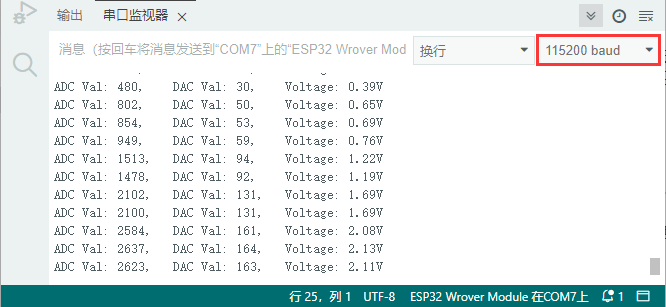
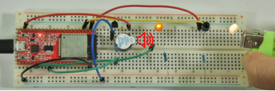

# 项目23 火焰警报器

## 1.项目介绍：
火灾是一种可怕的灾害，火灾报警系统在房屋，商业建筑和工厂中是非常有用的。在本项目中，我们将使用ESP32控制火焰传感器，蜂鸣器和LED来模拟火灾报警装置。这是一个有意义的创客活动。

## 2.项目元件：
|||||
| :--: | :--: | :--: | :--: |
|ESP32*1|面包板*1|火焰传感器*1|红色 LED*1|
|||| |
|有源蜂鸣器*1|220Ω电阻*1|10KΩ电阻*1|跳线若干 |
|img-20230412171102.png)||| |
|NPN型晶体管(S8050)*1|1kΩ 电阻*1 |USB 线*1| |

## 3.元件知识：

**火焰传感器（红外接收三极管）：** 火焰会发出一定程度的IR光，这种光人眼是看不到的，但我们的红外接收三极管可以检测到它，并提醒微控制器（如ESP32）已经检测到火灾。红外接收三极管可以探测火焰，然后将火焰亮度转换为波动水平信号。红外接收三极管的短引脚是负极，另一个长引脚是正极。我们应该连接短引脚（负极)到5V，连接长引脚(正极)到模拟引脚，一个电阻和GND。如下图所示：


<span style="color: rgb(255, 76, 65);">注意：</span>火焰传感器应避开日光、汽车头灯、白炽灯直接照射，也不能对着热源(如暖气片、加热器)或空调，以避免环境温度较大的变化而造成误报。同时还易受射频辐射的干扰。

## 4.读取火焰传感器的ADC值，DAC值和电压值：
我们首先用一个简单的代码来读取火焰传感器的ADC值，DAC值和电压值并打印出来。接线请参照以下接线图：


你可以打开我们提供的代码：

本项目中使用的代码保存在（即路径)：**..\Keyes ESP32 高级版学习套件\4. Arduino C 教程\1. Windows 系统\3. 项目教程\项目23 火焰警报器\Project_23.1_Read_Analog_Value_Of_Flame_Sensor** 。

```
//**********************************************************************************
/*  
 * 文件名  : 读取火焰传感器的模拟值
 * 描述 : ADC,DAC和电压的基本用法
*/
#define PIN_ANALOG_IN  36  //火焰传感器的引脚

void setup() {
  Serial.begin(115200);
}

//在loop()中，使用analogRead()函数获取ADC值，
//然后使用map()函数将值转换为8位精度的DAC值。
//输入输出电压按下式计算，
//信息最终被打印出来.

void loop() {
  int adcVal = analogRead(PIN_ANALOG_IN);
  int dacVal = map(adcVal, 0, 4095, 0, 255);
  double voltage = adcVal / 4095.0 * 3.3;
  Serial.printf("ADC Val: %d, \t DAC Val: %d, \t Voltage: %.2fV\n", adcVal, dacVal, voltage);
  delay(200);
}
//**********************************************************************************

```

编译并上传代码到ESP32，代码上传成功后，利用USB线上电，打开串口监视器，设置波特率为<span style="color: rgb(255, 76, 65);">115200</span>。可以看到的现象是：串口监视器窗口将打印火焰传感器读取的ADC值，DAC值和电压值，当火焰靠近火焰传感器时，ADC值，DAC值和电压值增大；反之，ADC值，DAC值和电压值减小。


<span style="color: rgb(255, 76, 65);">注意：</span> 如果上传代码不成功，可以再次点击后用手按住ESP32主板上的Boot键，出现上传进度百分比数后再松开Boot键，如下图所示：


## 5.火焰报警的接线图：
接下来，我们将使用火焰传感器和蜂鸣器、LED制作一个有趣的项目——火灾报警装置。当火焰传感器检测到火焰时，LED闪烁，蜂鸣器报警。


## 6.项目代码：
（<span style="color: rgb(255, 76, 65);">注意：代码中的阀值500可以根据实际情况自己重新设置</span>）

你可以打开我们提供的代码：

本项目中使用的代码保存在（即路径)：**..\Keyes ESP32 高级版学习套件\4. Arduino C 教程\1. Windows 系统\3. 项目教程\项目23 火焰警报器\Project_23.2_Flame_Alarm** 。

```
//**********************************************************************************
/*  
 * 文件名 : 火焰警报
 * 描述 : 通过火焰传感器控制蜂鸣器和LED.
*/
#define PIN_ADC0      36  //火焰传感器的引脚
#define PIN_LED       15  // LED的引脚
#define PIN_BUZZER    4  // 蜂鸣器的引脚

void setup() {
  pinMode(PIN_LED, OUTPUT);
  pinMode(PIN_BUZZER, OUTPUT);
  pinMode(PIN_ADC0, INPUT);
}

void loop() {
  int adcVal = analogRead(PIN_ADC0); //读取火焰传感器的ADC值
  if (adcVal >= 500) {
    digitalWrite (PIN_BUZZER, HIGH); //蜂鸣器鸣叫
    digitalWrite(PIN_LED, HIGH); // 点亮 LED
    delay(500); // 延时0.5s.
    digitalWrite (PIN_BUZZER, LOW);
    digitalWrite(PIN_LED, LOW); // 熄灭 LED
    delay(500); // 延时0.5s.
  }
 else
 {
    digitalWrite(PIN_LED, LOW);  //熄灭 LED
    digitalWrite (PIN_BUZZER, LOW); //关闭蜂鸣器
  }
}
//**********************************************************************************

```
## 7.项目现象：
编译并上传代码到ESP32，代码上传成功后，利用USB线上电，你会看到的现象是：当火焰传感器检测到火焰时，LED闪烁，蜂鸣器报警；否则，LED不亮，蜂鸣器不响。

<span style="color: rgb(255, 76, 65);">注意：</span> 如果上传代码不成功，可以再次点击后用手按住ESP32主板上的Boot键，出现上传进度百分比数后再松开Boot键，如下图所示：


