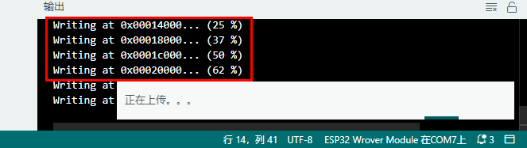

# 项目27 温度测量

## 1.项目介绍： 
LM35是一种常用且易于使用的温度传感器。它不需要其他硬件你只需要一个模拟端口就可以了。难点在于编译代码，将其读取的模拟值转换为摄氏温度。在这个项目中，我们使用一个温度传感器和3个LED灯来制作一个温度测试仪。当温度传感器接触不同的温度物体时，LED灯就会显示不同的颜色。

## 2.项目元件：
|||||
| :--: | :--: | :--: | :--: |
|ESP32*1|面包板*1|红色LED*1|黄色 LED*1|
||||  |
|绿色LED*1|220Ω电阻*3|LM35温度传感器*1|3P转杜邦线公单*1|
| || | |
|跳线若干|USB 线*1| | |

## 3.元件知识：                                                                    

**LM35温度传感器：** 是一种常用的LM35温度传感器，它主要采用LM35DZ传感器元件。该元件的输出电压与摄氏温标呈线性关系。在室温下，无需额外的校准处理即可达到1/4℃的精度。LM35温度传感器可以根据不同的温度产生不同的电压，当温度为0℃时输出0V；每升高1℃，输出电压将增加10mv。换算公式如下：


## 4.读取LM35的温度值：
我们首先使用一个简单的代码读取温度传感器的值并将其打印出来，，其接线图如下所示：


这里，LM35输出给ESP32的模拟引脚是GPIO36。这个模拟电压被转换成数字形式，并经过处理得到温度读数。

你可以打开我们提供的代码：

本项目中使用的代码保存在（即路径)：**..\Keyes ESP32 高级版学习套件\4. Arduino C 教程\1. Windows 系统\3. 项目教程\项目27 温度测量\Project_27.1_Read_LM35_Temperature_Value** 。

```
//**********************************************************************************
/*  
 * 文件名 : 读取LM35温度值
 * 描述 : ADC值转换为LM35温度值
*/
#define PIN_ANALOG_IN  36  //温度传感器的引脚

void setup() {
  Serial.begin(115200);
}

//在loop()中，使用analogRead()函数获取ADC值，
//然后使用map()函数将值转换为8位精度的DAC值。
//通过下面的公式计算测量电压值，摄氏度和华氏度值，
//并通过串口监视器打印这些数据.

void loop() {
  int adcVal = analogRead(PIN_ANALOG_IN);
  int dacVal = map(adcVal, 0, 4095, 0, 255);
  double voltage = adcVal / 4095.0 * 3.3;
  float temperatureC = (voltage * 1000.0) / 10.0 ;
  float temperatureF = (temperatureC * 1.8) + 32.0;
  Serial.print("ADC Value: " + String(adcVal));
  Serial.print("--DAC Value: " + String(dacVal));
  Serial.print("--Voltage Value: " + String(voltage) + "V");
  Serial.print("--temperatureC: " + String(temperatureC) + "C");
  Serial.println("--temperatureF: " + String(temperatureF) + "F");
  delay(200);
}
//**********************************************************************************

```
编译并上传代码到ESP32，代码上传成功后，利用USB线上电，打开串口监视器，设置波特率为115200。可以看到的现象是：串口监视器窗口将打印LM35温度传感器读取的温度值。用手捏住LM35元件，LM35温度传感器读取的温度值在变化。


<span style="color: rgb(255, 76, 65);">注意：</span> 如果上传代码不成功，可以再次点击后用手按住ESP32主板上的Boot键，出现上传进度百分比数后再松开Boot键，如下图所示：


## 5.温度测量的接线图： 
现在使用LM35温度传感器和3个led做一个温度测试。当LM35温度传感器感应到不同的温度时，不同的led会点亮。按照下图进行接线。


## 6.项目代码：
（<span style="color: rgb(255, 76, 65);">注意：</span>代码中的阀值20和25可以根据实际情况自己重新设置）

你可以打开我们提供的代码：

本项目中使用的代码保存在（即路径)：**..\Keyes ESP32 高级版学习套件\4. Arduino C 教程\1. Windows 系统\3. 项目教程\项目27 温度测量\Project_27.2_Temperature_Measurement** 。

```
//**********************************************************************************
/*  
 * 文件名  : 温度测量
 * 描述 : 当LM35感知到不同的温度时，不同的led会点亮
*/
#define PIN_ADC0       36      //LM35传感器的引脚
#define PIN_GREENLED   4      //绿色LED的引脚
#define PIN_YELLOWLED  2      //黄色LED的引脚
#define PIN_REDLED     15      //红色LED的引脚
void setup() {
  Serial.begin(115200);
  pinMode(PIN_GREENLED, OUTPUT); //设置PIN_GREENLED为输出
  pinMode(PIN_YELLOWLED, OUTPUT);//设置PIN_YELLOWLED为输出
  pinMode(PIN_REDLED, OUTPUT);//设置PIN_REDLED为输出
  pinMode(PIN_ADC0, INPUT);//设置PIN_ADC0为输入
}

void loop() {
  int adcVal = analogRead(PIN_ADC0);
  double voltage = adcVal / 4095.0 * 3.3;
  float temperatureC = (voltage * 1000.0) / 10.0 ;
  float temperatureF = (temperatureC * 1.8) + 32.0;
  Serial.print("ADC Value: " + String(adcVal));
  Serial.print("---Voltage Value: " + String(voltage) + "V");
  Serial.print("---temperatureC: " + String(temperatureC) + "℃");
  Serial.println("---temperatureF: " + String(temperatureF) + "F");
  if (temperatureC >= 25) {
    delay(100);
    digitalWrite(PIN_GREENLED, LOW);
    digitalWrite(PIN_YELLOWLED, LOW);
    digitalWrite(PIN_REDLED, HIGH);
  }
  else if (temperatureC >= 20 && temperatureC < 25) {
    digitalWrite(PIN_GREENLED, LOW);
    digitalWrite(PIN_YELLOWLED, HIGH);
    digitalWrite(PIN_REDLED, LOW);
  }
  else {
    digitalWrite(PIN_GREENLED, HIGH);
    digitalWrite(PIN_YELLOWLED, LOW);
    digitalWrite(PIN_REDLED, LOW);
  }

  delay(500);
}
//**********************************************************************************

```
## 7.项目现象：
编译并上传代码到ESP32，代码上传成功后，利用USB线上电，你会看到的现象是：打开串口监视器，设置波特率为115200。可以看到的现象是：串口监视器窗口将打印LM35温度传感器读取的温度值，当LM35温度传感器感应到不同的温度时，不同的led会点亮。

<span style="color: rgb(255, 76, 65);">注意：</span> 如果上传代码不成功，可以再次点击后用手按住ESP32主板上的Boot键，出现上传进度百分比数后再松开Boot键，如下图所示：


