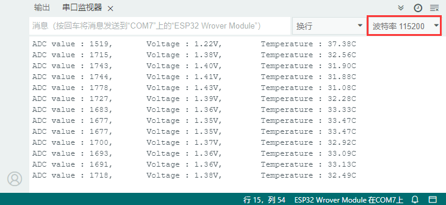
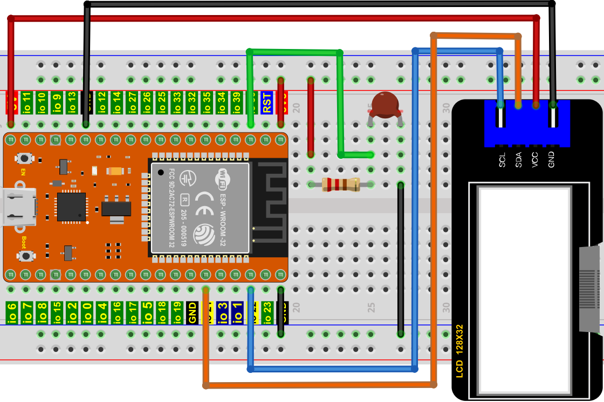

# 项目31 温度仪表

## 1.项目介绍：
热敏电阻是一种电阻，其阻值取决于温度和温度的变化，广泛应用于园艺、家庭警报系统等装置中。因此，我们可以利用这一特性来制作温度仪表。

## 2.项目元件：
|||||
| :--: | :--: | :--: | :--: |
|ESP32*1|面包板*1|LCD_128X32_DOT*1|热敏电阻*1|
||||  |
|10KΩ电阻*1|4P转杜邦线公单*1|USB 线*1|跳线若干 |

## 3.元件知识：
**热敏电阻：** 热敏电阻是一种温度敏感电阻。当热敏电阻感应到温度的变化时，它的电阻就会发生变化。我们可以利用热敏电阻的这种特性来检测温度强度。热敏电阻及其电子符号如下所示。

热敏电阻的电阻值与温度的关系为：

式中：
Rt为热敏电阻在T2温度下的电阻；
R为热敏电阻在T1温度下的标称阻值；
EXP[n]是e的n次幂；
B为温度指数；
T1，T2是开尔文温度(绝对温度)，开尔文温度=273.15 +摄氏温度。对于热敏电阻的参数，我们使用：B=3950, R=10KΩ，T1=25℃。热敏电阻的电路连接方法与光敏电阻类似，如下所示：

我们可以利用ADC转换器测得的值来得到热敏电阻的电阻值，然后利用公式来得到温度值。因此，温度公式可以推导为：


## 4.读取热敏电阻的值：
首先我们学习热敏电阻读取当前的ADC值、电压值和温度值并将其打印出来。请按下面的接线图接好线：


你可以打开我们提供的代码：

本项目中使用的代码保存在（即路径)：**..\Keyes ESP32 高级版学习套件\4. Arduino C 教程\1. Windows 系统\3. 项目教程\项目31 温度仪表\Project_31.1_Read_the_thermistor_analog_value** 。

```
//**********************************************************************************
/*  
 * 文件名 : 热敏电阻
 * 描述 : 读取热敏电阻的阻值.
*/
#define PIN_ANALOG_IN   36
void setup() {
  Serial.begin(115200);
}

void loop() {
  int adcValue = analogRead(PIN_ANALOG_IN);                       //读ADC引脚
  double voltage = (float)adcValue / 4095.0 * 3.3;                // 计算电压
  double Rt = 10 * voltage / (3.3 - voltage);                     //计算热敏电阻电阻值
  double tempK = 1 / (1 / (273.15 + 25) + log(Rt / 10) / 3950.0); //计算温度(开尔文)
  double tempC = tempK - 273.15;                                  //计算温度(摄氏)
  Serial.printf("ADC value : %d,\tVoltage : %.2fV, \tTemperature : %.2fC\n", adcValue, voltage, tempC);
  delay(1000);
}
//**********************************************************************************

```
编译并上传代码到ESP32，代码上传成功后，利用USB线上电，打开串口监视器，设置波特率为<span style="color: rgb(255, 76, 65);">115200</span>。你会看到的现象是：串口监视器窗口将不断显示热敏电阻当前的ADC值、电压值和温度值。试着用食指和拇指捏一下热敏电阻(不要碰触导线)一小段时间，你应该会看到温度值增加。


<span style="color: rgb(255, 76, 65);">注意：</span> 如果上传代码不成功，可以再次点击后用手按住ESP32主板上的Boot键，出现上传进度百分比数后再松开Boot键，如下图所示：


## 5.温度仪表的接线图：


## 6.添加LCD_128×32库：
本项目代码使用了一个名为“<span style="color: rgb(255, 76, 65);">LCD_128×32</span>”库。如果你已经添加好了“<span style="color: rgb(255, 76, 65);">LCD_128×32</span>”库，则跳过此步骤。如果你还没有添加，请在学习之前安装它。添加第三方库的步骤如下:

打开Arduino IDE，单击“**项目**”→“**包含库**”→“**添加.ZIP库...**”。在弹出窗口中找到该目录下名为**Keyes ESP32 高级版学习套件\4. Arduino C 教程\1. Windows 系统\2. Arduino 库文件\LCD_128X32.ZIP**的文件，先选中**LCD_128X32.ZIP**文件，再单击“**打开**”。


## 7.项目代码：
<span style="color: rgb(255, 76, 65);">LCD_128×32</span>库添加完成后，你可以打开我们提供的代码：
<br>
<br>

本项目中使用的代码保存在（即路径)：**..\Keyes ESP32 高级版学习套件\4. Arduino C 教程\1. Windows 系统\3. 项目教程\项目31 温度仪表\Project_31.2_Temperature_Instrument** 。

```
//**********************************************************************************
/*  
 * 文件名  : 温度仪表
 * 描述 : LCD显示热敏电阻的温度.
*/
#include "lcd128_32_io.h"

#define PIN_ANALOG_IN   36

lcd lcd(21, 22); //创建lCD128 *32引脚，sda->21， scl->22

void setup() {
  lcd.Init(); //初始化
  lcd.Clear();  //清屏
}
char string[10];

void loop() {
  int adcValue = analogRead(PIN_ANALOG_IN);                       //读ADC引脚
  double voltage = (float)adcValue / 4095.0 * 3.3;                // 计算电压
  double Rt = 10 * voltage / (3.3 - voltage);                     //计算热敏电阻电阻值
  double tempK = 1 / (1 / (273.15 + 25) + (log(Rt / 10) / 3950.0)); //计算温度(开尔文)
  double tempC = tempK - 273.15;                                  //计算温度(摄氏)
  lcd.Cursor(0,0); //设置显示位置
  lcd.Display("Voltage:"); //设置显示
  lcd.Cursor(0,8);
  lcd.DisplayNum(voltage);
  lcd.Cursor(0,11);
  lcd.Display("V");
  lcd.Cursor(2,0); 
  lcd.Display("tempC:");
  lcd.Cursor(2,8);
  lcd.DisplayNum(tempC);
  lcd.Cursor(2,11);
  lcd.Display("C");
  delay(200);
}
//**********************************************************************************

```
## 7.项目现象：
编译并上传代码到ESP32，代码上传成功后，利用USB线上电，你会看到的现象是：LCD 128X32 DOT的屏幕上显示热敏电阻的电压值和当前环境中的温度值。

<span style="color: rgb(255, 76, 65);">注意：</span> 如果上传代码不成功，可以再次点击后用手按住ESP32主板上的Boot键，出现上传进度百分比数后再松开Boot键，如下图所示：


