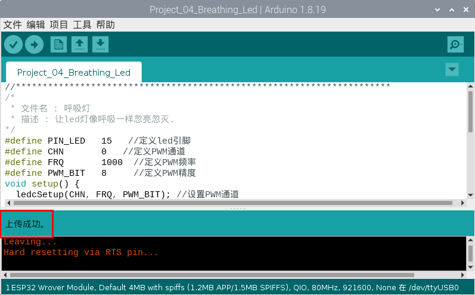
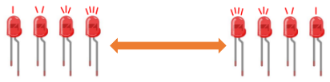

# 项目04 呼吸灯

## 1.项目介绍：
在之前的研究中，我们知道LED有亮/灭状态，那么如何进入中间状态呢?如何输出一个中间状态让LED“半亮”?这就是我们将要学习的。呼吸灯，即LED由灭到亮，再由亮到灭，就像“呼吸”一样。那么，如何控制LED的亮度呢?我们将使用ESP32的PWM来实现这个目标。

## 2.项目元件：
||||
| :--: | :--: | :--: |
|ESP32*1|面包板*1|红色LED*1|
|| ||
|220Ω电阻*1|跳线*2|USB 线*1|

## 3.元件知识：

**模拟信号 & 数字信号** 
模拟信号在时间和数值上都是连续的信号。相反，数字信号或离散时间信号是由一系列数字组成的时间序列。生活中的大多数信号都是模拟信号，一个熟悉的模拟信号的例子是：全天的温度是连续不断变化的，而不是突然从0到10的瞬间变化。然而，数字信号的值可以瞬间改变，这个变化用数字表示为1和0(二进制代码的基础)。如下图所示，我们可以更容易地看出它们的差异。

在实际应用中，我们经常使用二进制作为数字信号，即一系列的0和1。由于二进制信号只有两个值(0或1)，因此具有很大的稳定性和可靠性。最后，可以将模拟信号和数字信号相互转换。

**PWM：**
脉宽调制(PWM)是一种利用数字信号控制模拟电路的有效方法。普通处理器不能直接输出模拟信号。PWM技术使这种转换(将数字信号转换为模拟信号)非常方便。PWM技术利用数字引脚发送一定频率的方波，即高电平和低电平的输出，交替持续一段时间。每一组高电平和低电平的总时间一般是固定的，称为周期(注:周期的倒数是频率)。高电平输出的时间通常称为脉宽，占空比是脉宽(PW)与波形总周期(T)之比的百分比。高电平输出持续时间越长，占空比越长，模拟信号中相应的电压也就越高。下图显示了对应于脉冲宽度0%-100%的模拟信号电压在0V-3.3V(高电平为3.3V)之间的变化情况.


PWM占空比越长，输出功率越高。既然我们了解了这种关系，我们就可以用PWM来控制LED的亮度或直流电机的速度等等。从上面可以看出，PWM并不是真实的模拟信号，电压的有效值等于相应的模拟信号。因此，我们可以控制LED和其他输出模块的输出功率，以达到不同的效果。

**ESP32 与 PWM**
在ESP32上，LEDC(PWM)控制器有16个独立通道，每个通道可以独立控制频率，占空比，甚至精度。与传统的PWM引脚不同，ESP32的PWM输出引脚是可配置的，每个通道有一个或多个PWM输出引脚。最大频率与比特精度的关系如下公式所示：

其中比特的最大值为31。例如,生成PWM的8位精度(28 = 256。取值范围为0 ~ 255)，最大频率为80,000,000/255 = 312,500Hz。)

## 4.项目接线图： 


## 5.项目代码：
<span style="color: rgb(255, 76, 65);">本项目设计使GPIO15 输出PWM，脉宽由0%逐渐增加到100%，再由100%逐渐减小到0%。</span>

本项目中使用的代码保存在（即路径)：**..\Keyes ESP32 高级版学习套件\4. Arduino C 教程\2. 树莓派 系统\3. 项目教程\代码集**。你可以把代码移到任何地方。例如，我们将代码保存在Raspberry Pi系统的文件夹pi中，<span style="color: rgb(255, 76, 65);">**路径：../home/pi/代码集**</span>。

可以在此路径下打开代码“**Project_04_Breathing_Led**”。

```
//**********************************************************************
/*
 * 文件名 : 呼吸灯
 * 描述 : 让led灯像呼吸一样忽亮忽灭.
*/
#define PIN_LED   15   //定义led引脚
#define CHN       0   //定义PWM通道
#define FRQ       1000  //定义PWM频率
#define PWM_BIT   8     //定义PWM精度
void setup() {
  ledcSetup(CHN, FRQ, PWM_BIT); //设置PWM通道
  ledcAttachPin(PIN_LED, CHN);  //将led引脚连接到PWM通道
}

void loop() {
  for (int i = 0; i < 255; i++) { //让LED逐渐变亮
    ledcWrite(CHN, i);
    delay(10);
  }
  for (int i = 255; i > -1; i--) {  //让LED逐渐变暗
    ledcWrite(CHN, i);
    delay(10);
  }
}
//*************************************************************************************

```
在上传项目代码到ESP32之前，请检查Arduino IDE的配置。

单击“**工具**”，确认“**开发板**”板型和“**端口(COM)**”，如下所示：


单击将项目代码上传到ESP32主板上。


<span style="color: rgb(255, 76, 65);">注意：</span> 如果上传代码不成功，可以再次点击后用手按住ESP32主板上的Boot键，出现上传进度百分比数后再松开Boot键，如下图所示：


项目代码上传成功！


## 6.项目现象：
项目代码上传成功后，利用USB线上电，可以看到的现象是：电路中的LED从暗逐渐变亮，再从亮逐渐变暗，就像呼吸一样。



