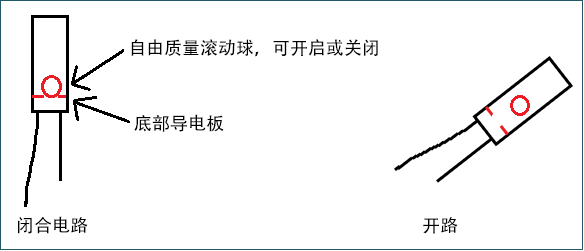

# 项目15 模拟沙漏

## 1.项目介绍：
古代人没有电子时钟，就发明了沙漏来测时间，沙漏两边的容量比较大，在一边装了细沙，中间有个很小的通道，将沙漏直立，有细沙的一边在上方，由于重力的作用，细沙就会往下流通过通道到沙漏的另一边，当细沙都流到下边了，就倒过来，把一天反复的次数记录下来，第二天就可以通过沙漏反复流动的次数而知道这一天大概的时间了。这一课我们将利用ESP32控制倾斜开关和LED灯来模拟沙漏，制作一个电子沙漏。

## 2.项目元件：
|||||
| :--: | :--: | :--: | :--: |
|ESP32*1|面包板*1|倾斜开关*1|10KΩ电阻*1|
||| ||
|红色 LED*4|220Ω电阻*1|跳线若干|USB 线*1|

## 3.元件知识：

倾斜开关也叫数字开关。里面有一个可以滚动的金属球。采用金属球滚动与底部导电板接触的原理来控制电路的通断。倾斜开关是滚珠型倾斜感应单方向性触发开关，当倾斜传感器向触发端（两根金属脚端）倾斜时，倾斜开关处于闭路状态，模拟端口的电压约为5V(二进制数为1023)。这样，LED会亮起。当倾斜开关在水平位置或向另一端倾斜时，倾斜开关处于开路状态，模拟端口的电压约为0V(0二进制)，LED将会关闭。在程序中，我们根据模拟端口的电压值，是否大于2.5V(512二进制)来判断开关是开还是关。
这里用倾斜开关的内部结构来说明它是如何工作的，显示如下图：


## 4.项目接线图：


<span style="color: rgb(255, 76, 65);">注意: </span>

怎样连接LED 

怎样识别五色环220Ω电阻和五色环10KΩ电阻


## 5.项目代码：
本项目中使用的代码保存在（即路径)：**..\Keyes ESP32 高级版学习套件\4. Arduino C 教程\2. 树莓派 系统\3. 项目教程\代码集**。你可以把代码移到任何地方。例如，我们将代码保存在Raspberry Pi系统的文件夹pi中，<span style="color: rgb(255, 76, 65);">**路径：../home/pi/代码集**</span>。

可以在此路径下打开代码“**Project_15_Tilt_And_LED**”。

```
//**********************************************************************
/* 
 * 文件名  : 倾斜和LED
 * 描述 : 倾斜开关和四个led模拟沙漏.
*/
#define SWITCH_PIN  15  // 倾斜开关连接Pin15
byte switch_state = 0;
void setup()
{
     for(int i=16;i<20;i++)
  {
        pinMode(i, OUTPUT);
  } 
    pinMode(SWITCH_PIN, INPUT);
 for(int i=16;i<20;i++)
  {
    digitalWrite(i,0);
  } 
  Serial.begin(9600);
}
void loop()
{
switch_state = digitalRead(SWITCH_PIN); 
Serial.println(switch_state);
 if (switch_state == 0) 
 {
 for(int i=16;i<20;i++)
  {
    digitalWrite(i,1);
    delay(500);
  } 
  }
   if (switch_state == 1) 
 {
   for(int i=19;i>15;i--)
   {
    digitalWrite(i,0);
    delay(500);
   }
  }
}
//**********************************************************************************

```
ESP32主板通过USB线连接到计算机后开始上传代码。为了避免将代码上传至ESP32主板时出现错误，必须选择与计算机连接正确的开发板和端口（COM）。

点击“**工具**”→“**开发板**”，可以查看到各种不同型号ESP32开发板，选择对应的ESP32开发板型号。

点击“**工具**”→“**端口**”，选择对应的端口（COM）。

**注意：将ESP32主板通过USB线连接到计算机后才能看到对应的端口（COM）**。

单击将代码上传到ESP32主控板。

## 6.项目现象：
代码上传成功后，利用USB线上电，你会看到的现象是：将面包板倾斜到一定角度，led就会一个一个地亮起来。当回到上一个角度时，led会一个一个关闭。就像沙漏一样，随着时间的推移，沙子漏了出来。

<span style="color: rgb(255, 76, 65);">注意：</span> 如果上传代码不成功，可以再次点击后用手按住ESP32主板上的Boot键，出现上传进度百分比数后再松开Boot键，如下图所示：


