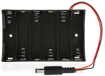
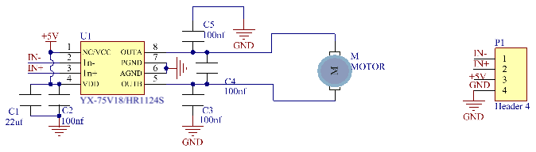

# 项目18 小风扇

## 1.项目介绍： 
在炎热的夏季，需要电扇来给我们降温，那么在这个项目中，我们将使用ESP32控制130电机模块和小扇叶来制作一个小电扇。

## 2.项目元件：
||||
| :--: | :--: | :--: |
|ESP32*1|面包板*1|130电机模块*1|
||||
|面包板专用电源模块*1|6节5号电池盒*1|风扇叶*1|
|  |||
|4P转杜邦线公单*1|5号电池(<span style="color: rgb(255, 76, 65);">自备</span>)*6|USB 线*1|

## 3.元件知识:

**130电机模块：** 该电机控制模块采用HR1124S电机控制芯片，HR1124S是应用于直流电机方案的单通道H桥驱动器芯片。HR1124S的H桥驱动部分采用低导通电阻的PMOS和NMOS功率管，低导通电阻保证芯片低的功率损耗，使得芯片安全工作更长时间。此外HR1124S拥有低待机电流，低静态工作电流，这些性能使130电机模块易用于玩具方案。

**130电机模块参数：**
工作电压：5V
工作电流：≤200MA
工作功率：2W
工作温度：-10℃~+50℃

**130电机模块原理图：**
HR1124S芯片的作用是助于驱动电机，而电机所需电流较大，无法用三极管驱动更无法直接用IO口驱动。让电机转动起来的方法很简单，给电机两端添加电压即可。不同电压方向电机转向也不相同，在额度电压内，电压越大，电机转动得越快；反之电压越低，电机转动得越慢，甚至无法转动。控制方式有两种：一种是高低电平控制（控制转动和停止），一种是PWM控制（控制转速）。


**面包板专用电源模块：**

**说明：**
此模块，能方便的给面包板提供3.3V和5V的电源，具有DC2.1输入（DC7－12V），另外，具备USB Type C接口的电源输入。

**规格：** 
 输入电压：DC座：7-12V；  Type C USB：5V 
 电流：3.3V：最大500mA；        5V：最大500mA；
 最大功率: 2.5W
 尺寸: 53mmx26.3mm
 环保属性: ROHS

**接口说明：**


**原理图：**


## 4. 项目接线图：


(<span style="color: rgb(255, 76, 65);">注: 先接好线，然后在直流电机上安装一个小风扇叶片。</span>)


## 5.项目代码：
本项目中使用的代码保存在（即路径)：**..\Keyes ESP32 高级版学习套件\4. Arduino C 教程\2. 树莓派 系统\3. 项目教程\代码集**。你可以把代码移到任何地方。例如，我们将代码保存在Raspberry Pi系统的文件夹pi中，<span style="color: rgb(255, 76, 65);">**路径：../home/pi/代码集**</span>。

可以在此路径下打开代码“**Project_18_Small_Fan**”。

```
//**********************************************************************************
/*
 * 文件名  : 小风扇
 * 描述 : 风扇顺时针旋转，停止，逆时针旋转，停止，循环.
*/
#define Motorla    15  // 电机的Motor_IN+引脚
#define Motorlb     2  // 电机的Motor_IN引脚

void setup(){
  pinMode(Motorla, OUTPUT);//设置Motorla为OUTPUT
  pinMode(Motorlb, OUTPUT);//设置Motorlb为OUTPUT
}
void loop(){
//设置为逆时针旋转5s
  digitalWrite(Motorla,HIGH);
  digitalWrite(Motorlb,LOW);
  delay(5000);
//设置停止旋转2s 
  digitalWrite(Motorla,LOW);
  digitalWrite(Motorlb,LOW);
  delay(2000);
//设置为顺时针旋转5s
  digitalWrite(Motorla,LOW);
  digitalWrite(Motorlb,HIGH);
  delay(5000);
//设置停止旋转2s 
  digitalWrite(Motorla,LOW);
  digitalWrite(Motorlb,LOW);
  delay(2000);
}
//********************************************************************************

```
ESP32主板通过USB线连接到计算机后开始上传代码。为了避免将代码上传至ESP32主板时出现错误，必须选择与计算机连接正确的开发板和端口（COM）。

点击“**工具**”→“**开发板**”，可以查看到各种不同型号ESP32开发板，选择对应的ESP32开发板型号。

点击“**工具**”→“**端口**”，选择对应的端口（COM）。

**注意：将ESP32主板通过USB线连接到计算机后才能看到对应的端口（COM）**。

单击将代码上传到ESP32主控板。

## 6.项目现象：
代码上传成功后，外接电源，上电后，你会看到的现象是：小风扇先逆时针转5秒，停止2秒，再顺时针转5秒，停止2秒，以此规律重复执行。

<span style="color: rgb(255, 76, 65);">注意：</span> 如果上传代码不成功，可以再次点击后用手按住ESP32主板上的Boot键，出现上传进度百分比数后再松开Boot键，如下图所示：

