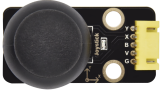

# 项目28 摇杆控制RGB灯

## 1.项目介绍：
摇杆模块是一个有两个模拟输入和一个数字输入的组件。广泛应用于游戏操作、机器人控制、无人机控制等领域。在这个项目中，我们使用ESP32和摇杆模块控制RGB。这样，你可以在实践中对摇杆模块的原理和操作有更深入的了解。 

## 2.项目元件：
|||||
| :--: | :--: | :--: | :--: |
|ESP32*1|面包板*1|摇杆模块*1|RGB LED*1|
|| |||
|220Ω电阻*3|跳线若干|USB 线*1|5P转杜邦线公单*1|

## 3.元件知识：

**摇杆模块：** 主要是采用PS2手柄摇杆元件，实际上摇杆模块有3个信号端引脚，模拟3维空间，摇杆模块的引脚分别是GND、VCC、信号端（B、X、Y），其中信号端X、Y模拟空间的X轴和Y轴，控制时，模块的X、Y信号端是连接控制板模拟口，通过控制2个模拟输入值来控制物体在空间X、Y轴的坐标。信号端B模拟空间Z轴，它一般是接数字口，做按键使用。
VCC接控制板的电源输出端V/VCC（3.3/5V），GND接控制板的G/GND，原始状态下读出电压大约为1.65V/2.5V左右，对于X轴方向，当随箭头方向逐渐移动，读出电压值随着增加，且可以达到最大电压；随箭头相反方向逐渐移动，读出电压值逐渐减少，减少到最小电压。对于Y轴方向，当沿着模块上的箭头方向逐渐按下，读出电压值随着增加，且可以达到最大电压；随箭头相反方向逐渐按下，读出电压值逐渐减少，减少到最小电压。对于Z轴方向，信号端B接数字口，原始状态下输出0，按下输出1。这样，我们可以读取两个模拟值和一个数字口的高低电平情况，来判断模块上摇杆的工作状态。

**模块参数：**
- 输入电压：DC 3.3V ~ 5V
- 输出信号：X/Y双轴模拟值+Z轴数字信号
- 适用范围：适用于控制点坐标在平面内的运动，双自由度舵机的控制等。
- 产品特点：外观精美，摇杆手感优越，操作简单，反应灵敏，使用寿命长。

## 4.读取摇杆模块的值：
我们必须使用ESP32的模拟IO口从摇杆模块的X/Y引脚读取值，并使用数字IO口读取按钮的数字信号。请按照下面的接线图进行接线：


本项目中使用的代码保存在（即路径)：**..\Keyes ESP32 高级版学习套件\4. Arduino C 教程\2. 树莓派 系统\3. 项目教程\代码集**。你可以把代码移到任何地方。例如，我们将代码保存在Raspberry Pi系统的文件夹pi中，<span style="color: rgb(255, 76, 65);">**路径：../home/pi/代码集**</span>。

可以在此路径下打开代码“**Project_28.1_Read_Rocker_Value**”。

```
//**********************************************************************************
/*  
 * 文件名  : 读取摇杆值
 * 描述 : 从摇杆模块读取数据.
*/
int xyzPins[] = {36, 39, 14};   //引脚x,y,z
void setup() {
  Serial.begin(115200);
  pinMode(xyzPins[0], INPUT); //x 轴. 
  pinMode(xyzPins[1], INPUT); //y 轴. 
  pinMode(xyzPins[2], INPUT_PULLUP);   //z 轴是一个按键.
}

//在loop()中，使用analogRead()读取X轴和Y轴的值
//和使用digitalRead()读取Z轴的值，然后显示它们.

void loop() {
  int xVal = analogRead(xyzPins[0]);
  int yVal = analogRead(xyzPins[1]);
  int zVal = digitalRead(xyzPins[2]);
  Serial.println("X,Y,Z: " + String(xVal) + ", " +  String(yVal) + ", " + String(zVal));
  delay(500);
}
//**********************************************************************************

```
编译并上传代码到ESP32，代码上传成功后，利用USB线上电，打开串口监视器，设置波特率为<span style="color: rgb(255, 76, 65);">115200</span>。可以看到的现象是：串口监视器窗口将打印当前摇杆的模拟值和数字值，移动摇杆或按下摇杆帽将改变串口监视器窗口中的模拟值和数字值。


<span style="color: rgb(255, 76, 65);">注意：</span> 如果上传代码不成功，可以再次点击后用手按住ESP32主板上的Boot键，出现上传进度百分比数后再松开Boot键，如下图所示：


## 5.摇杆模块控制RGB的接线图： 
我们刚读了摇杆模块的值，这里我们需要用摇杆模块和RGB做一些事情，按照下图连接：


## 6.项目代码：
本项目中使用的代码保存在（即路径)：**..\Keyes ESP32 高级版学习套件\4. Arduino C 教程\2. 树莓派 系统\3. 项目教程\代码集**。你可以把代码移到任何地方。例如，我们将代码保存在Raspberry Pi系统的文件夹pi中，<span style="color: rgb(255, 76, 65);">**路径：../home/pi/代码集**</span>。

可以在此路径下打开代码“**Project_28.2_Rocker_Control_Light**”。

```
//**********************************************************************************
/*  
 * 文件名  : 摇杆控制灯
 * 描述 : 通过摇杆控制RGB来点亮不同的颜色.
*/
int x_Pin = 36;   //x 引脚
int y_Pin = 39;   //y 引脚
int z_Pin = 14;   //z 引脚
int ledPins[] = {4, 0, 2};    //定义红、绿、蓝引脚
const byte chns[] = {0, 1, 2};        //定义PWM通道

void setup() {
  pinMode(x_Pin, INPUT); //x 轴. 
  pinMode(y_Pin, INPUT); //y 轴. 
  pinMode(z_Pin, INPUT_PULLUP);   //z 轴 是一个按键.
  for (int i = 0; i < 3; i++) {   //设置pwm通道，1KHz,8bit
    ledcSetup(chns[i], 1000, 8);
    ledcAttachPin(ledPins[i], chns[i]);
  }
}

//在loop()中，使用analogRead()读取X轴和Y轴的值
//和使用digitalRead()读取Z轴的值，然后显示它们.

void loop() {
  int xVal = analogRead(x_Pin);
  int yVal = analogRead(y_Pin);
  int zVal = digitalRead(z_Pin);
  if (xVal < 1000){
     ledcWrite(chns[0], 255); //普通阴极LED，高电平开启LED.
     ledcWrite(chns[1], 0);
     ledcWrite(chns[2], 0);
   }
  else if (xVal > 3000){
     ledcWrite(chns[0], 0); 
     ledcWrite(chns[1], 255);
     ledcWrite(chns[2], 0);
   }
  else if (yVal < 1000){
     ledcWrite(chns[0], 0);
     ledcWrite(chns[1], 0);
     ledcWrite(chns[2], 255);
   }
  else if (yVal > 3000){
     ledcWrite(chns[0], 255); 
     ledcWrite(chns[1], 255);
     ledcWrite(chns[2], 255);
   }
}
//**********************************************************************************

```
## 7.项目现象：
编译并上传代码到ESP32，代码上传成功后，利用USB线上电，你会看到的现象是：①如果摇杆在X方向上移动到最左边，RGB光变成红色; ②如果摇杆在X方向上移动到最右边，RGB光变为绿色; ③如果摇杆在Y方向上移动到最上面，RGB光变成白色; ④如果摇杆在Y方向上移动到最下面，RGB光变成蓝色。


<span style="color: rgb(255, 76, 65);">注意：</span> 如果上传代码不成功，可以再次点击后用手按住ESP32主板上的Boot键，出现上传进度百分比数后再松开Boot键，如下图所示：


