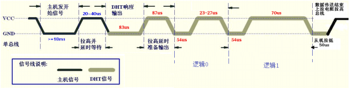
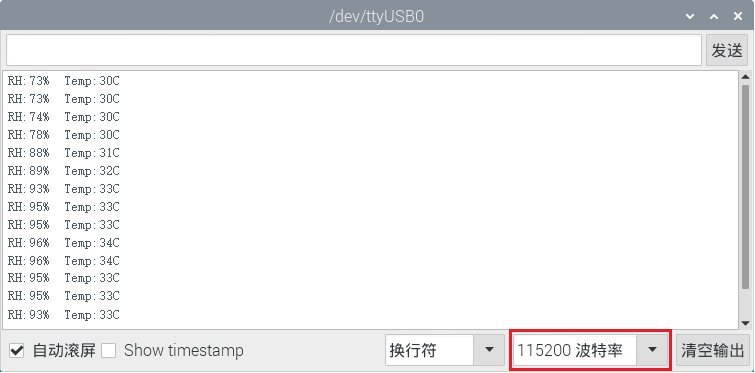

# 项目29 温湿度表

## 1.项目介绍：
在冬季时，空气中的湿度很低，就是空气很干燥，再加上寒冷，人体的皮肤就容易过于干燥而裂，所以需要在用加湿器给家里的空气增加湿度，但是怎么知道空气过于干燥了呢？那就需要检测空气湿度的设备，这节课就来学习温湿度传感器的使用。我们使用温湿度传感器制作一个温湿度计，并且还结合LCD 128X32 DOT来显示温度和湿度值。

## 2.项目元件：
|||||
| :--: | :--: | :--: | :--: |
|ESP32*1|面包板*1|LCD_128X32_DOT*1|温湿度传感器*1|
| ||| |
|3P转杜邦线公单*1|4P转杜邦线公单*1|USB 线*1| |

## 3.元件知识：

**温湿度传感器：** 是一款含有已校准数字信号输出的温湿度复合传感器，其精度湿度±5%RH， 温度±2℃，量程湿度20-90%RH， 温度0~50℃。温湿度传感器应用专用的数字模块采集技术和温湿度传感技术，确保产品具有极高的可靠性和卓越的长期稳定性。温湿度传感器包括一个电阻式感湿元件和一个NTC测温元件，非常适用于对精度和实时性要求不高的温湿度测量场合。
工作电压在3.3V-5.5V范围内。
温湿度传感器有三个引脚，分别为VCC，GND和S。S为数据输出的引脚。使用的是串行通讯。
**温湿度传感器的单总线格式定义：**
| 名称 |单总线格式定义 |
| :--: | :--: |
| 起始信号| 微处理器把数据总线(SDA)拉低一段时间至少 18ms(最大不得超过 30ms)，通知传感器准备数据。 | 
| 响应信号 | 传感器把数据总线（SDA）拉低 83µs，再接高 87µs 以响应主机的起始信号。 |
| 湿度 | 湿度高位为湿度整数部分数据，湿度低位为湿度小数部分数据  |
| 温度 |温度高位为温度整数部分数据，温度低位为温度小数部分数据，且温度低位 Bit8 为 1 则表示负温度，否则为正温度 |
| 校验位 | 校验位＝湿度高位+湿度低位+温度高位+温度低位 |

**温湿度传感器数据时序图：** 
用户主机（MCU）发送一次开始信号后，温湿度传感器从低功耗模式转换到高速模式，待主机开始信号结束后，温湿度传感器发送响应信号，送出 40bit 的数据，并触发一次信采集。信号发送如图所示。 


温湿度传感器可以很容易地将温湿度数据添加到您的DIY电子项目中。它是完美的远程气象站，家庭环境控制系统，和农场或花园监测系统。
**温湿度传感器的参数：**
- 工作电压：+5 V
- 温度范围：0-50 °C ，误差：± 2 °C
- 湿度范围：20-90% RH ，误差：± 5% RH
- 数字接口

**温湿度传感器的原理图：**


## 4.读取温湿度值：


**如何添加xht11库：**
本项目代码使用了一个名为“<span style="color: rgb(255, 76, 65);">xht11</span>”库。如果你已经添加好了“<span style="color: rgb(255, 76, 65);">xht11</span>”库，则跳过此步骤。如果你还没有添加，请在学习之前添加它。添加第三方库的方法请参考“<span style="color: rgb(0, 209, 0);">开发环境设置</span>”。

本项目中使用的代码保存在（即路径)：**..\Keyes ESP32 高级版学习套件\4. Arduino C 教程\2. 树莓派 系统\3. 项目教程\代码集**。你可以把代码移到任何地方。例如，我们将代码保存在Raspberry Pi系统的文件夹pi中，<span style="color: rgb(255, 76, 65);">**路径：../home/pi/代码集**</span>。

可以在此路径下打开代码“**Project_29.1_Detect_Temperature_Humidity**”。

```
//**********************************************************************************
/*
 * 文件名  : 温湿度传感器
 * 描述 : 使用XHT11测量温湿度。将结果打印到串口.
*/
#include "xht11.h"
//gpio13
xht11 xht(13);

unsigned char dht[4] = {0, 0, 0, 0};//只接收数据的前32位，不接收奇偶校验位
void setup() {
  Serial.begin(115200);//打开串口监视器，将波特率设置为115200
}

void loop() {
  if (xht.receive(dht)) { //正确选中时返回true
    Serial.print("RH:");
    Serial.print(dht[0]); //湿度的积分部分，DHT[0]为小数部分
    Serial.print("%  ");
    Serial.print("Temp:");
    Serial.print(dht[2]); //温度的积分部分，DHT[3]是分数部分
    Serial.println("C");
  } else {    //读取错误
    Serial.println("sensor error");
  }
  delay(1000);  //设备读取等待时间为1000ms
}
//**********************************************************************************

```
编译并上传代码到ESP32，代码上传成功后，利用USB线上电，打开串口监视器，设置波特率为<span style="color: rgb(255, 76, 65);">115200</span>。你会看到的现象是：串口监视器窗口将打印当前显示当前环境中的温湿度数据，如下图。


<span style="color: rgb(255, 76, 65);">注意：</span> 如果上传代码不成功，可以再次点击后用手按住ESP32主板上的Boot键，出现上传进度百分比数后再松开Boot键，如下图所示：


## 5.温湿度仪表的接线图：
现在我们开始用LCD_128X32_DOT打印温湿度传感器的值，我们会在LCD_128X32_DOT的屏幕上看到相应的值。让我们开始这个项目吧。请按照下面的接线图进行接线：


## 6.项目代码：
前面已经添加过<span style="color: rgb(255, 76, 65);">xht11</span>和<span style="color: rgb(255, 76, 65);">LCD_128×32</span>库，可以不用重复添加。如果没有添加，就需要添加<span style="color: rgb(255, 76, 65);">xht11</span>和<span style="color: rgb(255, 76, 65);">LCD_128×32</span>库，添加第三方库的方法请参考“<span style="color: rgb(0, 209, 0);">开发环境设置</span>”。

本项目中使用的代码保存在（即路径)：**..\Keyes ESP32 高级版学习套件\4. Arduino C 教程\2. 树莓派 系统\3. 项目教程\代码集**。你可以把代码移到任何地方。例如，我们将代码保存在Raspberry Pi系统的文件夹pi中，<span style="color: rgb(255, 76, 65);">**路径：../home/pi/代码集**</span>。

可以在此路径下打开代码“**Project_29.2_Temperature_Humidity_Meter**”。

```
//**********************************************************************************
/*
 * 文件名  : 温湿度计
 * 描述 : LCD显示温度和湿度的数值.
*/
#include "xht11.h"
#include "lcd128_32_io.h"

//gpio13
xht11 xht(13);
unsigned char dht[4] = {0, 0, 0, 0};//只接收数据的前32位，不接收奇偶校验位

lcd lcd(21, 22); //创建lCD128 *32引脚，sda->21， scl->22

void setup() {
  lcd.Init(); //初始化
  lcd.Clear();  //清屏
}
char string[10];

//LCD显示湿度和温度值
void loop() {
  if (xht.receive(dht)) { //正确选中时返回true
    }
  lcd.Cursor(0,0); //设置显示位置
  lcd.Display("Temper:"); //设置显示
  lcd.Cursor(0,8);
  lcd.DisplayNum(dht[2]);
  lcd.Cursor(0,11);
  lcd.Display("C");
  lcd.Cursor(2,0); 
  lcd.Display("humid:");
  lcd.Cursor(2,8);
  lcd.DisplayNum(dht[0]);
  lcd.Cursor(2,11);
  lcd.Display("%");
  delay(200);
}
//**********************************************************************************

```
## 7.项目现象：
编译并上传代码到ESP32，代码上传成功后，利用USB线上电，你会看到的现象是：LCD 128X32 DOT的屏幕上显示温湿度传感器检测环境中相应的温度值和湿度值。

<span style="color: rgb(255, 76, 65);">注意：</span> 如果上传代码不成功，可以再次点击后用手按住ESP32主板上的Boot键，出现上传进度百分比数后再松开Boot键，如下图所示：

