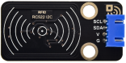
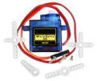
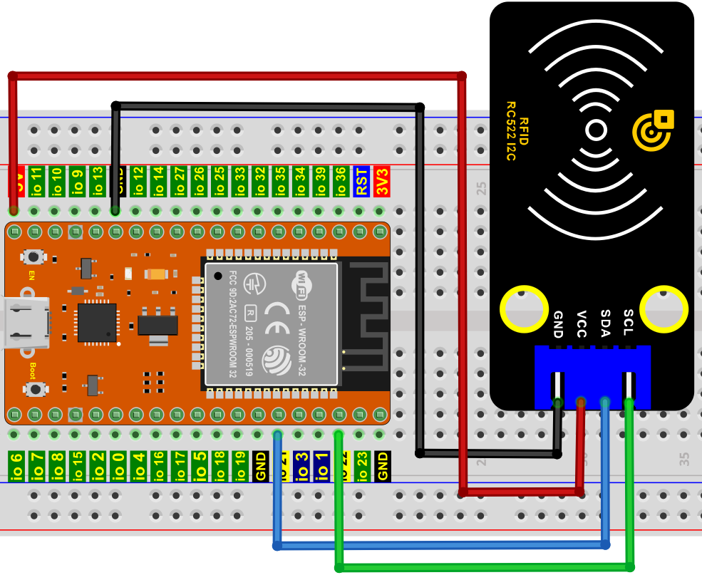
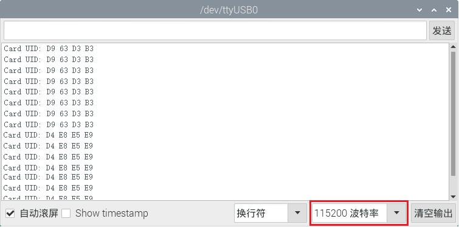
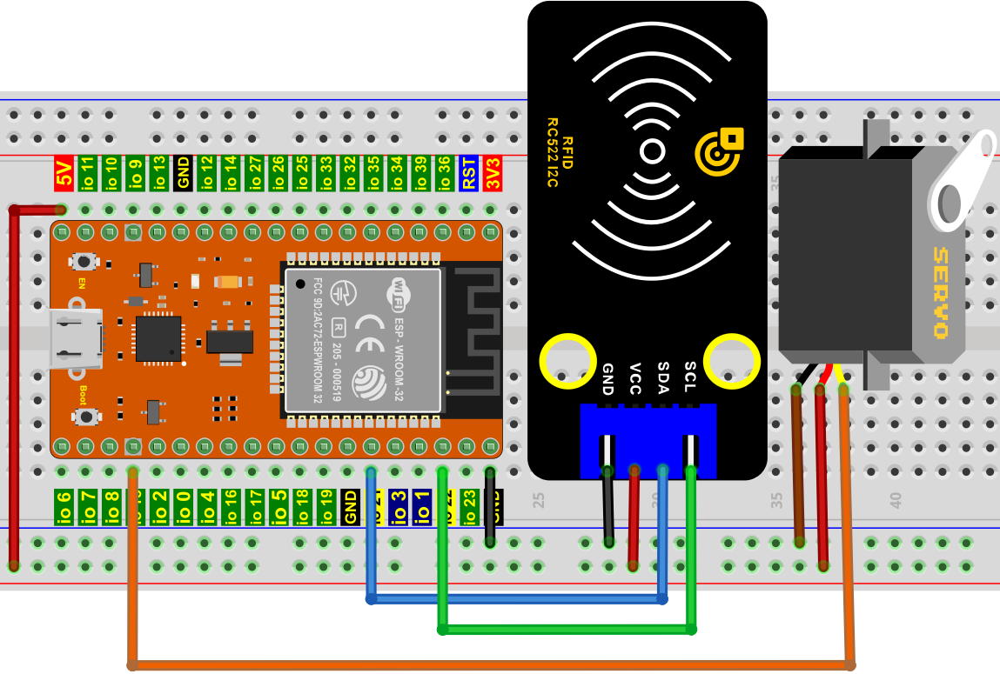
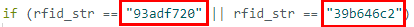
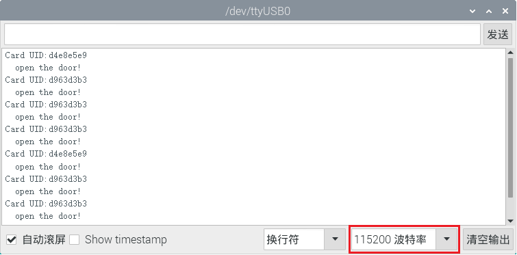

# 项目32 RFID

## 1.实验介绍：
现在很多小区的门使用了刷卡开门这个功能，非常的方便。这节课我们将学习使用RFID(射频识别)无线通信技术和对卡（钥匙扣/白卡）进行读、写操作及RFID-MFRC522模块控制舵机转动。   

## 2.实验元件：
||||||
| :--: | :--: | :--: | :--: | :--: |
|ESP32*1|面包板*1|RFID-RC522模块*1|舵机*1|白卡*1|
|||| | |
|4P转杜邦线公单*1|跳线若干|USB 线*1|钥匙扣*1 | |

## 3.元件知识：
**RFID：** 无线射频识别，读卡器由频射模块及高平磁场组成。Tag应答器为待感应设备，此设备不包含电池。他只包含微型集成电路芯片及存储数据的介质以及接收和发送信号的天线。读取tag中的数据，首先要放到读卡器的读取范围内。读卡器会产生一个磁场，因为磁能生电由楞次定律，RFID Tag就会供电，从而激活设备。

**RFID-RC522模块：** 采用Philips MFRC522原装芯片设计读卡电路，使用方便，成本低廉，适用于设备开发、读卡器开发等高级应用的用户、需要进行射频卡终端设计/生产的用户。本模块可直接装入各种读卡器模具。模块采用电压为5V,通过SPI接口简单的几条线就可以直接与用户任何CPU主板或单片机相连接通信。


**规格参数：**
- 工作电压：DC 5V
- 工作电流：13—100mA/DC 5V
- 空闲电流：10-13mA/DC 5V
- 休眠电流：<80uA
- 峰值电流：<100mA
- 工作频率：13.56MHz
- 最大功率：0.5W
- 支持的卡类型：mifare1 S50、mifare1 S70、mifare UltraLight、mifare Pro、mifare Desfire
- 环境工作温度：摄氏-20—80℃
- 环境储存温度：摄氏-40—85℃
- 环境相对湿度：相对湿度5%—95%
- 数据传输速率：最大10Mbit/s

## 4.RFID 读取 UID：
我们将读取RFID卡的唯一ID号(UID)，识别RFID卡的类型，并通过串口显示相关信息，其接线图如下所示：


**添加MFRC522_I2C和Wire库：**

如果你已经添加好了“<span style="color: rgb(255, 76, 65);">MFRC522_I2C</span>”和“<span style="color: rgb(255, 76, 65);">Wire</span>”库, 则跳过此步骤。如果你还没有添加“<span style="color: rgb(255, 76, 65);">MFRC522_I2C</span>”和“<span style="color: rgb(255, 76, 65);">Wire</span>”库，请在学习之前添加它们。添加第三方库的方法请参考“<span style="color: rgb(0, 209, 0);">开发环境设置</span>”。

本项目中使用的代码保存在（即路径)：**..\Keyes ESP32 高级版学习套件\4. Arduino C 教程\2. 树莓派 系统\3. 项目教程\代码集**。你可以把代码移到任何地方。例如，我们将代码保存在Raspberry Pi系统的文件夹pi中，<span style="color: rgb(255, 76, 65);">**路径：../home/pi/代码集**</span>。

可以在此路径下打开代码“**Project_32.1_RFID_Read_UID**”。

```
//**********************************************************************************
/*  
 * 文件名 : RFID
 * 描述 : RFID阅读UID
*/
#include <Wire.h>
#include "MFRC522_I2C.h"
// IIC引脚默认为ESP32的GPIO21和GPIO22
// 0x28是SDA的i2c地址，如果不匹配，请用i2c检查你的地址.
MFRC522 mfrc522(0x28);   // 创建MFRC522.

void setup() {
  Serial.begin(115200);           // 初始化与PC机的串行通信
  Wire.begin();                   // 初始化I2C
  mfrc522.PCD_Init();             // 初始化MFRC522
  ShowReaderDetails();            // 显示PCD - MFRC522读卡器
  Serial.println(F("Scan PICC to see UID, type, and data blocks..."));
}

void loop() {
  // 
  if ( ! mfrc522.PICC_IsNewCardPresent() || ! mfrc522.PICC_ReadCardSerial() ) {
    delay(50);
    return;
  }
  
  // 选择一张门卡。UID和SAK为mfrc522.uid.
  
  // 保存UID
  Serial.print(F("Card UID:"));
  for (byte i = 0; i < mfrc522.uid.size; i++) {
    Serial.print(mfrc522.uid.uidByte[i] < 0x10 ? " 0" : " ");
    Serial.print(mfrc522.uid.uidByte[i], HEX);
  } 
  Serial.println();
}

void ShowReaderDetails() {
  //  运行或调用MFRC522软件
  byte v = mfrc522.PCD_ReadRegister(mfrc522.VersionReg);
  Serial.print(F("MFRC522 Software Version: 0x"));
  Serial.print(v, HEX);
  if (v == 0x91)
    Serial.print(F(" = v1.0"));
  else if (v == 0x92)
    Serial.print(F(" = v2.0"));
  else
    Serial.print(F(" (unknown)"));
  Serial.println("");
  // 当返回到0x00或0xFF时，可能无法传输通信信号
  if ((v == 0x00) || (v == 0xFF)) {
    Serial.println(F("WARNING: Communication failure, is the MFRC522 properly connected?"));
  }
}
//**********************************************************************************

```
编译并上传代码到ESP32，代码上传成功后，利用USB线上电，打开串口监视器，设置波特率为115200。你会看到的现象是：将白卡和钥匙扣分别靠近模块感应区，串口监视器窗口将分别显示白卡和钥匙扣的卡号值。如下图所示：


<span style="color: rgb(255, 76, 65);">注意：</span> 如果上传代码不成功，可以再次点击后用手按住ESP32主板上的Boot键，出现上传进度百分比数后再松开Boot键，如下图所示：


<span style="color: rgb(255, 76, 65);">特别注意：对于不同的RFID-RC522的白卡和钥匙扣，其门白卡值和钥匙扣可能都不一样。</span>

## 5.RFID MFRC522的接线图：
现在使用RFID-RC522模块、白卡/钥匙扣和舵机模拟做一个智能门禁系统。当白卡/钥匙扣靠近RFID-RC522模块感应区舵机转动。按照下图进行接线。


## 6.添加MFRC522_I2C，Wire和ESP32Servo库：
前面已经添加过<span style="color: rgb(255, 76, 65);">MFRC522_I2C</span>，<span style="color: rgb(255, 76, 65);">Wire</span>和<span style="color: rgb(255, 76, 65);">ESP32Servo</span>库，可以不用重复添加。如果没有添加，就需要添加<span style="color: rgb(255, 76, 65);">MFRC522_I2C</span>，<span style="color: rgb(255, 76, 65);">Wire</span>和<span style="color: rgb(255, 76, 65);">ESP32Servo</span>库，添加第三方库的方法请参考“<span style="color: rgb(0, 209, 0);">开发环境设置</span>”。

## 7.项目代码：
本项目中使用的代码保存在（即路径)：**..\Keyes ESP32 高级版学习套件\4. Arduino C 教程\2. 树莓派 系统\3. 项目教程\代码集**。你可以把代码移到任何地方。例如，我们将代码保存在Raspberry Pi系统的文件夹pi中，<span style="color: rgb(255, 76, 65);">**路径：../home/pi/代码集**</span>。

可以在此路径下打开代码“**Project_32.2_RFID_Control_Servo**”。

<span style="color: rgb(255, 76, 65);">特别注意：对于不同的RFID-RC522的白卡和钥匙扣，其RFID-RC522读取的白卡和钥匙扣值可能都不一样。你们将自己的RFID-RC522模块读取的白卡和钥匙扣值替换程序代码中对应的白卡和钥匙扣值，要不然可能会导致白卡和钥匙扣控制不了舵机。</span>
<br>
<br>
<span style="color: rgb(255, 169, 0);">例如: 你把程序代码中的rfid_str字符串替换成自己的RFID-RC522模块读取的白卡和钥匙扣值。</span>
<br>
<br>

```
//*************************************************************************************
/* 
 * 文件名  : RFID mfrc522控制点击
 * 描述 : RFID控制舵机模拟开门
*/
#include <Wire.h>
#include "MFRC522_I2C.h"
// IIC引脚默认为ESP32的GPIO21和GPIO22
// 0x28是SDA的i2c地址，如果不匹配，请用i2c检查你的地址。
MFRC522 mfrc522(0x28);   // 创建MFRC522.

#include <ESP32Servo.h>
Servo myservo;  // 创建舵机对象来控制舵机
int servoPin = 15; // 舵机引脚

String rfid_str = "";

void setup() {
  Serial.begin(115200);
  Wire.begin();
  mfrc522.PCD_Init();
  ShowReaderDetails();            // 显示PCD - MFRC522读卡器
  Serial.println(F("Scan PICC to see UID, type, and data blocks..."));
  
  myservo.setPeriodHertz(50);           // 标准50赫兹舵机
  myservo.attach(servoPin, 500, 2500);  // 将servoPin上的舵机附加到舵机对象上
  myservo.write(0); 
  delay(500);
}

void loop() {
   if ( ! mfrc522.PICC_IsNewCardPresent() || ! mfrc522.PICC_ReadCardSerial() ) {
    delay(50);
    return;
  }
  
  // 选择一张门卡。UID和SAK为mfrc522.uid.
  
  // 保存UID
  rfid_str = ""; //字符串清空
  Serial.print(F("Card UID:"));
  for (byte i = 0; i < mfrc522.uid.size; i++) {
    rfid_str = rfid_str + String(mfrc522.uid.uidByte[i], HEX);  //转换为字符串
    //Serial.print(mfrc522.uid.uidByte[i] < 0x10 ? " 0" : " ");
    //Serial.print(mfrc522.uid.uidByte[i], HEX);
  } 
  Serial.println(rfid_str);
  
  if (rfid_str == "d963d3b3" || rfid_str == "d4e8e5e9") {
    myservo.write(180);
    delay(500);
    Serial.println("  open the door!");
    }
}

void ShowReaderDetails() {
  //  运行或调用MFRC522软件
  byte v = mfrc522.PCD_ReadRegister(mfrc522.VersionReg);
  Serial.print(F("MFRC522 Software Version: 0x"));
  Serial.print(v, HEX);
  if (v == 0x91)
    Serial.print(F(" = v1.0"));
  else if (v == 0x92)
    Serial.print(F(" = v2.0"));
  else
    Serial.print(F(" (unknown)"));
  Serial.println("");
  // 当返回到0x00或0xFF时，可能无法传输通信信号
  if ((v == 0x00) || (v == 0xFF)) {
    Serial.println(F("WARNING: Communication failure, is the MFRC522 properly connected?"));
  }
}
//*************************************************************************************

```

## 8.项目现象：
编译并上传代码到ESP32，代码上传成功后，利用USB线上电，打开串口监视器，设置波特率为115200；你会看到的现象是：当我们使用白卡或者钥匙卡刷卡时，串口监视器显示出白卡或者钥匙卡信息和“open the door”，如下图，舵机转动到对应的角度模拟开门。


<span style="color: rgb(255, 76, 65);">注意：</span> 如果上传代码不成功，可以再次点击后用手按住ESP32主板上的Boot键，出现上传进度百分比数后再松开Boot键，如下图所示：


