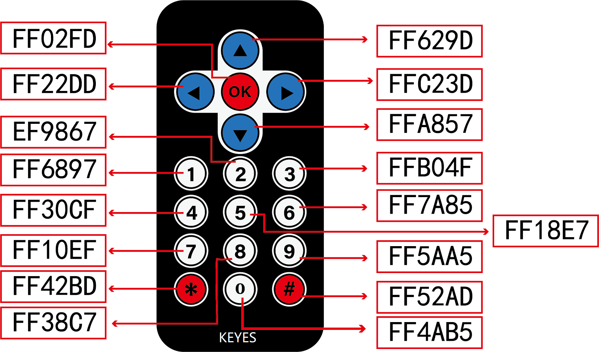

# 项目34 红外遥控控制声音和LED

## 1.项目介绍：
红外遥控是一种低成本、易于使用的无线通信技术。IR光与可见光非常相似，除了它的波长稍长一点。这意味着红外线是人眼无法检测到的，这对于无线通信来说是完美的。例如，当你按下电视遥控器上的一个按钮时，一个红外LED会以每秒38000次的频率反复开关，将信息(如音量或频道控制)传送到电视上的红外感光器。
我们将首先解释常见的红外通信协议是如何工作的。然后我们将从一个遥控器和一个红外接收组件开始这个项目。

## 2.项目元件：
|||||
| :--: | :--: | :--: | :--: |
|ESP32*1|面包板*1|红外接收器*1|RGB LED*1|
|||| |
|有源蜂鸣器*1|220Ω电阻*3|10KΩ电阻*1|红外遥控器*1|
|img-20230412171102.png)||| |
|NPN型晶体管(S8050)*1|1kΩ电阻*1 |USB 线*1| 跳线若干|

## 3.元件知识：                                                                        
**红外(IR)遥控器：** 是一种可以发射红外光信号的设备。按下不同的按钮，位于遥控器前端的红外发射管会发出不同指令的红外线。红外遥控技术应用广泛，如电视、空调等。因此，在当今科技发达社会，红外遥控技术使你切换电视节目和调节空调温度都很方便。
我们使用的遥控器如下所示：
遥控器img-20230414191439.png)

该红外遥控器采用NEC编码。

**红外(IR)接收器：** 它是一种元件，可以接收红外光，所以可以用它来接收红外遥控器发出的红外光信号。红外接收器解调接收到的红外光信号，并将其转换回二进制，然后将信息传递给微控制器。
红外信号调制过程图：


## 4.解码红外信号：
我们按照下面接线图将红外接收元件连接到ESP32。


**如何安装IRremoteESP8266库：**

本项目代码使用了一个名为“<span style="color: rgb(255, 76, 65);">IRremoteESP8266</span>”库。如果已经添加好了“<span style="color: rgb(255, 76, 65);">IRremoteESP8266</span>”库，则跳过此步骤。如果你还没有添加，请在学习之前安装它。添加第三方库的方法请参考“<span style="color: rgb(0, 209, 0);">开发环境设置</span>”。

本项目中使用的代码保存在（即路径)：**..\Keyes ESP32 高级版学习套件\4. Arduino C 教程\2. 树莓派 系统\3. 项目教程\代码集**。你可以把代码移到任何地方。例如，我们将代码保存在Raspberry Pi系统的文件夹pi中，<span style="color: rgb(255, 76, 65);">**路径：../home/pi/代码集**</span>。

可以在此路径下打开代码“**Project_34.1_Decoded_IR_Signal**”。

```
//**********************************************************************************
/*  
 * 文件名  : 解码的红外信号
 * 描述 : 红外遥控器解码后通过串口打印出来.
*/
#include <Arduino.h>
#include <IRremoteESP8266.h>
#include <IRrecv.h>
#include <IRutils.h>

const uint16_t recvPin = 0; // 红外接收引脚
IRrecv irrecv(recvPin);      // 创建用于接收器的类对象
decode_results results;       // 创建解码结果类对象

void setup() {
  Serial.begin(115200);       // 初始化串口，波特率设置为115200
  irrecv.enableIRIn();        // 启动接收器
  Serial.print("IRrecvDemo is now running and waiting for IR message on Pin ");
  Serial.println(recvPin);   //打印红外接收引脚接收到的信号
}

void loop() {
  if (irrecv.decode(&results)) {          // 等待解码
    serialPrintUint64(results.value, HEX);// 打印出解码结果
    Serial.println("");
    irrecv.resume();                      // 释放IRremote。接收下一个值
  }
  delay(1000);
}
//**********************************************************************************

```
编译并上传代码到ESP32，代码上传成功后，利用USB线上电，打开串口监视器，设置波特率为<span style="color: rgb(255, 76, 65);">115200</span>。你会看到的现象是：将红外遥控器发射器对准红外接收头，按下红外控制器上的按键，串口监视器将打印当前接收到的按键编码值。多次按下相同的按键以确保你拥有该按键的正确编码值。如果看到FFFFFFFF，请忽略它。


<span style="color: rgb(255, 76, 65);">注意：</span> 如果上传代码不成功，可以再次点击后用手按住ESP32主板上的Boot键，出现上传进度百分比数后再松开Boot键，如下图所示：


写下红外遥控器与每个按键相关联的按键编码值，因为你稍后将需要这些信息。


## 5. 红外遥控的接线图：


## 6.项目代码：
本项目中使用的代码保存在（即路径)：**..\Keyes ESP32 高级版学习套件\4. Arduino C 教程\2. 树莓派 系统\3. 项目教程\代码集**。你可以把代码移到任何地方。例如，我们将代码保存在Raspberry Pi系统的文件夹pi中，<span style="color: rgb(255, 76, 65);">**路径：../home/pi/代码集**</span>。

可以在此路径下打开代码“**Project_34.2_IR_Control_Sound_And_LED**”。

```
//**********************************************************************************
/*  
 * 文件名  : 红外控制声音和LED
 * 描述 : 红外遥控控制RGB和无源蜂鸣器.
*/
#include <Arduino.h>
#include <IRremoteESP8266.h>
#include <IRrecv.h>
#include <IRutils.h>

const uint16_t recvPin = 0; // 红外接收引脚
IRrecv irrecv(recvPin);      // 创建用于接收器的类对象
decode_results results;       // 创建解码结果类对象

int ledPins[] = {22, 21, 4};    //定义红、绿、蓝引脚
const byte chns[] = {0, 1, 2};        //定义PWM通道
int buzzerPin = 15;  // 蜂鸣器引脚的引脚

void setup() {
  irrecv.enableIRIn();                  // 启动接收器
  pinMode(buzzerPin, OUTPUT);
  for (int i = 0; i < 3; i++) {   //设置pwm通道，1KHz,8bit
    ledcSetup(chns[i], 1000, 8);
    ledcAttachPin(ledPins[i], chns[i]);
  }
}

void loop() {
  if(irrecv.decode(&results)) {        // 等待解码
    handleControl(results.value);       // 处理来自远程控制的命令
    irrecv.resume();                    // 接收下一个值
  }
}

void handleControl(unsigned long value) {
  // 当它接收到命令时发出声音
  digitalWrite(buzzerPin, HIGH);
  delay(100);
  digitalWrite(buzzerPin, LOW);
  // 处理命令
  if (value == 0xFF6897) // 收到数字“1”
  { 
      ledcWrite(chns[0], 255); //普通阴极LED，高电平开启LED.
      ledcWrite(chns[1], 0);
      ledcWrite(chns[2], 0);
      delay(1000);
  }
   else if (value == 0xFF9867) // 收到数字 '2'
   { 
      ledcWrite(chns[0], 0); 
      ledcWrite(chns[1], 255);
      ledcWrite(chns[2], 0);
      delay(1000);
   }
    else if (value == 0xFFB04F) // 收到数字 '3'
   { 
      ledcWrite(chns[0], 0);
      ledcWrite(chns[1], 0);
      ledcWrite(chns[2], 255);
      delay(1000);
    }
    else if (value == 0xFF30CF) // 收到数字 '4'
   {  
      ledcWrite(chns[0], 255);
      ledcWrite(chns[1], 255);
      ledcWrite(chns[2], 0);
      delay(1000);
    }
    else if (value == 0xFF18E7) // 收到数字 '5'
   {  
      ledcWrite(chns[0], 255);
      ledcWrite(chns[1], 0);
      ledcWrite(chns[2], 255);
      delay(1000);
    }
    else if (value == 0xFF7A85)  // 收到数字 '6'
   {  
      ledcWrite(chns[0], 0);
      ledcWrite(chns[1], 255);
      ledcWrite(chns[2], 255);
      delay(1000);
    }
    else if (value == 0xFF10EF)  // 收到数字 '7'
   {   
      ledcWrite(chns[0], 255);
      ledcWrite(chns[1], 255);
      ledcWrite(chns[2], 255);
      delay(1000);
    }
    else{
      ledcWrite(chns[0], 0);
      ledcWrite(chns[1], 0);
      ledcWrite(chns[2], 0);
      delay(1000);
      }
  }
//**********************************************************************************

```
## 8.项目现象：
编译并上传代码到ESP32，代码上传成功后，利用USB线上电，你会看到的现象是：按红外遥控器的1~7键，蜂鸣器都会鸣响一次，同时RGB分别亮红灯，绿灯，蓝灯，黄灯，洋红灯，蓝绿灯，白灯。按其他另一按键（除1-7键以外），RGB熄灭。

<span style="color: rgb(255, 76, 65);">注意：</span> 如果上传代码不成功，可以再次点击后用手按住ESP32主板上的Boot键，出现上传进度百分比数后再松开Boot键，如下图所示：


