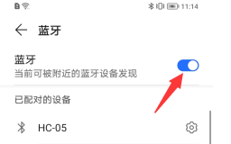
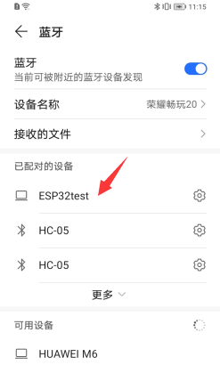

# 项目35 蓝牙

本章主要介绍如何通过ESP32的蓝牙与手机进行简单的数据传输。项目35.1 是常规蓝牙，项目35.2 是蓝牙控制LED。

## 项目35.1 常规蓝牙

### 1. 项目元件：
||||
| :--: | :--: |:--: |
| ESP32*1 | USB 线*1 |智能手机/平板电脑（<span style="color: rgb(255, 76, 65);">自备</span>）*1|

在本项目中，我们需要使用一个名为串口蓝牙终端的蓝牙应用程序来协助实验。如果您还没有安装它，请点击安装：https://www.appsapk.com/serial-bluetooth-terminal/ 。
下面是它的标志。


### 2.元件知识：

蓝牙是一种短距离通信系统，可分为两种类型，即低功耗蓝牙(BLE)和经典蓝牙。简单的数据传输有两种模式：主模式和从模式。
**主模式：** 在这种模式下，工作在主设备上完成，并且可以与从设备连接。我们可以搜索和选择附近的从设备来连接。当设备在主模式下发起连接请求时，需要其他蓝牙设备的地址和配对密码等信息。配对完成后，可直接与它们连接。
**从模式：** 处于从模式的蓝牙模块只能接受来自主机的连接请求，但不能发起连接请求。与主机设备连接后，可以向主机设备发送数据，也可以从主机设备接收数据。蓝牙设备之间可以进行数据交互，一个设备处于主模式，另一个设备处于从模式。当它们进行数据交互时，处于主模式的蓝牙设备会搜索并选择附近要连接的设备。在建立连接时，它们可以交换数据。当手机与ESP32进行数据交换时，手机通常处于主模式，ESP32为从模式。


### 3.项目接线：
使用USB线将ESP32主板连接到电脑上的USB口。


### 4.项目代码：
本项目中使用的代码保存在（即路径)：**..\Keyes ESP32 高级版学习套件\4. Arduino C 教程\2. 树莓派 系统\3. 项目教程\代码集**。你可以把代码移到任何地方。例如，我们将代码保存在Raspberry Pi系统的文件夹pi中，<span style="color: rgb(255, 76, 65);">**路径：../home/pi/代码集**</span>。

可以在此路径下打开代码“**Project_35.1_Classic_Bluetooth**”。

```
//**********************************************************************************
/*
 * 文件名 : 经典的蓝牙
 * 描述 : ESP32通过蓝牙与手机通信，并通过串口打印手机数据
*/
#include "BluetoothSerial.h"

BluetoothSerial SerialBT;
String buffer;
void setup() {
  Serial.begin(115200);
  SerialBT.begin("ESP32test"); //蓝牙设备名称
  Serial.println("\nThe device started, now you can pair it with bluetooth!");
}

void loop() {
  if (Serial.available()) {
    SerialBT.write(Serial.read());
  }
  if (SerialBT.available()) {
    Serial.write(SerialBT.read());
  }
  delay(20);
}
//**********************************************************************************

```

### 5.项目现象：
编译并上传代码到ESP32，上传成功后，打开串行监视器，波特率设置为<span style="color: rgb(255, 76, 65);">115200</span>。当您看到串行打印出字符串，如下所示，表示ESP32的蓝牙已就绪，等待与手机连接。(如果打开串口监视器且设置波特率为115200之后，串口监视器窗口没有显示如下信息，可以按下ESP32的复位键）


<span style="color: rgb(255, 76, 65);">注意：</span> 如果上传代码不成功，可以再次点击后用手按住ESP32主板上的Boot键，出现上传进度百分比数后再松开Boot键，如下图所示：


请确认你的手机已开启手机蓝牙，且已安装“**串口蓝牙终端**”的蓝牙应用程序。



手机自动搜索附近的蓝牙设备，点击“ESP32 test”进行配对，出现配对对话框，点击“**配对**”，这样“ESP32 test”设备就连接好了。




打开软件APP，点击终端左侧。选择 "Devices"。


选择经典蓝牙模式下的ESP32test，会出现如下图所示的连接成功提示。


现在，数据可以通过ESP32在你的手机和电脑之间传输。
在IDE中的文本框输入“Hi!”,当手机收到它的时候，给你的手机回复“Hi!”；手机发送“Hello!”，当电脑收到它的时候，给你的电脑回复“Hello!”。


## 项目35.2 蓝牙控制LED

### 1.项目元件：
|||||
| :--: | :--: | :--: |:--: |
|ESP32*1|面包板*1|红色LED*1|智能手机/平板电脑（<span style="color: rgb(255, 76, 65);">自备</span>）*1|
|| || |
|220Ω电阻*1|跳线*2|USB 线*1| |

### 2.项目接线：


### 3.项目代码：
本项目中使用的代码保存在（即路径)：**..\Keyes ESP32 高级版学习套件\4. Arduino C 教程\2. 树莓派 系统\3. 项目教程\代码集**。你可以把代码移到任何地方。例如，我们将代码保存在Raspberry Pi系统的文件夹pi中，<span style="color: rgb(255, 76, 65);">**路径：../home/pi/代码集**</span>。

可以在此路径下打开代码“**Project_35.2_Bluetooth_Control_LED**”。

```
//**********************************************************************************
/*
 * 文件名  : 蓝牙控制LED
 * 描述 : 手机通过蓝牙控制esp32指示灯.
          当手机发送“LED_on”时，ESP32的LED灯就会亮起.
          当手机发送“LED_off”时，ESP32的LED灯将关闭.
*/
#include "BluetoothSerial.h"
#include "string.h"
#define LED 15
BluetoothSerial SerialBT;
char buffer[20];
static int count = 0;
void setup() {
  pinMode(LED, OUTPUT);
  SerialBT.begin("ESP32test"); //蓝牙设备名称
  Serial.begin(115200);
  Serial.println("\nThe device started, now you can pair it with bluetooth!");
}

void loop() {
  while(SerialBT.available())
  {
    buffer[count] = SerialBT.read();
    count++;
  }
  if(count>0){
    Serial.print(buffer);
    if(strncmp(buffer,"led_on",6)==0){
      digitalWrite(LED,HIGH);
    }
    if(strncmp(buffer,"led_off",7)==0){
      digitalWrite(LED,LOW);
    }
    count=0;
    memset(buffer,0,20);
  }
}
//**********************************************************************************

```

### 4.项目现象：
编译并上传代码到ESP32。APP的操作与**项目35.1**相同，要使外接LED亮灭，只需将发送内容更改为"led_on" 和 "led_off" 即可。移动APP发送的数据：


LED的现象：


<span style="color: rgb(255, 76, 65);">注意：</span> 如果上传代码不成功，可以再次点击后用手按住ESP32主板上的Boot键，出现上传进度百分比数后再松开Boot键，如下图所示：

<br>
<br>
<span style="color: rgb(255, 76, 65);">注意：</span> 如果发送的内容不是 "led_on'或"led_off"，那么LED的状态不会改变。如果LED是亮的，当接收到不相关内容时，LED继续亮；与之对应的是，如果LED是灭的，当接收到不相关内容时，LED继续熄灭。


