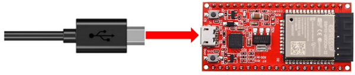
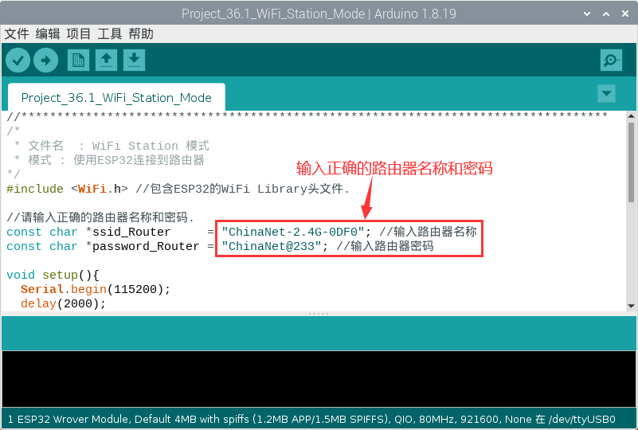
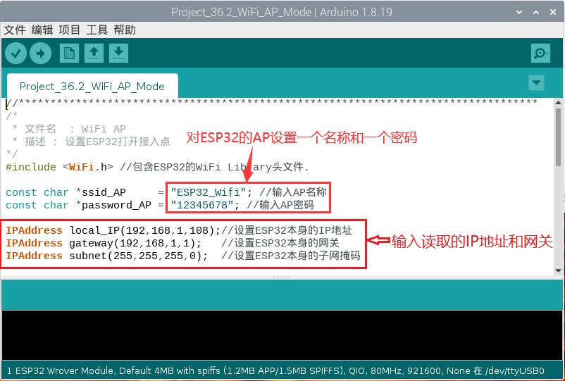
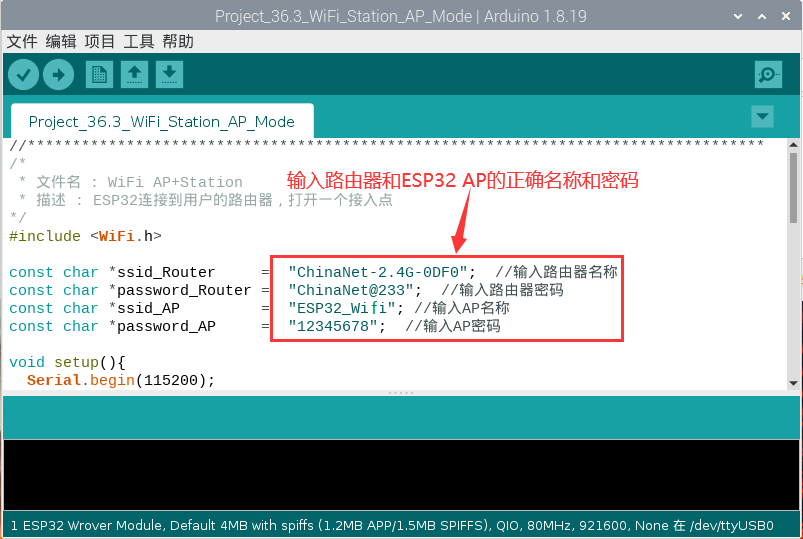

# 项目36 WiFi 工作模式

在如今科技高速发展的时代，人们的生活质量越来越好，生活节奏越来越快，开始有人觉得复杂多样的智能化设备控制起来十分麻烦，通过手机统一控制智能化设备这种方法逐渐得到了人们的青睐。这种方法是利用单片机通过wifi模块和Internet网络建立手机和智能化设备之间的连接以此来实现对智能化设备的远程控制。在本章中，我们将重点关注ESP32的WiFi基础设施。ESP32有3种不同的WiFi工作模式：Station模式、AP模式和AP+Station模式。所有WiFi编程项目在使用WiFi前必须配置WiFi运行模式，否则无法使用WiFi。

## 项目36.1: WIFI Station 模式

### 1.实验元件：
|||
| :--: | :--: |
| USB 线 x1|ESP32x1|

## 2.实验接线：
使用USB线将ESP32主板连接到电脑上的USB口。


## 3.元件知识： 
**Station 模式：** 当ESP32选择Station模式时，它作为一个WiFi客户端。它可以连接路由器网络，通过WiFi连接与路由器上的其他设备通信。如下图所示，PC和路由器已经连接，ESP32如果要与PC通信，需要将PC和路由器连接起来。


## 4.项目代码：
本项目中使用的代码保存在（即路径)：**..\Keyes ESP32 高级版学习套件\4. Arduino C 教程\2. 树莓派 系统\3. 项目教程\代码集**。你可以把代码移到任何地方。例如，我们将代码保存在Raspberry Pi系统的文件夹pi中，<span style="color: rgb(255, 76, 65);">**路径：../home/pi/代码集**</span>。

可以在此路径下打开代码“**Project_36.1_WiFi_Station_Mode**”。

```
//**********************************************************************************
/*
 * 文件名  : WiFi Station 模式
 * 模式 : 使用ESP32连接到路由器
*/
#include <WiFi.h> //包含ESP32的WiFi Library头文件.

//请输入正确的路由器名称和密码.
const char *ssid_Router     = "ChinaNet-2.4G-0DF0"; //输入路由器名称
const char *password_Router = "ChinaNet@233"; //输入路由器密码

void setup(){
  Serial.begin(115200);
  delay(2000);
  Serial.println("Setup start");
  WiFi.begin(ssid_Router, password_Router);//将ESP32设置为“Station 模式”，并连接到路由器。
  Serial.println(String("Connecting to ")+ssid_Router);
//每0.5s检查ESP32是否连接路由器成功.  
  while (WiFi.status() != WL_CONNECTED){
    delay(500);
    Serial.print(".");
  }
  Serial.println("\nConnected, IP address: ");
  Serial.println(WiFi.localIP());//串行监视器打印出分配给ESP32的IP地址.
  Serial.println("Setup End");
}
 
void loop() {
}
//**********************************************************************************

```
由于各地的WiFi名称和密码是不同，所以在程序代码运行之前，用户需要在下图所示的框中输入正确的WiFi名称和密码。


## 5.项目现象：
确认正确输入WiFi名称和密码后，编译并上传代码到ESP32主板，上传成功后，打开串口监视器，设置波特率为<span style="color: rgb(255, 76, 65);">115200</span>。当ESP32成功连接到ssid_Router时，串行监视器将打印出WiFi分配给ESP32的IP地址。然后串口监视器窗口将显示如下：(如果打开串口监视器且设置波特率为115200之后，串口监视器窗口没有显示如下信息，可以按下ESP32的复位键）


<span style="color: rgb(255, 76, 65);">注意：</span> 如果上传代码不成功，可以再次点击后用手按住ESP32主板上的Boot键，出现上传进度百分比数后再松开Boot键，如下图所示：


## 项目36.2：WIFI AP 模式

## 1.实验元件&接线：
实验元件和实验接线与上面的**项目36.1: WIFI Station 模式**相同。

## 2.元件知识：
**AP模式：** 当ESP32选择AP模式时，会创建一个独立于Internet的热点网络，等待其他WiFi设备连接。如下图所示，以ESP32为热点。如果手机或PC需要与ESP32通信，则必须连接到ESP32的热点。只有通过ESP32建立连接后才能进行通信。


## 3.项目代码：
本项目中使用的代码保存在（即路径)：**..\Keyes ESP32 高级版学习套件\4. Arduino C 教程\2. 树莓派 系统\3. 项目教程\代码集**。你可以把代码移到任何地方。例如，我们将代码保存在Raspberry Pi系统的文件夹pi中，<span style="color: rgb(255, 76, 65);">**路径：../home/pi/代码集**</span>。

可以在此路径下打开代码“**Project_36.2_WiFi_AP_Mode**”。

```
//**********************************************************************************
/*
 * 文件名  : WiFi AP
 * 描述 : 设置ESP32打开接入点
*/
#include <WiFi.h> //包含ESP32的WiFi Library头文件.

const char *ssid_AP     = "ESP32_Wifi"; //输入AP名称
const char *password_AP = "12345678"; //输入AP密码

IPAddress local_IP(192,168,1,108);//设置ESP32本身的IP地址
IPAddress gateway(192,168,1,1);   //设置ESP32本身的网关
IPAddress subnet(255,255,255,0);  //设置ESP32本身的子网掩码

void setup(){
  Serial.begin(115200);
  delay(2000);
  Serial.println("Setting soft-AP configuration ... ");
  WiFi.disconnect();
  WiFi.mode(WIFI_AP);
  Serial.println(WiFi.softAPConfig(local_IP, gateway, subnet) ? "Ready" : "Failed!");
  Serial.println("Setting soft-AP ... ");
  boolean result = WiFi.softAP(ssid_AP, password_AP);
  if(result){
    Serial.println("Ready");
    Serial.println(String("Soft-AP IP address = ") + WiFi.softAPIP().toString());
    Serial.println(String("MAC address = ") + WiFi.softAPmacAddress().c_str());
  }else{
    Serial.println("Failed!");
  }
  Serial.println("Setup End");
}
 
void loop() {
}
//**********************************************************************************

```
在程序代码运行之前，你可以像下图所示对框中ESP32的AP名称和密码进行任何更改。当然，在默认情况下，你也可以不修改它。


## 4.项目现象：
正确输入ESP32的AP名称和密码，编译并上传代码到ESP32主板，上传成功后，打开串口监视器，设置波特率为<span style="color: rgb(255, 76, 65);">115200</span>。然后串口监视器窗口将显示如下：(如果打开串口监视器且设置波特率为115200之后，串口监视器窗口没有显示如下信息，可以按下ESP32的复位键）


<span style="color: rgb(255, 76, 65);">注意：</span> 如果上传代码不成功，可以再次点击后用手按住ESP32主板上的Boot键，出现上传进度百分比数后再松开Boot键，如下图所示：

<br>
<br>
观察串口监视器打印信息时，打开手机WiFi扫描功能，可以看到ESP32上的ssid_AP被调用，在本程序代码中称为“ESP32_Wifi”。你可以输入密码“12345678”连接它，也可以通过修改程序代码来修改它的AP名称和密码。


## 项目36.3：WIFI AP+Station模式

## 1.实验元件&接线：
实验元件和实验接线与上面的**项目36.1: WIFI Station 模式**和**项目36.2: WIFI AP 模式**相同。
## 2.元件知识：

**AP+Station模式：** ESP32除AP模式和Station模式外，还可以同时使用AP模式和Station模式。此模式包含前两种模式的功能。打开ESP32的Station模式，将其连接到路由器网络，它可以通过路由器与Internet通信。同时开启其AP模式，创建热点网络。其他WiFi设备可以选择连接路由器网络或热点网络与ESP32通信。

## 3.项目代码：
本项目中使用的代码保存在（即路径)：**..\Keyes ESP32 高级版学习套件\4. Arduino C 教程\2. 树莓派 系统\3. 项目教程\代码集**。你可以把代码移到任何地方。例如，我们将代码保存在Raspberry Pi系统的文件夹pi中，<span style="color: rgb(255, 76, 65);">**路径：../home/pi/代码集**</span>。

可以在此路径下打开代码“**Project_36.3_WiFi_Station_AP_Mode**”。

```
//**********************************************************************************
/*
 * 文件名 : WiFi AP+Station
 * 描述 : ESP32连接到用户的路由器，打开一个接入点
*/
#include <WiFi.h>
 
const char *ssid_Router     =  "ChinaNet-2.4G-0DF0";  //输入路由器名称
const char *password_Router =  "ChinaNet@233";  //输入路由器密码
const char *ssid_AP         =  "ESP32_Wifi"; //输入AP名称
const char *password_AP     =  "12345678";  //输入AP密码

void setup(){
  Serial.begin(115200);
  Serial.println("Setting soft-AP configuration ... ");
  WiFi.disconnect();
  WiFi.mode(WIFI_AP);
  Serial.println("Setting soft-AP ... ");
  boolean result = WiFi.softAP(ssid_AP, password_AP);
  if(result){
    Serial.println("Ready");
    Serial.println(String("Soft-AP IP address = ") + WiFi.softAPIP().toString());
    Serial.println(String("MAC address = ") + WiFi.softAPmacAddress().c_str());
  }else{
    Serial.println("Failed!");
  }
  
  Serial.println("\nSetting Station configuration ... ");
  WiFi.begin(ssid_Router, password_Router);
  Serial.println(String("Connecting to ")+ ssid_Router);
  while (WiFi.status() != WL_CONNECTED){
    delay(500);
    Serial.print(".");
  }
  Serial.println("\nConnected, IP address: ");
  Serial.println(WiFi.localIP());
  Serial.println("Setup End");
}

void loop() {
}
//**********************************************************************************

```
它类似于上面的**项目36.1**和**项目36.2**。在运行代码之前，你需要修改ssid_Router、password_Router、ssid_AP和password_AP，如下图中的红色框所示。


## 4.项目现象：
确认程序代码修改正确后，编译并上传代码到 ESP32主板上，上传成功后，打开串口监视器，设置波特率为<span style="color: rgb(255, 76, 65);">115200</span>。然后串口监视器窗口将显示如下：(如果打开串口监视器且设置波特率为115200之后，串口监视器窗口没有显示如下信息，可以按下ESP32的RESET键）


打开手机的WiFi搜索功能，可以在ESP32上看到ssid_AP被调用。


<span style="color: rgb(255, 76, 65);">注意：</span> 如果上传代码不成功，可以再次点击后用手按住ESP32主板上的Boot键，出现上传进度百分比数后再松开Boot键，如下图所示：


