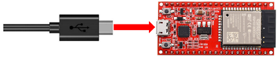
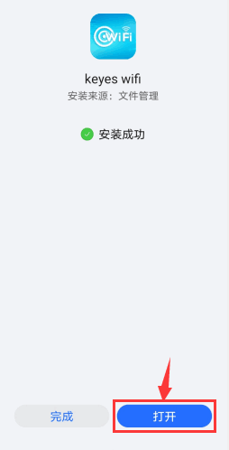

# 项目37 WiFi 测试

## 1.实验简介：
在本实验中，我们先使用ESP32的WiFi Station模式读取WiFi的IP地址，然后通过APP连接WiFi来读取APP上各功能按钮发送的字符。

## 2.实验元件
||||
| :--: | :--: | :--: |
| ESP32*1 | USB 线*1 |智能手机/平板电脑(<span style="color: rgb(255, 76, 65);">自备</span>)*1|

## 3.实验接线：
使用USB线将ESP32主板连接到电脑上的USB口。


## 4.安装APP:

### (1) 安卓系统设备（手机/平板）APP：
我们提供了Android APP 的安装包：


**安装步骤：**

A. 现将文件夹中的**keyes wifi.apk**文件转移到安卓系统手机或平板电脑上。

或者用安卓系统手机/平板电脑的浏览器中的扫码功能扫下面的二维码。


B. 点击keyes wifi.apk文件进入安装页面，点击“**允许**”按钮，然后点击“**安装**”按钮，过一会儿，安装完成后点击“**打开**”按钮就可以进入APP界面。





### (2) IOS系统设备（手机/iPad）APP

a. 打开App Store。


b.在搜索框输入**keyes link**，点击搜索，出现下载界面，点击“”，就可以下载安装**keyes link**的APP。接下来的操作和安卓系统类似的，可以参考上面安卓系统的步骤进行操作。

## 3.项目代码：
本项目中使用的代码保存在（即路径)：**..\Keyes ESP32 高级版学习套件\4. Arduino C 教程\2. 树莓派 系统\3. 项目教程\代码集**。你可以把代码移到任何地方。例如，我们将代码保存在Raspberry Pi系统的文件夹pi中，<span style="color: rgb(255, 76, 65);">**路径：../home/pi/代码集**</span>。

可以在此路径下打开代码“**Project_37_WiFi_Test**”。

```
//**********************************************************************************
/*
 * 文件名   : WIFI 测试
 * 描述 : Wifi模块测试Wifi ip
*/

#include <Arduino.h>
#include <WiFi.h>
#include <ESPmDNS.h>
#include <WiFiClient.h>

String item = "0";
const char* ssid = "ChinaNet-2.4G-0DF0";
const char* password = "ChinaNet@233";
WiFiServer server(80);

void setup() {
  Serial.begin(115200);
  WiFi.begin(ssid, password);
  while (WiFi.status() != WL_CONNECTED) {
    delay(500);
    Serial.print(".");
  }
  Serial.println("");
  Serial.print("Connected to ");
  Serial.println(ssid);
  Serial.print("IP address: ");
  Serial.println(WiFi.localIP());
  server.begin();
  Serial.println("TCP server started");
  MDNS.addService("http", "tcp", 80);
}

void loop() {
  WiFiClient client = server.available();
  if (!client) {
      return;
  }
  while(client.connected() && !client.available()){
      delay(1);
  }
  String req = client.readStringUntil('\r');
  int addr_start = req.indexOf(' ');
  int addr_end = req.indexOf(' ', addr_start + 1);
  if (addr_start == -1 || addr_end == -1) {
      Serial.print("Invalid request: ");
      Serial.println(req);
      return;
  }
  req = req.substring(addr_start + 1, addr_end);
  item=req;
  Serial.println(item);
  String s;
  if (req == "/")
  {
      IPAddress ip = WiFi.localIP();
      String ipStr = String(ip[0]) + '.' + String(ip[1]) + '.' + String(ip[2]) + '.' + String(ip[3]);
      s = "HTTP/1.1 200 OK\r\nContent-Type: text/html\r\n\r\n<!DOCTYPE HTML>\r\n<html>Hello from ESP32 at ";
      s += ipStr;
      s += "</html>\r\n\r\n";
      Serial.println("Sending 200");
      client.println(s);
  }
  //client.print(s);
  client.stop();
}
//**********************************************************************************

```
<span style="color: rgb(255, 76, 65);">特别注意：</span>需要先将实验代码中的用户Wifi名称和用户Wifi密码改成你们自己的Wifi名称和Wifi密码。

## 5.实验现象
确认程序代码中的Wifi名称和Wifi密码修改正确后，编译并上传代码到 ESP32主板上。
<span style="color: rgb(255, 76, 65);">注意：</span> 如果上传代码不成功，可以再次点击后用手按住ESP32主板上的Boot键，出现上传进度百分比数后再松开Boot键，如下图所示：


打开串口监视器，设置波特率为<span style="color: rgb(255, 76, 65);">115200</span>，这样，串口监视器打印检测到的WiFi IP地址，然后打开WiFi APP。 在WIFI按钮前面的文本框中输入检测到的WIFI IP地址（<span style="color: rgb(255, 76, 65);">例如，下上面串口监视器检测到的IP地址：192.168.1.136</span>），再点击WIFI按钮，“403 Forbidden”或“网页无法打开”就会变成“192.168.1.136”。这样，就说明APP已经连接上了WIFI。


用手分别点击APP上的各个功能按钮，然后串口监视器会打印接收到的对应字符。


**注意：** 如果打开串口监视器且设置波特率为115200之后，串口监视器窗口没有显示如上信息，可以按下ESP32的复位键）

