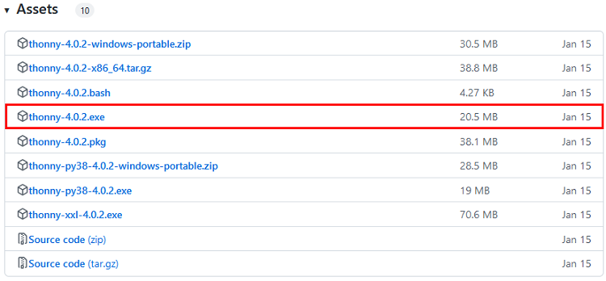
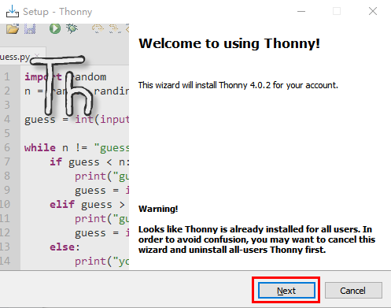
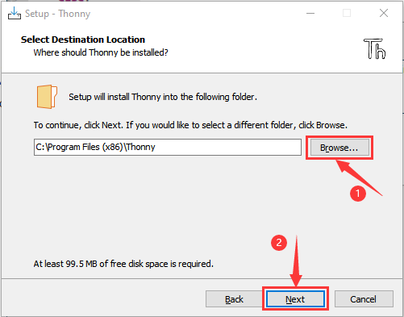
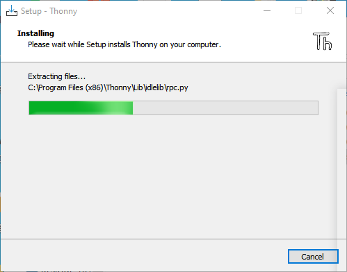
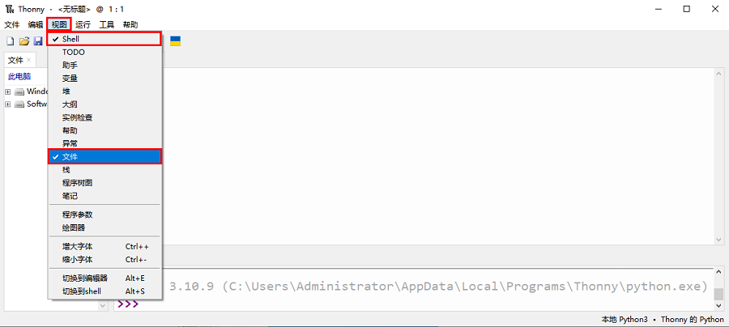
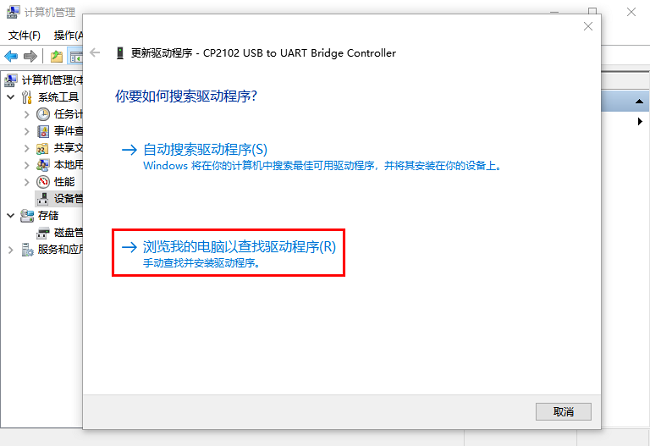
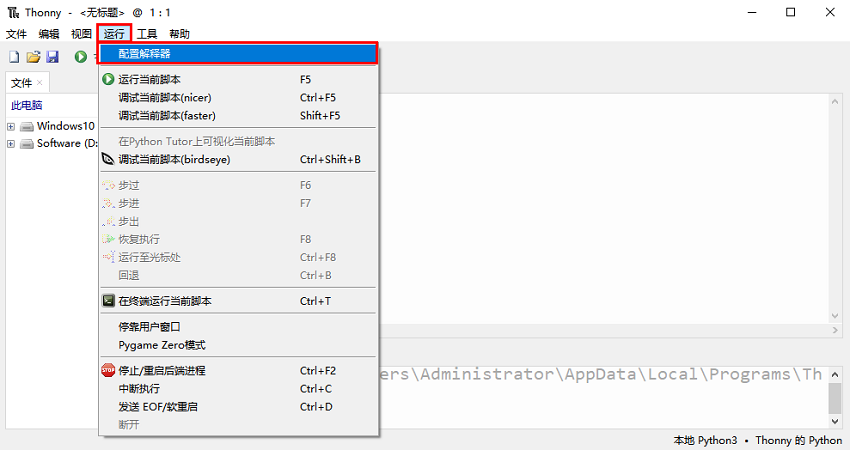
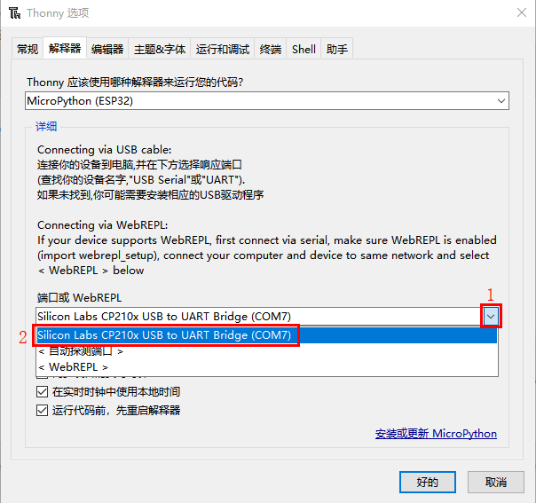
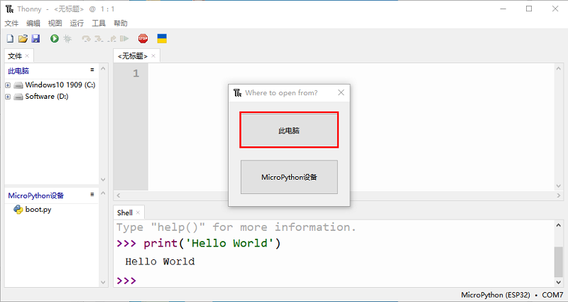

# 开发环境设置

在开始构建项目之前，你需要首先做一些准备，这是非常重要的，你不能跳过。
## 一、安装Thonny(重要)：
Thonny是一个免费、开源的软件平台，体积小，界面简单，操作简单，功能丰富，是一个适合初学者的Python IDE。在本教程中，我们使用这个IDE在整个过程中开发ESP32。Thonny支持多种操作系统，包括Windows, Mac OS,  Linux。
### 1.下载Thonny软件：
(1) 进入软件官网：https://thonny.org 下载Thonny软件，最好下载最新版的，否则可能不支持ESP32.
(2) Thonny的开源代码库：https://github.com/thonny/thonny
请按照官网的指导安装或点击下面的链接下载安装。(请根据您的操作系统选择相应的选项.)
|操作系统|下载链接/方法|
| :--: | :--: |
|MAC OS：|https://github.com/thonny/thonny/releases/download/v3.2.7/thonny-3.2.7.pkg|
|Windows：|https://github.com/thonny/thonny/releases/download/v3.2.7/thonny-3.2.7.exe|
|Linux：|最新版本:(如下)
```
Binary bundle for PC (Thonny+Python): 
bash <(wget -O - https://thonny.org/installer-for-linux) 
With pip:
pip3 install thonny
Distro packages (may not be the latest version):
Debian, Rasbian, Ubuntu, Mint and others:
sudo apt install thonny
Fedora:
sudo dnf install thonny
```
|




### 2.Windows上安装Thonny软件：
A.下载后的Thonny图标如下。


B.双击“thonny-4.0.2.exe”，会出现下面对话框，我这里是选择“”进行操作的。你也可以选择“”进行操作的。


C.如果您不熟悉电脑软件安装，您可以一直单击“**Next**”直到安装完成。



D.如果您需要更改Thonny软件的安装路径，可以单击“**Browse...**”进行修改。选择安装路径后，单击“**OK**”。
如果您不想更改安装路径，只需单击“**Next**”；然后又继续单击“**Next**”。



E.选中“**Create desktop icon**”，Thonny软件会在你的桌面上生成一个快捷方式，方便你稍后打开Thonny软件。


F.单击“**Install**”安装软件。


G.在安装过程中，您只需等待安装完成，千万不要点击“**Cancel**”，否则将无法安装成功。


H.一旦看到如下界面，就表示已经成功安装了Thonny软件，点击“**Finish**”就可以。


I.如果你在安装过程中选择了“**Create desktop icon**”，则可以在桌面上看到如下图标。


## 二、Thonny软件基本配置                                          
A.双击Thonny软件的桌面图标，可以看到如下界面，同时还可以进行语言选择(<span style="color: rgb(255, 76, 65);">这里选择简体中文</span>)和初始设置。设置完了点击“**Let’s go！**”。


B.选择“**视图**”→“**文件**”和“**Shell**”。



## 三、安装CP2102驱动：
ESP32通过CP2102驱动下载代码。所以在使用它之前，我们需要在计算机中安装CP2102驱动程序。
### Windows 系统

#### 检查CP2102驱动是否已经安装
1. 用USB线连接计算机和ESP32。


2. 进入计算机主界面，选择“**此电脑**”，右键单击选择“**管理**”。


3.单击“**设备管理器**”。如果你的计算机已经安装了CP2102驱动，则可以看到“**Silicon Labs CP210x USB to UART Bridge(COMx)**”。


#### 安装CP2102驱动
1. 如果未安装CP2102驱动，界面显示如下。


2.单击“**CP2102 USB to UART Bridge Controller**”，右键选择“**更新驱动程序(P)**”。


3.单击“**浏览我的电脑以查找驱动程序(R) **”.


4.单击“浏览(R)...”选择CP210x_6.7.4(驱动路径：**..\Python 教程\1. 开发环境设置\CP2102 驱动文件-Windows**)，单击“**下一页**”


5. 等待CP2102驱动安装完成。当界面显示如下时，表示已安装CP2102驱动。你可以关闭该界面。


6.ESP32与计算机连接时，界面显示如下。


### MAC 系统
安装CP2102驱动方法请参照文档“开发环境设置”，路径：**..\4. Arduino C 教程\1. Windows 系统\1. 开发环境设置**


## 四、烧入Micropython固件(重要)
要在ESP32主板上运行Python程序，我们需要先将固件烧入到ESP32主板。
### 下载Micropython固件
microPython官方网站：http://micropython.org/
网页列出microPython的ESP32固件：https://micropython.org/download/esp32/


本教程中使用的固件是：esp32-20210902-v1.19.bin

我们的文件夹中也提供了这个固件：“**..\3. Python 教程\1. Windows 系统\1. 开发环境设置\Python_固件**”。


### 烧入Micropython固件
用USB线连接计算机和ESP32主板。


确保驱动程序已成功安装，并能正确识别COM端口。打开设备管理器并展开“**端口(COM和LPT)**”。


<span style="color: rgb(255, 76, 65);">注意：不同的电脑，COM端口可能不同，这是正常情况。</span>
<br>
<br>

1. 打开Thonny，点击“**运行**” ，选择 “**配置解释器**”


2.选中“**MicroPython (ESP32)**”，选中“**Silicon Labs CP210x USB to UART Bridge(COM7)**”，然后点击“**安装或更新MicroPython**”。




3.弹出如下对话框，“**Port**”选择“**Silicon Labs CP210x USB to UART Bridge(COM7)**”，单击“**Browse...**”选择之前准备好的microPython固件<span style="color: rgb(0, 209, 0);">esp32-20220618-v1.19.1.bin</span>。检查“Erase flash before installing”和“Flash mode”，然后点击“**安装**”，等待安装完成提示。（<span style="color: rgb(255, 76, 65);">注意：如果安装固件失败，请再次点击“**安装**”，然后按住ESP32主板上的Boot键，出现上传进度百分比再松开Boot键。</span>）


4.等待安装完成。安装完成后先点击“**关闭**”再点击“**好的**”就行。


5.关闭所有对话框，转到主界面，点击“”。如下图所示：


6.到目前为止，一切准备工作都已就绪。

## 五、测试代码：
### 测试Shell命令
在“Shell”窗口中输入“print('hello world')”并按Enter键。


### 在线运行
ESP32需要连接到计算机时，它是在线运行。用户可以使用Thonny编写和调试程序。

1. 打开Thonny并单击“打开”。


2.在新弹出的窗口中，单击“**此电脑**”。


在新的对话框中，在路径：“..\Keyes ESP32 高级版学习套件\3. Python 教程\1. Windows 系统\2. 项目教程\项目01 Hello World” 中选择“**Project_01_HelloWorld.py**”。


单击, “Hello World”将在“Shell”窗口中打印出来。


<span style="color: rgb(255, 76, 65);">注意：</span>在线运行时，如果按下ESP32的复位键，用户的代码将不会再次执行。

## 六、Thonny常见的操作：
本教程中使用的代码保存在（即路径）：
“**..\Keyes ESP32 高级版学习套件\3. Python 教程\1. Windows 系统\2. 项目教程**”。

你可以把代码移到任何地方。例如，我们将代码保存在**D盘**中，<span style="color: rgb(0, 209, 0);">路径为D:\2. 项目教程</span>。


### 上传代码到ESP32
为了方便起见，我们以“**项目10 8×8点阵屏**”为例。在“**项目10 8×8点阵屏**”文件夹中选择“ht16k33\.py”，右键单击鼠标，选择“**上传到/**”将代码上传到ESP32的根目录中。


### 下载代码到电脑
在“MicroPython 设备”中选择“boot\.py”，右键选择“**下载到…**”把代码下载到你的电脑里。


### 删除ESP32根目录下的文件
在“MicroPython 设备”中选择“ht16k33\.py”，右键单击它且选择“**删除**”，将“ht16k33\.py”从ESP32的根目录中删除。


