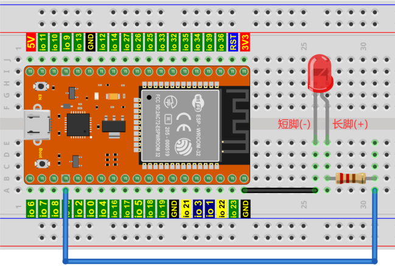
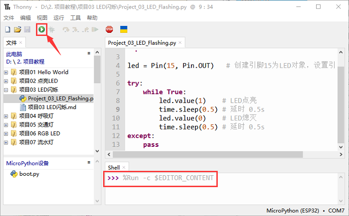

# 项目03 LED闪烁

## 1.项目介绍：
在这个项目中，我们将向你展示LED闪烁效果。我们使用ESP32的数字引脚打开LED，让它闪烁。

## 2.项目元件：
||||
| :--: | :--: | :--: |
|ESP32*1|面包板*1|红色LED*1|
|| ||
|220Ω电阻*1|跳线*2|USB 线*1|

## 3.项目接线图：
首先，切断ESP32的所有电源。然后根据电路图和接线图搭建电路。电路搭建好并验证无误后，用USB线将ESP32连接到电脑上。
<span style="color: rgb(255, 76, 65);">注意：</span>避免任何可能的短路(特别是连接3.3V和GND)!
<span style="color: rgb(255, 76, 65);">警告：短路可能导致电路中产生大电流，造成元件过热，并对硬件造成永久性损坏。 </span>



<span style="color: rgb(255, 76, 65);">注意: </span>

怎样连接LED 

怎样识别五色环220Ω电阻


## 4.项目代码：
本教程中使用的代码保存在：
“**..\Keyes ESP32 高级版学习套件\3. Python 教程\1. Windows 系统\2. 项目教程**”的路径中。

你可以把代码移到任何地方。例如，我们将代码保存在**D盘**中，<span style="color: rgb(0, 209, 0);">路径为D:\2. 项目教程</span>。


打开“Thonny”软件，点击“此电脑”→“D:”→“2. 项目教程”→“项目03 LED闪烁”。并鼠标左键双击“Project_03_LED_Flashing.py”。


```
from machine import Pin
import time

led = Pin(15, Pin.OUT)   # 创建引脚15为LED对象，设置引脚15为输出

try:
    while True:
        led.value(1)    # LED点亮
        time.sleep(0.5) # 延时 0.5s
        led.value(0)    # LED熄灭
        time.sleep(0.5) # 延时 0.5s
except:
    pass

```
## 5.项目现象：
确保ESP32已经连接到电脑上，单击。


单击“”，代码开始执行，你会看到的现象是：电路中的LED开始闪烁。按“Ctrl+C”或单击“”退出程序。



