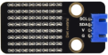

 # 项目10 8×8点阵屏

## 1.项目介绍：
点阵屏是一种电子数字显示设备，可以显示机器、钟表、公共交通离场指示器和许多其他设备上的信息。在这个项目中，我们将使用ESP32控制8x8 LED点阵来显示图案。

## 2.项目元件：
||||
| :--: | :--: | :--: |
|ESP32*1|面包板*1|8×8点阵屏*1|
||| |
|4P转杜邦线公单*1|USB 线*1| |

## 3.元件知识：
**8×8点阵屏模块：** 8×8的点阵由64个LED组成，每个LED被放置在一排和一列的交叉点上。利用单片机驱动一个8×8点阵时，我们总共需要用到16个数字口，这样就极大的浪费单片机资料。为此，我们特别设计了这个模块，利用HT16K33芯片驱动1个8×8点阵，只需要利用单片机的I2C通信端口控制点阵，大大的节约了单片机资源。


**8×8点阵屏模块规格参数：**
工作电压：DC 5V
工作电流：≤200MA
最大功率：1W

**8×8点阵屏模块原理：**
如原理图所示，如果想要点亮第一行第一列的LED灯，只需要把C1置高电平，R1置低电平，它就亮了。如果我们想让第一行led全部点亮，那么我们让R1为低电平，C1~C8全部为高电平就可以了，原理非常简单。但是这样的话我们总共需要用到16个IO口，这样就极大的浪费单片机资源。为此，我们特别设计了这个模块，利用HT16K33芯片驱动1个8*8点阵，只需要利用单片机的I2C通信端口控制点阵，大大的节约了单片机资源。

有些模块上自带3个拨码开关，可以让你随意拨动开关，这是用来设置I2C通信地址的，设置方法如下表格。我们的这个模块中，模块已经固定了通信地址，A0，A1，A2全部接地，即地址为0x70。


## 4.项目接线图：


## 5.项目代码：
本教程中使用的代码保存在：
“**..\Keyes ESP32 高级版学习套件\3. Python 教程\1. Windows 系统\2. 项目教程**”的路径中。

你可以把代码移到任何地方。例如，我们将代码保存在**D盘**中，<span style="color: rgb(0, 209, 0);">路径为D:\2. 项目教程</span>。


打开“Thonny”软件，点击“此电脑”→“D:”→“2. 项目教程”→“项目10 8×8点阵屏”。分别选择“ht16k33matrix\.py”和“ht16k33\.py”，右击鼠标选择“上传到/”，等待“ht16k33matrix\.py”和“ht16k33\.py”被上传到ESP32，然后鼠标左键双击“Project_10_8×8_Dot_Matrix_Display.py”。


```
# 导入库
import utime as time
from machine import I2C, Pin, RTC
from ht16k33matrix import HT16K33Matrix

# 常量
DELAY = 0.01
PAUSE = 3

# 启动
if __name__ == '__main__':
    i2c = I2C(scl=Pin(22), sda=Pin(21))
    display = HT16K33Matrix(i2c)
    display.set_brightness(2)

    # 在点阵屏上绘制一个自定义图标
    icon = b"\x00\x66\x00\x00\x18\x42\x3c\x00"
    display.set_icon(icon).draw()
    # 旋转图标
    display.set_angle(0).draw()
    time.sleep(PAUSE)
```

## 6.项目现象：
确保ESP32已经连接到电脑上，单击。


单击，代码开始执行，你会看到的现象是：8*8点阵屏显示“笑脸”图案。按“Ctrl+C”或单击退出程序。


