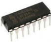
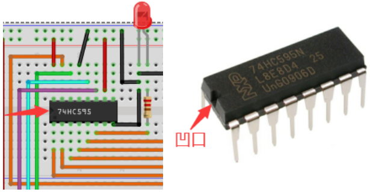
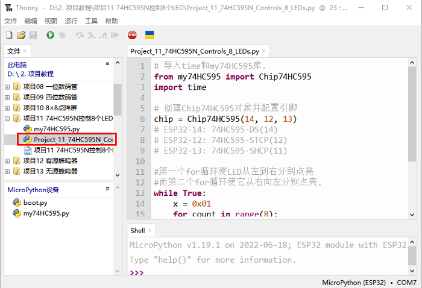

# 项目11 74HC595N控制8个LED

## 1.项目介绍：
在之前的项目中，我们已经学过了怎样点亮一个LED。
ESP32上只有32个IO端口，我们如何点亮大量的led呢? 有时可能会耗尽ESP32上的所有引脚，这时候就需要用移位寄存器扩展它。你可以使用74HC595N芯片一次控制8个输出，而只占用你的微控制器上的几个引脚。你还可以将多个寄存器连接在一起，以进一步扩展输出，在这个项目中，我们将使用ESP32，74HC595芯片和LED制作一个流水灯来了解74HC595芯片的功能。

## 2.项目元件：
|||||
| :--: | :--: | :--: | :--: |
|ESP32*1|面包板*1|74HC595N芯片*1|红色LED*8|
|| || |
|220Ω电阻*8|跳线若干|USB 线*1| |

## 3.元件知识：


**74HC595N芯片：** 简单来说就是具有8 位移位寄存器和一个存储器，以及三态输出功能。移位寄存器和存储器同步于不同的时钟，数据在移位寄存器时钟SCK的上升沿输入，在存储寄存器时钟RCK的上升沿进入的存储寄存器中去。如果两个时钟连在一起，则移位寄存器总是比存储寄存器早一个脉冲。移位寄存器有一个串行移位输入端（SI）和一个用于级联的串行输出端（SQH）,8位移位寄存器可以异步复位（低电平复位），存储寄存器有一个8位三态并行的总线输出，当输出使能（OE）被使能（低电平有效）将存储寄存器中输出至74HC595N的引脚（总线）。

**引脚说明：**
| 引脚： | 引脚说明： |
| :--: | :--: |
| 13引脚OE|	是一个输出使能引脚，用于确保锁存器的数据是否输入到Q0-Q7引脚。在低电平时，不输出高电平。在本实验中，我们直接连接GND，保持低电平输出数据。|
|14引脚SI/DS|这是74HC595接收数据的引脚，即串行数据输入端，一次只能输入一位，那么连续输入8次，就可以组成一个字节了。|
|10引脚SCLR/MR|一个初始化存储寄存器管脚的管脚。在低电平时初始化内部存储寄存器。在这个实验中，我们连接VCC以保持高水平。|
|11引脚SCK/SH_CP|移位寄存器的时钟引脚，上升沿时，移位寄存器中的数据整体后移，并接收新的数据输入。|
|12引脚RCK/ST_CP|存储寄存器的时钟输入引脚。上升沿时，数据从移位寄存器转存到存储寄存器中。这时数据就从Q0~Q7端口并行输出。|
|9引脚SQH|引脚是一个串行输出引脚，专门用于芯片级联，接下一个74HC595的SI端。|
|Q0--Q7(15引脚，1-7引脚)|八位并行输出端，可以直接控制数码管的8个段。|

## 4.项目接线图：
<span style="color: rgb(255, 76, 65);">注意：</span>需要注意74HC595N芯片插入的方向。



## 5.项目代码：
本教程中使用的代码保存在：
“**..\Keyes ESP32 高级版学习套件\3. Python 教程\1. Windows 系统\2. 项目教程**”的路径中。

你可以把代码移到任何地方。例如，我们将代码保存在**D盘**中，<span style="color: rgb(0, 209, 0);">路径为D:\2. 项目教程</span>。


打开“Thonny”软件，点击“此电脑”→“D:”→“2. 项目教程”→“项目11 74HC595N控制8个LED”。选择“my74HC595\.py”，鼠标右键单击选择 “上传到/”，等待“my74HC595\.py”被上传到ESP32，然后鼠标左键双击“Project_11_74HC595N_Controls_8_LEDs.py”。



```
# 导入time和my74HC595库.
from my74HC595 import Chip74HC595
import time

# 创建Chip74HC595对象并配置引脚
chip = Chip74HC595(14, 12, 13)
# ESP32-14: 74HC595-DS(14)
# ESP32-12: 74HC595-STCP(12)
# ESP32-13: 74HC595-SHCP(11)

#第一个for循环使LED从左到右分别点亮
#而第二个for循环使它从右向左分别点亮.
while True:
    x = 0x01
    for count in range(8):
        chip.shiftOut(1, x)
        x = x<<1;
        time.sleep_ms(300)
    x = 0x01
    for count in range(8):
        chip.shiftOut(0, x)
        x = x<<1
        time.sleep_ms(300)
```
## 6.项目现象：
确保ESP32已经连接到电脑上，单击。


单击，代码开始执行，你会看到的现象是：8个LED开始以流水模式闪烁。按“Ctrl+C”或单击退出程序。


