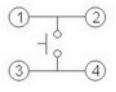
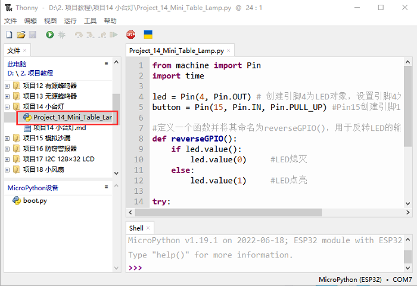
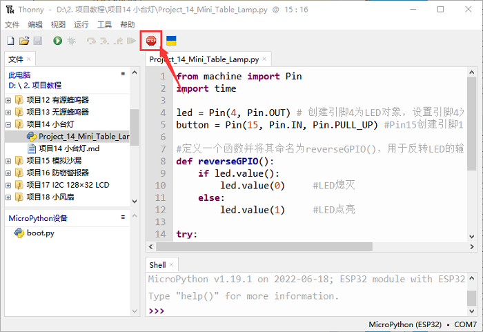
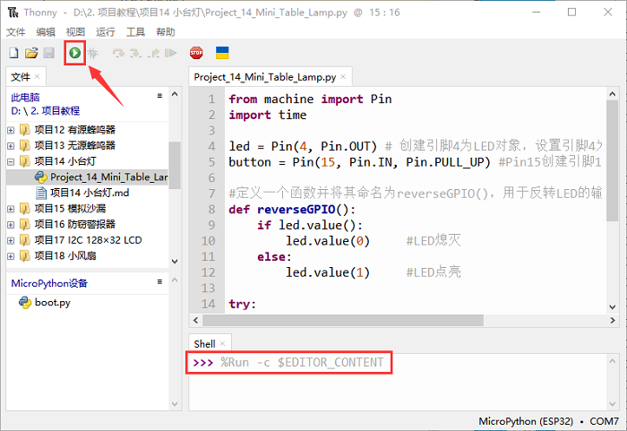

# 项目14 小台灯

## 1.项目介绍：
你知道ESP32可以在你按下外接按键的时候点亮LED吗? 在这个项目中，我们将使用ESP32，一个按键开关和一个LED来制作一个迷你台灯。

## 2.项目元件：
||||
| :--: | :--: | :--: |
|ESP32*1|面包板*1|按键*1|
||||
|10KΩ电阻*1|红色 LED*1|220Ω电阻*1|
|| ||
|按键帽*1|跳线若干|USB 线*1|

## 3.元件知识：


**按键：** 按键可以控制电路的通断，把按键接入电路中，不按下按键的时候电路是断开的，
一按下按键电路就通啦，但是松开之后就又断了。可是为什么按下才通电呢？这得从按键的内部构造说起。没按下之前，电流从按键的一端过不去另一端；按下的时候，按键内部的金属片把两边连接起来让电流通过。
按键内部结构如图：，未按下按键之前，1、2就是导通的，3、4也是导通的，但是1、3或1、4或2、3或2、4是断开（不通）的；只有按下按键时，1、3或1、4或2、3或2、4才是导通的。
在设计电路时，按键开关是最常用的一种元件。
**按键的原理图:**

  
**什么是按键抖动？**
我们想象的开关电路是“按下按键-立刻导通”“再次按下-立刻断开”，而实际上并非如此。
按键通常采用机械弹性开关，而机械弹性开关在机械触点断开闭合的瞬间（通常 10ms左右），会由于弹性作用产生一系列的抖动，造成按键开关在闭合时不会立刻稳定的接通电路，在断开时也不会瞬时彻底断开。


**那又如何消除按键抖动呢？**
常用除抖动方法有两种：软件方法和硬件方法。这里重点讲讲方便简单的软件方法。
我们已经知道弹性惯性产生的抖动时间为10ms 左右，用延时命令推迟命令执行的时间就可以达到除抖动的效果。
所以我们在代码中加入了0.02秒的延时以实现按键防抖的功能。


## 4. 项目接线图：


<span style="color: rgb(255, 76, 65);">注意: </span>

怎样连接LED 

怎样识别五色环220Ω电阻和五色环10KΩ电阻


## 5.项目代码：
本教程中使用的代码保存在：
“**..\Keyes ESP32 高级版学习套件\3. Python 教程\1. Windows 系统\2. 项目教程**”的路径中。

你可以把代码移到任何地方。例如，我们将代码保存在**D盘**中，<span style="color: rgb(0, 209, 0);">路径为D:\2. 项目教程</span>。


打开“Thonny”软件，点击“此电脑”→“D:”→“2. 项目教程”→“项目14 小台灯”。并鼠标左键双击“Project_14_Mini_Table_Lamp.py”。


```
from machine import Pin
import time

led = Pin(4, Pin.OUT) # 创建引脚4为LED对象，设置引脚4为输出                  
button = Pin(15, Pin.IN, Pin.PULL_UP) #Pin15创建引脚15按钮对象，设置GP15为输入

#定义一个函数并将其命名为reverseGPIO()，用于反转LED的输出电平
def reverseGPIO():
    if led.value():
        led.value(0)     #LED熄灭
    else:
        led.value(1)     #LED点亮

try:
    while True:
        if not button.value():
            time.sleep_ms(20)
            if not button.value():
                reverseGPIO()
                while not button.value():
                    time.sleep_ms(20)
except:
    pass

```
## 6.项目现象：
确保ESP32已经连接到电脑上，单击。


单击，代码开始执行，你会看到的现象是：按下按钮，LED亮起；当按钮松开时，LED仍亮着。再次按下按钮，LED熄灭；当按钮释放时，LED保持关闭。是不是很像个小台灯？按“Ctrl+C”或单击退出程序。



