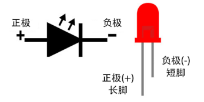
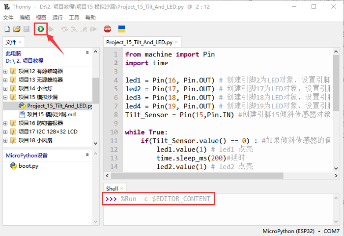

# 项目15 模拟沙漏

## 1.项目介绍：
古代人没有电子时钟，就发明了沙漏来测时间，沙漏两边的容量比较大，在一边装了细沙，中间有个很小的通道，将沙漏直立，有细沙的一边在上方，由于重力的作用，细沙就会往下流通过通道到沙漏的另一边，当细沙都流到下边了，就倒过来，把一天反复的次数记录下来，第二天就可以通过沙漏反复流动的次数而知道这一天大概的时间了。这一课我们将利用ESP32控制倾斜开关和LED灯来模拟沙漏，制作一个电子沙漏。

## 2.项目元件：
|||||
| :--: | :--: | :--: | :--: |
|ESP32*1|面包板*1|倾斜开关*1|10KΩ电阻*1|
||| ||
|红色 LED*4|220Ω电阻*1|跳线若干|USB 线*1|

## 3.元件知识：

倾斜开关也叫数字开关。里面有一个可以滚动的金属球。采用金属球滚动与底部导电板接触的原理来控制电路的通断。倾斜开关是滚珠型倾斜感应单方向性触发开关，当倾斜传感器向触发端（两根金属脚端）倾斜时，倾斜开关处于闭路状态，模拟端口的电压约为5V(二进制数为1023)。这样，LED会亮起。当倾斜开关在水平位置或向另一端倾斜时，倾斜开关处于开路状态，模拟端口的电压约为0V(0二进制)，LED将会关闭。在程序中，我们根据模拟端口的电压值，是否大于2.5V(512二进制)来判断开关是开还是关。
这里用倾斜开关的内部结构来说明它是如何工作的，显示如下图：


## 4.项目接线图：


<span style="color: rgb(255, 76, 65);">注意: </span>

怎样连接LED 

怎样识别五色环220Ω电阻和五色环10KΩ电阻


## 5.项目代码：
本教程中使用的代码保存在：
“**..\Keyes ESP32 高级版学习套件\3. Python 教程\1. Windows 系统\2. 项目教程**”的路径中。

你可以把代码移到任何地方。例如，我们将代码保存在**D盘**中，<span style="color: rgb(0, 209, 0);">路径为D:\2. 项目教程</span>。


打开“Thonny”软件，点击“此电脑”→“D:”→“2. 项目教程”→“项目15 模拟沙漏”。并鼠标左键双击“Project_15_Tilt_And_LED.py”。


```
from machine import Pin
import time

led1 = Pin(16, Pin.OUT) # 创建引脚2为LED对象，设置引脚2为输出
led2 = Pin(17, Pin.OUT) # 创建引脚17为LED对象，设置引脚17为输出
led3 = Pin(18, Pin.OUT) # 创建引脚18为LED对象，设置引脚18为输出
led4 = Pin(19, Pin.OUT) # 创建引脚19为LED对象，设置引脚19为输出
Tilt_Sensor = Pin(15,Pin.IN) #创建引脚15倾斜传感器对象，设置GP15为输入

while True:
    if(Tilt_Sensor.value() == 0) : #如果倾斜传感器的值为0时
        led1.value(1) # led1 点亮
        time.sleep_ms(200)#延时
        led2.value(1) # led2 点亮
        time.sleep_ms(200)#延时
        led3.value(1) # led3 点亮
        time.sleep_ms(200)#延时
        led4.value(1) # led4 点亮
        time.sleep_ms(200)#延时
    else :           #如果倾斜传感器的值为1时
        led4.value(0) # led4 熄灭
        time.sleep_ms(200)#延时
        led3.value(0) # led3 熄灭
        time.sleep_ms(200)#延时
        led2.value(0) # led2 熄灭
        time.sleep_ms(200)#延时
        led1.value(0) # led1 熄灭
        time.sleep_ms(200)#延时
```

## 6.项目现象：
确保ESP32已经连接到电脑上，单击。


单击，代码开始执行，你会看到的现象是：将面包板倾斜到一定角度，led就会一个一个地亮起来。当回到上一个角度时，led会一个一个关闭。就像沙漏一样，随着时间的推移，沙子漏了出来。按“Ctrl+C”或单击退出程序。



