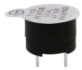
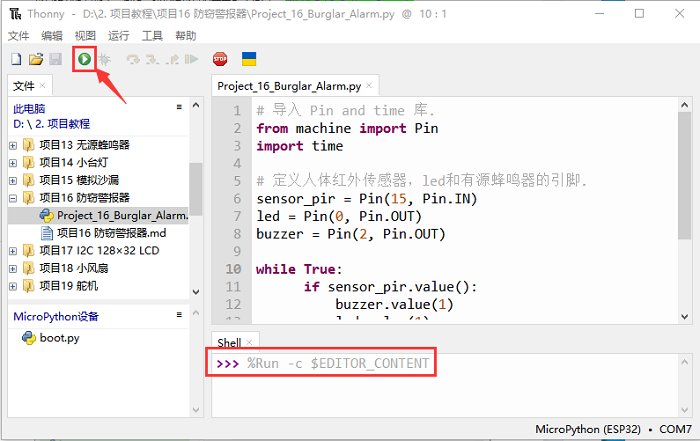

# 项目16 防窃警报器

## 1.项目介绍：
人体红外传感器测量运动物体发出的热的红外(IR)线。该传感器可以检测人、动物和汽车的运动，从而触发安全警报和照明。它们被用来检测移动，是安全的理想选择，如防盗警报和安全照明系统。在这个项目中，我们将使用ESP32控制人体红外传感器、蜂鸣器和LED来模拟防盗报警器。

## 2.项目元件：
||||img-20230411163556.png)|
| :--: | :--: | :--: | :--: |
|ESP32*1|面包板*1|人体红外传感器*1|NPN型晶体管(S8050)*1|
|||||
|有源蜂鸣器*1|红色 LED*1|220Ω电阻*1|1KΩ电阻*1|
|  | || |
|3P转杜邦线公单*1|跳线若干|USB 线*1| |

## 3.元件知识：
**人体红外传感器：** 是一款基于热释电效应的人体红外传感器，能检测到人体或动物身上发出的红外线，配合菲涅尔透镜能使传感器探测范围更远更广。它主要采用RE200B-P传感器元件，当附近有人或者动物运动时，该模块会输出一个高电平1；否则输出低电平0。特别注意，这个传感器可以检测在运动中的人、动物和汽车，静止中的人、动物和汽车是检测不到的，检测最远距离大约为7米左右。
<span style="color: rgb(255, 76, 65);">注意：人体红外传感器应避开日光、汽车头灯、白炽灯直接照射，也不能对着热源(如暖气片、加热器)或空调，以避免环境温度较大的变化而造成误报。同时还易受射频辐射的干扰。</span>

**传感器技术参数：**
最大输入电压：DC 5-15V 
最大工作电流：50MA
最大功率：0.3W
静态电流: <50uA
工作温度：-20 ~ 85℃
控制信号：数字信号(1/0)
延迟时间：大约2.3到3秒钟
感应角度：小于100度锥角
检测最远距离：大约7米左右

**传感器原理图：**


## 4.项目接线图：


## 5.项目代码：
本教程中使用的代码保存在：
“**..\Keyes ESP32 高级版学习套件\3. Python 教程\1. Windows 系统\2. 项目教程**”的路径中。

你可以把代码移到任何地方。例如，我们将代码保存在**D盘**中，<span style="color: rgb(0, 209, 0);">路径为D:\2. 项目教程</span>。


打开“Thonny”软件，点击“此电脑”→“D:”→“2. 项目教程”→“项目16 防窃警报器”。并鼠标左键双击“Project_16_Burglar_Alarm.py”。


```
# 导入 Pin and time 库.
from machine import Pin
import time

# 定义人体红外传感器，led和有源蜂鸣器的引脚. 
sensor_pir = Pin(15, Pin.IN)
led = Pin(0, Pin.OUT)
buzzer = Pin(2, Pin.OUT)

while True: 
      if sensor_pir.value():
          buzzer.value(1)
          led.value(1)
          time.sleep(0.2)
          buzzer.value(0)
          led.value(0)
          time.sleep(0.2)         
      else:
          buzzer.value(0)
          led.value(0)
```
## 6.项目现象：
确保ESP32已经连接到电脑上，单击。


单击，代码开始执行，你会看到的现象是：如果人体红外传感器检测到附近有人移动时，蜂鸣器就会不断地发出警报，且LED不断地闪烁。按“Ctrl+C”或单击退出程序。



