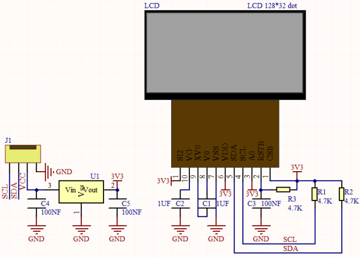
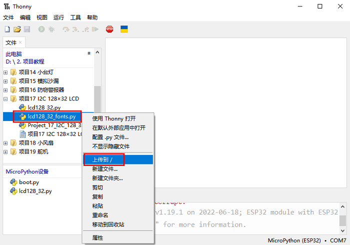

# 项目17 I2C 128×32 LCD

## 1.项目介绍：
在生活中，我们可以利用显示器等模块来做各种实验。你也可以DIY各种各样的小物件。例如，用一个温度传感器和显示器做一个温度测试仪，或者用一个超声波模块和显示器做一个距离测试仪。下面，我们将使用LCD_128X32_DOT模块作为显示器，将其连接到ESP32控制板上。将使用ESP32主板控制LCD_128X32_DOT显示屏显示各种英文文字、常用符号和数字。

## 2.项目元件：
||||
| :--: | :--: | :--: |
|ESP32*1|面包板*1|LCD_128X32_DOT*1|
||| |
|4P转杜邦线公单*1|USB 线*1| |

## 3.元件知识：

**LCD_128X32_DOT：** 一个像素为128*32的液晶屏模块，它的驱动芯片为ST7567A。模块使用IIC通信方式，它不仅可以显示英文字母、符号，还可以显示中文文字和图案。使用时，还可以在代码中设置，让英文字母和符号等显示不同大小。

**LCD_128X32_DOT原理图：**


**LCD_128X32_DOT技术参数：**
显示像素：128*32 字符
工作电压：DC 5V
工作电流：100mA (5V)
模块最佳工作电压：5V
亮度、对比度可通过程序指令控制

## 4.项目接线图：


## 5.项目代码：
本教程中使用的代码保存在：
“**..\Keyes ESP32 高级版学习套件\3. Python 教程\1. Windows 系统\2. 项目教程**”的路径中。

你可以把代码移到任何地方。例如，我们将代码保存在**D盘**中，<span style="color: rgb(0, 209, 0);">路径为D:\2. 项目教程</span>。


打开“Thonny”软件，点击“此电脑”→“D:”→“2. 项目教程”→“项目17 I2C 128×32 LCD”。分别选择“lcd128_32\.py”和 “lcd128_32_fonts\.py”，右键单击鼠标选择 “上传到/”，等待“lcd128_32\.py”和 “lcd128_32_fonts\.py”被上传到ESP32，并鼠标鼠标左键双击“Project_17_I2C_128_32_LCD.py”。




```
import machine
import time
import lcd128_32_fonts
from lcd128_32 import lcd128_32

#i2c配置
clock_pin = 22
data_pin = 21
bus = 0
i2c_addr = 0x3f
use_i2c = True

def scan_for_devices():
    i2c = machine.I2C(bus,sda=machine.Pin(data_pin),scl=machine.Pin(clock_pin))
    devices = i2c.scan()
    if devices:
        for d in devices:
            print(hex(d))
    else:
        print('no i2c devices')


if use_i2c:
    scan_for_devices()
    lcd = lcd128_32(data_pin, clock_pin, bus, i2c_addr)


lcd.Clear()

lcd.Cursor(0, 4)
lcd.Display("KEYES")
lcd.Cursor(1, 0)
lcd.Display("ABCDEFGHIJKLMNOPQR")
lcd.Cursor(2, 0)
lcd.Display("123456789+-*/<>=$@")
lcd.Cursor(3, 0)
lcd.Display("%^&(){}:;'|?,.~\\[]")
"""
while True:
    scan_for_devices()
    time.sleep(0.5)
"""
```
## 6.项目现象：
确保ESP32已经连接到电脑上，单击。


单击，代码开始执行，你会看到的现象是：128X32LCD模块显示屏第一行显示“KEYESTUDIO”、第二行显示“ABCDEFGHIJKLMNOPQR”、第三行显示“123456789+-*/<>=$@”、第四行显示“%^&(){}:;'|?,.~\\[]”。按“Ctrl+C”或单击退出程序。


