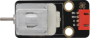
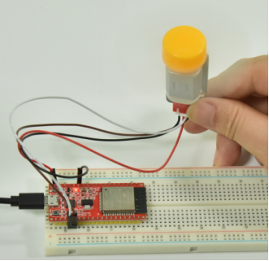

# 项目18 小风扇

## 1.项目介绍： 
在炎热的夏季，需要电扇来给我们降温，那么在这个项目中，我们将使用ESP32控制130电机模块和小扇叶来制作一个小电扇。

## 2.项目元件：
||||
| :--: | :--: | :--: |
|ESP32*1|面包板*1|130电机模块*1|
||||
|面包板专用电源模块*1|6节5号电池盒*1|风扇叶*1|
|  |||
|4P转杜邦线公单*1|5号电池(<span style="color: rgb(255, 76, 65);">自备</span>)*6|USB 线*1|

## 3.元件知识:

**130电机模块：** 该电机控制模块采用HR1124S电机控制芯片，HR1124S是应用于直流电机方案的单通道H桥驱动器芯片。HR1124S的H桥驱动部分采用低导通电阻的PMOS和NMOS功率管，低导通电阻保证芯片低的功率损耗，使得芯片安全工作更长时间。此外HR1124S拥有低待机电流，低静态工作电流，这些性能使130电机模块易用于玩具方案。

**130电机模块参数：**
工作电压：5V
工作电流：≤200MA
工作功率：2W
工作温度：-10℃~+50℃

**130电机模块原理：**
HR1124S芯片的作用是助于驱动电机，而电机所需电流较大，无法用三极管驱动更无法直接用IO口驱动。让电机转动起来的方法很简单，给电机两端添加电压即可。不同电压方向电机转向也不相同，在额度电压内，电压越大，电机转动得越快；反之电压越低，电机转动得越慢，甚至无法转动。控制方式有两种：一种是高低电平控制（控制转动和停止），一种是PWM控制（控制转速）。


**面包板专用电源模块：**

**说明：**
此模块，能方便的给面包板提供3.3V和5V的电源，具有DC2.1输入（DC7－12V），另外，具备USB Type C接口的电源输入。

**规格：** 
 输入电压：DC座：7-12V；  Type C USB：5V 
 电流：3.3V：最大500mA；        5V：最大500mA；
 最大功率: 2.5W
 尺寸: 53mmx26.3mm
 环保属性: ROHS

**接口说明：**


**原理图：**


## 4. 项目接线图：


(<span style="color: rgb(255, 76, 65);">注: 先接好线，然后在直流电机上安装一个小风扇叶片。</span>)


## 5.项目代码：
本教程中使用的代码保存在：
“**..\Keyes ESP32 高级版学习套件\3. Python 教程\1. Windows 系统\2. 项目教程**”的路径中。

你可以把代码移到任何地方。例如，我们将代码保存在**D盘**中，<span style="color: rgb(0, 209, 0);">路径为D:\2. 项目教程</span>。


打开“Thonny”软件，点击“此电脑”→“D:”→“2. 项目教程”→“项目18 小风扇”。并鼠标左键双击“Project_18_ Small_Fan.py”。


```
from machine import Pin
import time

motor1a = Pin(15, Pin.OUT) # 创建引脚15为motor1a对象，设置引脚15为输出
motor1b = Pin(2, Pin.OUT) # 创建引脚2为motor1b对象，设置引脚2为输出

def forward():
    motor1a.value(1) # 设置motor1a 为高
    motor1b.value(0) # 设置motor1b 为低
def backward():
    motor1a.value(0)
    motor1b.value(1)
def stop():
    motor1a.value(0)
    motor1b.value(0)

def test():
    forward() # 电机向前转
    time.sleep(5) #延时
    stop() # 电机停止
    time.sleep(2)
    backward()# 电机向后转
    time.sleep(5)
    stop()
    time.sleep(2)
    
for i in range(5):
    test() 
```

## 6.项目现象：
确保ESP32已经连接到电脑上，单击。


单击，代码开始执行，你会看到的现象是：小风扇先逆时针转5秒，停止2秒，再顺时针转5秒，停止2秒，以此规律重复执行5次后小风扇停止转动。按“Ctrl+C”或单击退出程序。



