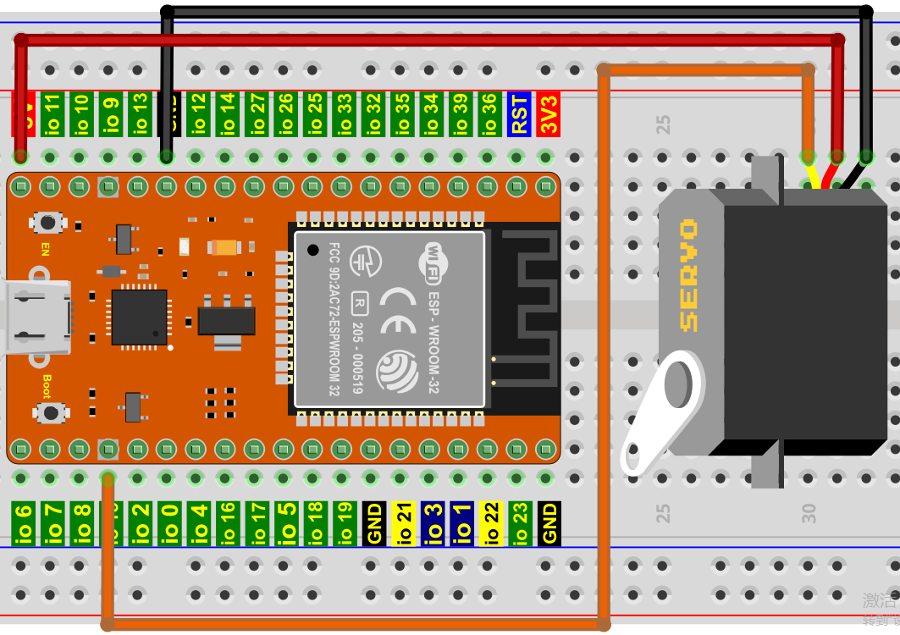
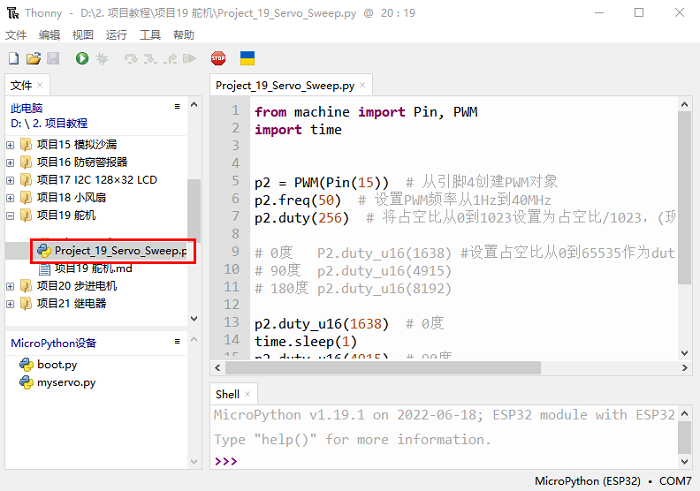
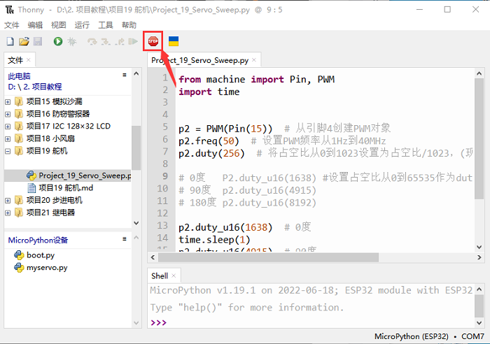
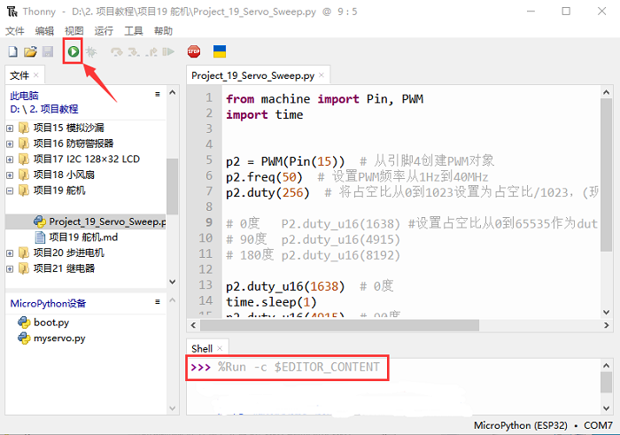

# 项目19 舵机

## 1.项目介绍：
舵机是一种可以非常精确地旋转的电机。目前已广泛应用于玩具车、遥控直升机、飞机、机器人等领域。在这个项目中，我们将使用ESP32控制舵机转动。

## 2.项目元件：
||||
| :--: | :--: | :--: |
|ESP32*1|面包板*1|舵机*1|
||| |
|跳线若干|USB 线*1| |

## 3.元件知识：

**舵机：** 舵机是一种位置伺服的驱动器，主要是由外壳、电路板、无核心马达、齿轮与位置检测器所构成。其工作原理是由接收机或者单片机发出信号给舵机，其内部有一个基准电路，产生周期为20ms，宽度为1.5ms 的基准信号，将获得的直流偏置电压与电位器的电压比较，获得电压差输出。经由电路板上的IC 判断转动方向，再驱动无核心马达开始转动，透过减速齿轮将动力传至摆臂，同时由位置检测器送回信号，判断是否已经到达定位。适用于那些需要角度不断变化并可以保持的控制系统。当电机转速一定时，通过级联减速齿轮带动电位器旋转，使得电压差为0，电机停止转动。一般舵机旋转的角度范围是0度到180 度。
控制舵机的脉冲周期为20ms，脉冲宽度为0.5ms ~ 2.5ms，对应位置为-90°~ +90°。下面是以一个180°角的舵机为例：


舵机有多种规格，但它们都有三根连接线，分别是棕色、红色、橙色(不同品牌可能有不同的颜色)。棕色为GND，红色为电源正极，橙色为信号线。


## 4.项目接线图：
舵机供电时请注意，电源电压应为3.3V-5V。请确保在将舵机连接到电源时不会出现任何错误。


## 5.项目代码：
本教程中使用的代码保存在：
“**..\Keyes ESP32 高级版学习套件\3. Python 教程\1. Windows 系统\2. 项目教程**”的路径中。

你可以把代码移到任何地方。例如，我们将代码保存在**D盘**中，<span style="color: rgb(0, 209, 0);">路径为D:\2. 项目教程</span>。


打开“Thonny”软件，点击“此电脑”→“D:”→“2. 项目教程”→“项目19 舵机”。并鼠标左键双击“Project_19_Servo_Sweep.py”。


```
from machine import Pin, PWM
import time
 
 
p2 = PWM(Pin(15))  # 从引脚15创建PWM对象
p2.freq(50)  # 设置PWM频率从1Hz到40MHz
p2.duty(256)  # 将占空比从0到1023设置为占空比/1023，(现在是25%)
 
# 0度   P2.duty_u16(1638) #设置占空比从0到65535作为duty_u16/65535的比值
# 90度  p2.duty_u16(4915)
# 180度 p2.duty_u16(8192)
 
p2.duty_u16(1638)  # 0度
time.sleep(1)
p2.duty_u16(4915)  # 90度
time.sleep(1)
p2.duty_u16(8100)  # 180度  # 真实舵机MG90S可以设为8192
time.sleep(1)
 
for i in range(1638, 8100, 10):
    p2.duty_u16(i)
    time.sleep_ms(10)
    
 
p2.duty_u16(1638)
time.sleep(1)
 
p2.deinit()              # 在引脚上关闭PWM
```
## 6.项目现象：
确保ESP32已经连接到电脑上，单击。


单击，代码开始执行，你会看到的现象是：舵机将转动。按“Ctrl+C”或单击退出程序。



