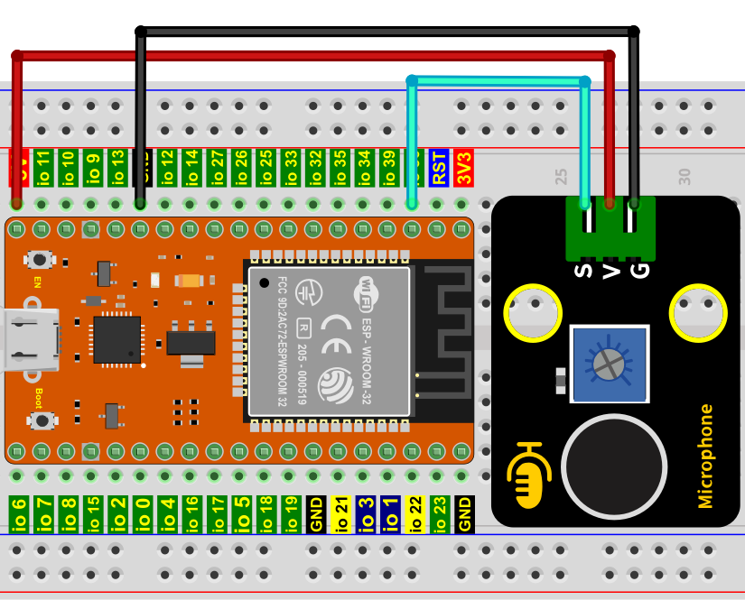
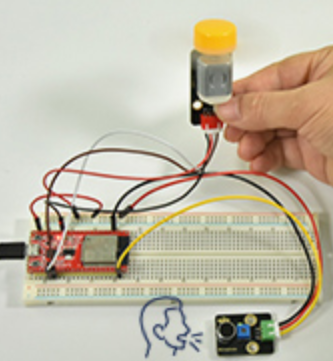

# 项目26 声控风扇

## 1.项目介绍：
声音传感器有一个内置的电容驻极体麦克风和功率放大器。它可以用来检测环境的声音强度。在这个项目中，我们利用ESP32控制声音传感器和电机模块模拟一个声控风扇。

## 2.项目元件：
|||||
| :--: | :--: | :--: | :--: |
|ESP32*1|面包板*1|130电机模块*1|声音传感器*1 |
||||  |
|面包板专用电源模块*1|6节5号电池盒*1|风扇叶*1|3P转杜邦线公单*1 |
|||| |
|4P转杜邦线公单*1|5号电池(<span style="color: rgb(255, 76, 65);">自备</span>)*6|USB 线*1| |

## 3.元件知识：

**声音传感器:** 通常用于检测周围环境中的声音响度。微型控制板可以通过模拟输入接口采集其输出信号。传感器的S引脚是模拟输出，是麦克风电压信号的实时输出。传感器附带一个电位器，这样你就可以调整信号强度。你可以使用它来制作一些交互式作品，如语音操作的开关等。

**声音传感器参数：**
- 工作电压：3.3V-5V（DC）
- 工作电流：≤100mA
- 最大功率：0.5W
- 输出信号：模拟信号

**声音传感器原理图：**
它主要采用一个高感度麦克风元件和LM386芯片。高感度麦克风元件用于检测外界的声音。利用LM386芯片搭建合适的电路，我们对高感度麦克风检测到的声音进行放大，最大倍数为200倍。使用时我们可以通过旋转传感器上电位器，调节声音的放大倍数。调节时，顺时针调节电位器到尽头，放大倍数最大。


## 4.读取声音传感器的ADC值，DAC值和电压值：
我们首先使用一个简单的代码来读取声音传感器的ADC值，DAC值和电压值并将其打印出来，接线请参照以下接线图：


本教程中使用的代码保存在：
“**..\Keyes ESP32 高级版学习套件\3. Python 教程\1. Windows 系统\2. 项目教程**”的路径中。

你可以把代码移到任何地方。例如，我们将代码保存在**D盘**中，<span style="color: rgb(0, 209, 0);">路径为D:\2. 项目教程</span>。


打开“Thonny”软件，点击“此电脑”→“D:”→“2. 项目教程”→“项目26 声控风扇”。并鼠标左键双击“Project_26.1_Read_Sound_Sensor_Analog_Value.py”。


```
# 导入 Pin, ADC 和 DAC 库.
from machine import ADC,Pin,DAC
import time

# 打开并配置0-3.3V的ADC
adc=ADC(Pin(36))
adc.atten(ADC.ATTN_11DB)
adc.width(ADC.WIDTH_12BIT)

# 每0.1秒读取一次ADC值，将ADC值转换为DAC值并输出，
# 并将这些数据打印到“Shell”. 
try:
    while True:
        adcVal=adc.read()
        dacVal=adcVal//16
        voltage = adcVal / 4095.0 * 3.3
        print("ADC Val:",adcVal,"DACVal:",dacVal,"Voltage:",voltage,"V")
        time.sleep(0.1)
except:
    pass
```
确保ESP32已经连接到电脑上，单击。


单击，代码开始执行，你会看到的现象是：Thonny IDE下的”Shell”窗口将打印声音传感器读取的模拟值，当对着传感器拍拍手，声音传感器的模拟值发生了显著的变化。按“Ctrl+C”或单击退出程序。


## 5.智能风扇的接线图：
接下来，我们正式进入这个项目。我们用声音传感器、130电机模块和风叶片来模拟一个声控风扇。接线图如下：


(<span style="color: rgb(255, 76, 65);">注: 先接好线，然后在直流电机上安装一个小风扇叶片。</span>)

## 6.项目代码：
（<span style="color: rgb(255, 76, 65);">注意：</span>代码中的阀值600可以根据实际情况自己重新设置）

本教程中使用的代码保存在：
“**..\Keyes ESP32 高级版学习套件\3. Python 教程\1. Windows 系统\2. 项目教程**”的路径中。

你可以把代码移到任何地方。例如，我们将代码保存在**D盘**中，<span style="color: rgb(0, 209, 0);">路径为D:\2. 项目教程</span>。


打开“Thonny”软件，点击“此电脑”→“D:”→“2. 项目教程”→“项目26 声控风扇”。并鼠标左键双击“Project_26.2_Sound_Control_Fan.py”。


```
from machine import ADC, Pin
import time
 
# 打开并配置0-3.3V的ADC 
adc=ADC(Pin(36))
adc.atten(ADC.ATTN_11DB)
adc.width(ADC.WIDTH_12BIT)
 
# 引脚初始化
motor1a = Pin(15, Pin.OUT) # 创建引脚15为motor1a对象，设置引脚15为输出
motor1b = Pin(2, Pin.OUT) # 创建引脚2为motor1b对象，设置引脚2为输出

# 如果声音传感器检测到声音，电机将旋转
# 当模拟值大于600时，否则，电机不转动.    
while True:
    adcVal=adc.read()
    print(adcVal)
    time.sleep(0.5)
    if adcVal >600:
        motor1a.value(1) # 设置 motor1a 为高
        motor1b.value(0) # 设置 motor1b 为低
        time.sleep(5)   # 延时
    else:
        motor1a.value(0)
        motor1b.value(0)
```
## 7.项目现象：
确保ESP32已经连接到电脑上，单击。


单击，代码开始执行，你会看到的现象是：对着声音传感器拍拍手，当声音强度超过阈值时，小风扇旋转起来；反之，小风扇不旋转。按“Ctrl+C”或单击退出程序。




