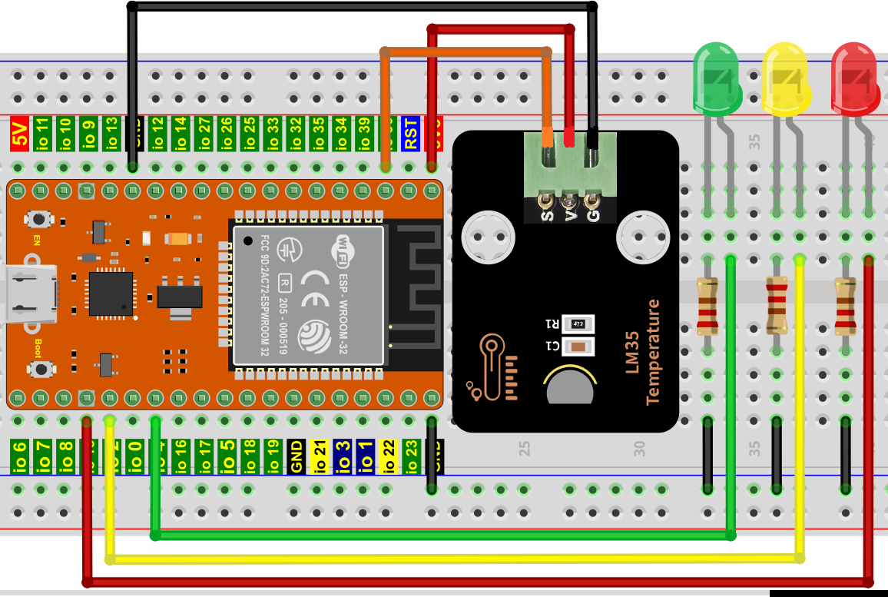

# 项目27 温度测量

## 1.项目介绍： 
LM35是一种常用且易于使用的温度传感器。它不需要其他硬件你只需要一个模拟端口就可以了。难点在于编译代码，将其读取的模拟值转换为摄氏温度。在这个项目中，我们使用一个温度传感器和3个LED灯来制作一个温度测试仪。当温度传感器接触不同的温度物体时，LED灯就会显示不同的颜色。

## 2.项目元件：
|||||
| :--: | :--: | :--: | :--: |
|ESP32*1|面包板*1|红色LED*1|黄色 LED*1|
||||  |
|绿色LED*1|220Ω电阻*3|LM35温度传感器*1|3P转杜邦线公单*1|
| || | |
|跳线若干|USB 线*1| | |

## 3.元件知识：                                                                    

**LM35温度传感器：** 是一种常用的LM35温度传感器，它主要采用LM35DZ传感器元件。该元件的输出电压与摄氏温标呈线性关系。在室温下，无需额外的校准处理即可达到1/4℃的精度。LM35温度传感器可以根据不同的温度产生不同的电压，当温度为0℃时输出0V；每升高1℃，输出电压将增加10mv。换算公式如下：


## 4.读取LM35的温度值：
我们首先使用一个简单的代码读取温度传感器的值并将其打印出来，，其接线图如下所示：


这里，LM35输出给ESP32的模拟引脚是GPIO36。这个模拟电压被转换成数字形式，并经过处理得到温度读数。

本教程中使用的代码保存在：
“**..\Keyes ESP32 高级版学习套件\3. Python 教程\1. Windows 系统\2. 项目教程**”的路径中。

你可以把代码移到任何地方。例如，我们将代码保存在**D盘**中，<span style="color: rgb(0, 209, 0);">路径为D:\2. 项目教程</span>。


打开“Thonny”软件，点击“此电脑”→“D:”→“2. 项目教程”→“项目27 温度测量”。并鼠标左键双击“Project_27.1_Read_LM35_Temperature_Value.py”。


```
from machine import ADC, Pin
import time

# 打开并配置0-3.3V的ADC
adc=ADC(Pin(36))
adc.atten(ADC.ATTN_11DB)
adc.width(ADC.WIDTH_12BIT)
conversion_factor = 3.3 / (4095)

while True:
    adcVal=adc.read()
    reading = adcVal * conversion_factor 
    temperature = reading * 102.4 
    print(temperature)
    time.sleep(1)
```
确保ESP32已经连接到电脑上，单击。


单击，代码开始执行，你会看到的现象是：Thonny IDE下的”Shell”窗口将打印LM35温度传感器读取的温度值。用手捏住LM35元件，LM35温度传感器读取的温度值在变化。按“Ctrl+C”或单击退出程序。


## 5.温度测量的接线图： 
现在使用LM35温度传感器和3个led做一个温度测试。当LM35温度传感器感应到不同的温度时，不同的led会点亮。按照下图进行接线。


## 6.项目代码：
（<span style="color: rgb(255, 76, 65);">注意：</span>代码中的阀值20和25可以根据实际情况自己重新设置）

本教程中使用的代码保存在：
“**..\Keyes ESP32 高级版学习套件\3. Python 教程\1. Windows 系统\2. 项目教程**”的路径中。

你可以把代码移到任何地方。例如，我们将代码保存在**D盘**中，<span style="color: rgb(0, 209, 0);">路径为D:\2. 项目教程</span>。


打开“Thonny”软件，点击“此电脑”→“D:”→“2. 项目教程”→“项目27 温度测量”。并鼠标左键双击“Project_27.2_Temperature_Measurement.py”。


```
from machine import ADC, Pin
import time

# 打开并配置0-3.3V的ADC
adc=ADC(Pin(36))
adc.atten(ADC.ATTN_11DB)
adc.width(ADC.WIDTH_12BIT)
conversion_factor = 3.3 / (4095)

# 创建引脚15为红色led对象，设置引脚15为输出
led_red = Pin(15, Pin.OUT)  
# 创建引脚2为黄色led对象，设置引脚2为输出
led_yellow = Pin(2, Pin.OUT)
# 创建引脚4为绿色led对象，将引脚4设置为输出
led_green = Pin(4, Pin.OUT) 

while True:
    adcVal=adc.read()
    reading = adcVal * conversion_factor 
    temperature = reading * 102.4 
    print(temperature)
    time.sleep(0.2)
    if temperature <20:
        led_red.value(1)  # 红色LED点亮
        led_yellow.value(0) # 黄色LED熄灭 
        led_green.value(0)  # 绿色LED熄灭
    elif temperature >=20 and temperature <25:
        led_red.value(0)  
        led_yellow.value(1) 
        led_green.value(0)  
    else:
        led_red.value(0)  
        led_yellow.value(0) 
        led_green.value(1)  
        
```
## 7.项目现象：
确保ESP32已经连接到电脑上，单击。


单击，代码开始执行，你会看到的现象是：Thonny IDE下的”Shell”窗口将打印LM35温度传感器读取的温度值，当LM35温度传感器感应到不同的温度时，不同的led会点亮。按“Ctrl+C”或单击退出程序。


