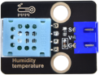
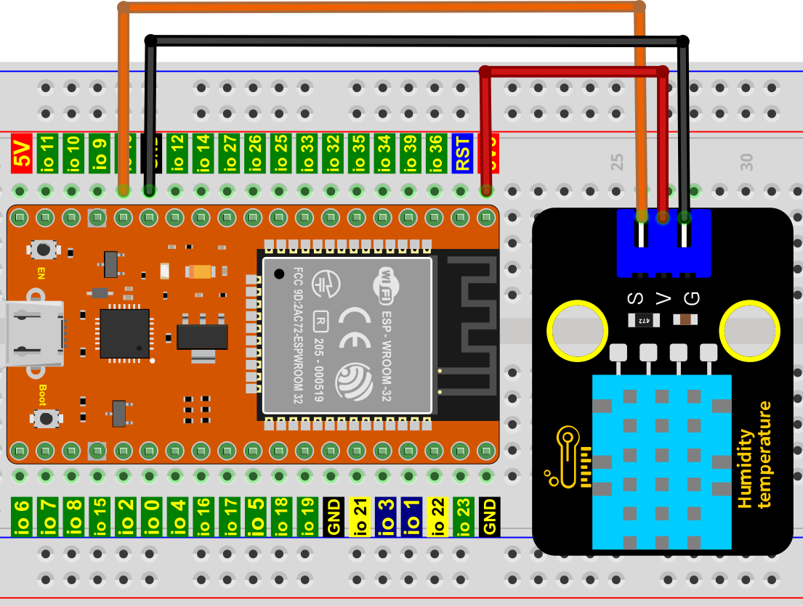

# 项目29 温湿度表

## 1.项目介绍：
在冬季时，空气中的湿度很低，就是空气很干燥，再加上寒冷，人体的皮肤就容易过于干燥而裂，所以需要在用加湿器给家里的空气增加湿度，但是怎么知道空气过于干燥了呢？那就需要检测空气湿度的设备，这节课就来学习温湿度传感器的使用。我们使用温湿度传感器制作一个温湿度计，并且还结合LCD 128X32 DOT来显示温度和湿度值。

## 2.项目元件：
|||||
| :--: | :--: | :--: | :--: |
|ESP32*1|面包板*1|LCD_128X32_DOT*1|温湿度传感器*1|
| ||| |
|3P转杜邦线公单*1|4P转杜邦线公单*1|USB 线*1| |

## 3.元件知识：

**温湿度传感器：** 是一款含有已校准数字信号输出的温湿度复合传感器，其精度湿度±5%RH， 温度±2℃，量程湿度20-90%RH， 温度0~50℃。温湿度传感器应用专用的数字模块采集技术和温湿度传感技术，确保产品具有极高的可靠性和卓越的长期稳定性。温湿度传感器包括一个电阻式感湿元件和一个NTC测温元件，非常适用于对精度和实时性要求不高的温湿度测量场合。
工作电压在3.3V-5.5V范围内。
温湿度传感器有三个引脚，分别为VCC，GND和S。S为数据输出的引脚。使用的是串行通讯。
**温湿度传感器的单总线格式定义：**
| 名称 |单总线格式定义 |
| :--: | :--: |
| 起始信号| 微处理器把数据总线(SDA)拉低一段时间至少 18ms(最大不得超过 30ms)，通知传感器准备数据。 | 
| 响应信号 | 传感器把数据总线（SDA）拉低 83µs，再接高 87µs 以响应主机的起始信号。 |
| 湿度 | 湿度高位为湿度整数部分数据，湿度低位为湿度小数部分数据  |
| 温度 |温度高位为温度整数部分数据，温度低位为温度小数部分数据，且温度低位 Bit8 为 1 则表示负温度，否则为正温度 |
| 校验位 | 校验位＝湿度高位+湿度低位+温度高位+温度低位 |

**温湿度传感器数据时序图：** 
用户主机（MCU）发送一次开始信号后，温湿度传感器从低功耗模式转换到高速模式，待主机开始信号结束后，温湿度传感器发送响应信号，送出 40bit 的数据，并触发一次信采集。信号发送如图所示。 


温湿度传感器可以很容易地将温湿度数据添加到您的DIY电子项目中。它是完美的远程气象站，家庭环境控制系统，和农场或花园监测系统。
**温湿度传感器的参数：**
- 工作电压：+5 V
- 温度范围：0-50 °C ，误差：± 2 °C
- 湿度范围：20-90% RH ，误差：± 5% RH
- 数字接口

**温湿度传感器的原理图：**


## 4.读取温湿度值：


本教程中使用的代码保存在：
“**..\Keyes ESP32 高级版学习套件\3. Python 教程\1. Windows 系统\2. 项目教程**”的路径中。

你可以把代码移到任何地方。例如，我们将代码保存在**D盘**中，<span style="color: rgb(0, 209, 0);">路径为D:\2. 项目教程</span>。


打开“Thonny”软件，点击“此电脑”→“D:”→“2. 项目教程”→“项目29 温湿度表”。并鼠标左键双击“Project_29.1_Detect_Temperature_Humidity.py”。


```
# 导入 machine, time 和 dht 库. 
import machine
import time
import dht

#关联DHT11引脚(13).
DHT = dht.DHT11(machine.Pin(13))

# 每秒获取一次温湿度数据，并打印出来. 
while True:
    DHT.measure() # 启动DHT11一次测量数据.
   # 调用DHT的内置函数来获取温度
   # 和湿度数据并打印在“Shell”中.
    print('temperature:',DHT.temperature(),'℃','humidity:',DHT.humidity(),'%')
    time.sleep_ms(1000)
```
确保ESP32已经连接到电脑上，单击。


单击，如果你的温湿度传感器连接错误，在“Shell”窗口中将打印以下信息。请确保你的电路已正确连接，再次单击，代码开始执行，你会看到的现象是：Thonny IDE下的”Shell”窗口将打印当前显示当前环境中的温湿度数据，如下图。

再次单击，代码开始执行，你会看到的现象是：Thonny IDE下的”Shell”窗口将打印声音传感器读取的模拟值，当对着传感器拍拍手，声音传感器的模拟值发生了显著的变化。按“Ctrl+C”或单击退出程序。


## 5.温湿度仪表的接线图：
现在我们开始用LCD_128X32_DOT打印温湿度传感器的值，我们会在LCD_128X32_DOT的屏幕上看到相应的值。让我们开始这个项目吧。请按照下面的接线图进行接线：


## 6.项目代码：
本教程中使用的代码保存在：
“**..\Keyes ESP32 高级版学习套件\3. Python 教程\1. Windows 系统\2. 项目教程**”的路径中。

你可以把代码移到任何地方。例如，我们将代码保存在**D盘**中，<span style="color: rgb(0, 209, 0);">路径为D:\2. 项目教程</span>。


打开“Thonny”软件，点击“此电脑”→“D:”→“2. 项目教程”→“项目29 温湿度表”。分别选择“lcd128_32.py”和 “lcd128_32_fonts.py”，右键单击鼠标选择 “上传到/”，等待 “lcd128_32.py”和 “lcd128_32_fonts.py”被上传到ESP32，然后鼠标左键左键双击“Project_29.2_Temperature_Humidity_Meter.py”。


```
from machine import Pin
import machine
import dht
import time
import lcd128_32_fonts
from lcd128_32 import lcd128_32

temp = 0
humi = 0

#关联DHT11引脚(13).
DHT = dht.DHT11(Pin(13))

#i2c配置
clock_pin = 22
data_pin = 21
bus = 0
i2c_addr = 0x3f
use_i2c = True

def scan_for_devices():
    i2c = machine.I2C(bus,sda=machine.Pin(data_pin),scl=machine.Pin(clock_pin))
    devices = i2c.scan()
    if devices:
        for d in devices:
            print(hex(d))
    else:
        print('no i2c devices')

try:
    while True:
        DHT.measure()
        temp = int(DHT.temperature())
        humi = int(DHT.humidity())
        if use_i2c:
            scan_for_devices()
            lcd = lcd128_32(data_pin, clock_pin, bus, i2c_addr)         
        lcd.Clear()
        lcd.Cursor(0, 0)
        lcd.Display("temper:")
        lcd.Cursor(0, 8)
        lcd.Display(str(temp))
        lcd.Cursor(0, 11)
        lcd.Display("C")
        lcd.Cursor(2, 0)
        lcd.Display("Humid:")
        lcd.Cursor(2, 7)
        lcd.Display(str(humi))
        lcd.Cursor(2, 10)
        lcd.Display("%")
        time.sleep(0.1)
except:
    pass

```
## 7.项目现象：
确保ESP32已经连接到电脑上，单击。


单击，代码开始执行，你会看到的现象是：LCD 128X32 DOT的屏幕上显示温湿度传感器检测环境中相应的温度值和湿度值。按“Ctrl+C”或单击退出程序。


