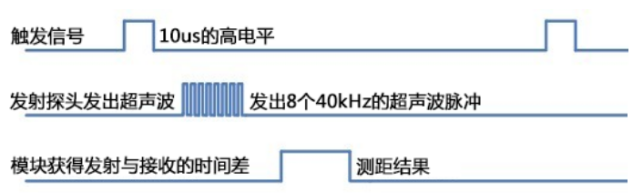
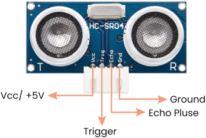
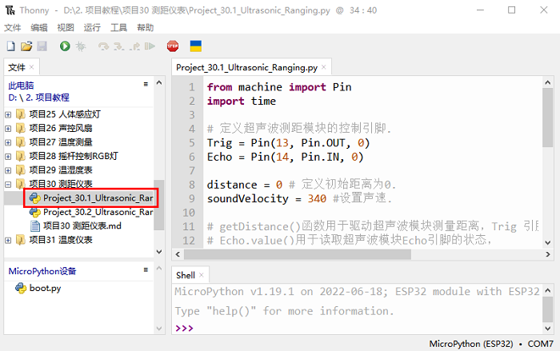
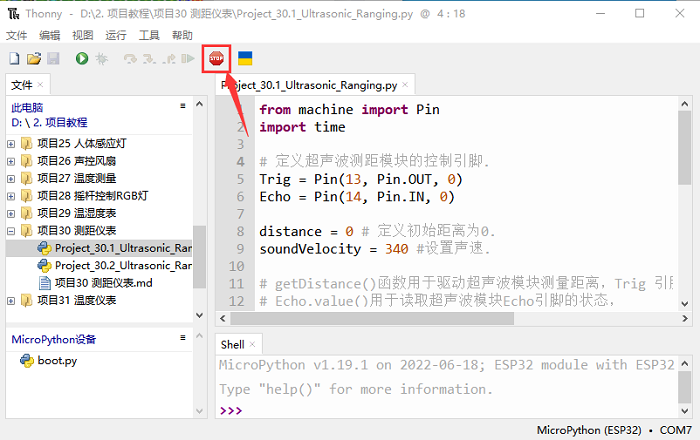
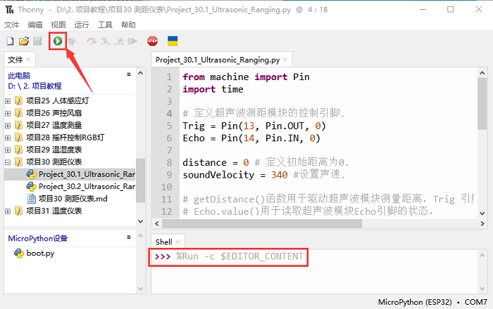
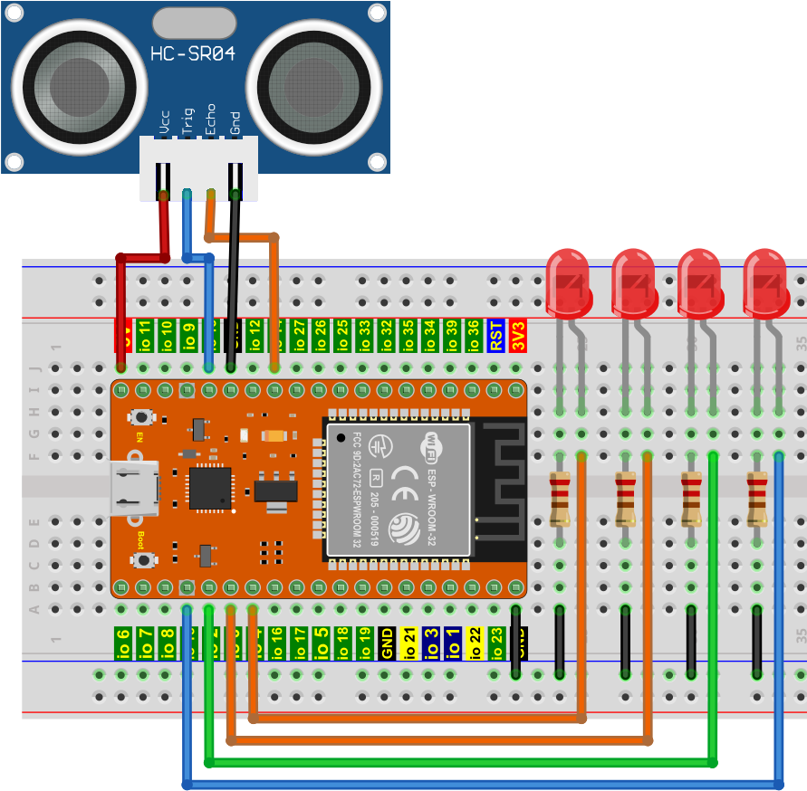
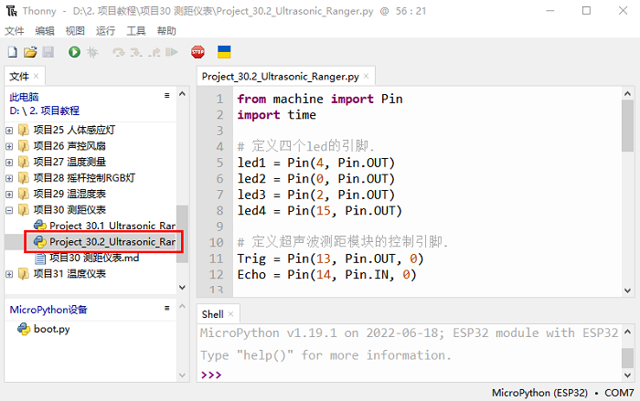
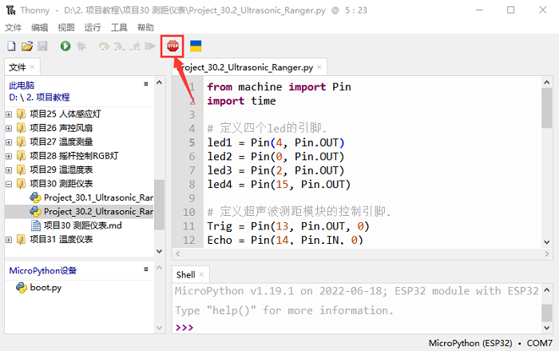
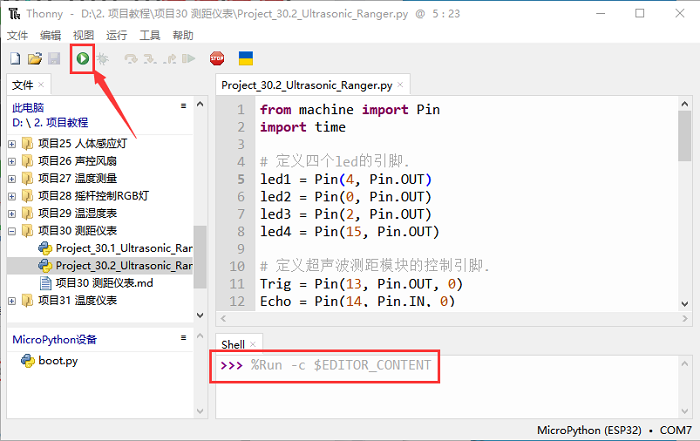
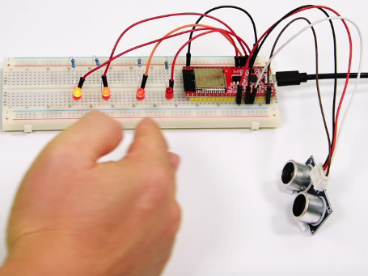

# 项目30 测距仪表

## 1.项目介绍：
HC-SR04超声波传感器是一种非常实惠的距离传感器，主要用于各种机器人项目中的物体躲避。它也被用于水位传感器，甚至作为一个停车传感器。我们把超声波传感器当作蝙蝠的眼睛，在黑暗中，蝙蝠仍然可以通过超声波识别前方的物体和方向。在本项目中，我们使用ESP32控制超声波传感器和LED模拟超声波测距仪。

## 2.项目元件：
|||||
| :--: | :--: | :--: | :--: |
|ESP32*1|面包板*1|超声波传感器*1|4P转杜邦线公单*1
|||||
|红色 LED*4|220Ω电阻*4|跳线若干|USB 线*1|

## 3.元件知识：                                                                     
**HC-SR04超声波传感器：** 像蝙蝠一样使用声纳来确定与物体的距离，它提供了精准的非接触范围检测、高精度和稳定的读数。它的操作不受阳光或黑色材料的影响，就像精密的照相机(在声学上像布料这样比较软的材料很难被探测到)。它带有超声波发射器和接收器。

在超声波传感器的前面是两个金属圆筒，这些是转换器。转换器将机械能转换成电信号。在超声波传感器中，有发射转换器和接收转换器。发射转换器将电信号转换为超声波脉冲，接收转换器将反射的超声波脉冲转换回电信号。如果你看超声波传感器的背面，你会看到的发射转换器后面有一个IC，这是控制发射转换器的IC。在接收转换器后面也有一个IC，这是一个四运算放大器，它将接收转换器产生的信号放大成足以传输到微控制器的信号。
**时序图：**
图示HC-SR04的时序图。为了开始测量，SR04的Trig必须接受至少10us的高(5V)脉冲，这将启动传感器将发射出8个周期的40kHz的超声波脉冲，并等待反射的超声波脉冲。当传感器从接收器检测到超声波时，它将设置回波引脚为高(5V)和延迟一个周期(宽度)，与距离成比例。为了获得距离，测量Echo引脚的宽度。

时间=回波脉冲宽度，单位为us(微秒)
距离厘米=时间/ 58
距离(英寸)=时间/ 148

## 4.读取超声波传感器距离值                                                      
我们将从一个简单的超声波测距开始，并打印测量的距离。 
                
HC-SR04超声波传感器有四个引脚：Vcc、Trig、Echo和GND。Vcc引脚提供产生超声波脉冲的电源，接Vcc/+5V。GND引脚接地/GND。Trig引脚是控制板发送信号来启动超声波脉冲的地方。Echo引脚是超声波传感器向控制板发送关于超声波脉冲行程持续时间的信息的地方。按下图接线：


本教程中使用的代码保存在：
“**..\Keyes ESP32 高级版学习套件\3. Python 教程\1. Windows 系统\2. 项目教程**”的路径中。

你可以把代码移到任何地方。例如，我们将代码保存在**D盘**中，<span style="color: rgb(0, 209, 0);">路径为D:\2. 项目教程</span>。


打开“Thonny”软件，点击“此电脑”→“D:”→“2. 项目教程”→“项目30 测距仪表”。并鼠标左键双击“Project_30.1_Ultrasonic_Ranging.py”。


```
from machine import Pin
import time

# 定义超声波测距模块的控制引脚. 
Trig = Pin(13, Pin.OUT, 0)
Echo = Pin(14, Pin.IN, 0)

distance = 0 # 定义初始距离为0.
soundVelocity = 340 #设置声速.

# getDistance()函数用于驱动超声波模块测量距离，Trig 引脚保持在高位10us以启动超声波模块。
# Echo.value()用于读取超声波模块Echo引脚的状态，
# 然后使用时间模块的时间戳函数计算Echo的持续时间
# 引脚的高电平，根据时间计算测量距离并返回值.
def getDistance():
    Trig.value(1)
    time.sleep_us(10)
    Trig.value(0)
    while not Echo.value():
        pass
    pingStart = time.ticks_us()
    while Echo.value():
        pass
    pingStop = time.ticks_us()
    pingTime = time.ticks_diff(pingStop, pingStart) // 2
    distance = int(soundVelocity * pingTime // 10000)
    return distance

# 延迟2秒，等待超声波模块稳定下来，从超声波模块获得的数据每500毫秒打印一次.
time.sleep(2)
while True:
    time.sleep_ms(500)
    distance = getDistance()
    print("Distance: ", distance, "cm")
```

确保ESP32已经连接到电脑上，单击。


单击，代码开始执行，你会看到的现象是：Thonny IDE下的”Shell”窗口将打印超声波传感器和物体之间的距离值。按“Ctrl+C”或单击退出程序。



## 5.超声波测距仪的接线图：
接下来，我们将使用ESP32控制超声波传感器和4个LED来模拟超声波测距仪。按如下图接好线：


## 6.项目代码：
本教程中使用的代码保存在：
“**..\Keyes ESP32 高级版学习套件\3. Python 教程\1. Windows 系统\2. 项目教程**”的路径中。

你可以把代码移到任何地方。例如，我们将代码保存在**D盘**中，<span style="color: rgb(0, 209, 0);">路径为D:\2. 项目教程</span>。


打开“Thonny”软件，点击“此电脑”→“D:”→“2. 项目教程”→“项目30 测距仪表”。并鼠标左键双击“Project_30.2_Ultrasonic_Ranger.py”。


```
from machine import Pin
import time

# 定义四个led的引脚.
led1 = Pin(4, Pin.OUT)
led2 = Pin(0, Pin.OUT)
led3 = Pin(2, Pin.OUT)
led4 = Pin(15, Pin.OUT)

# 定义超声波测距模块的控制引脚. 
Trig = Pin(13, Pin.OUT, 0)
Echo = Pin(14, Pin.IN, 0)

distance = 0 # 定义初始距离为0.
soundVelocity = 340 #设置声速.

# getDistance()函数用于驱动超声波模块测量距离，Trig 引脚保持在高位10us以启动超声波模块。
# Echo.value()用于读取超声波模块Echo引脚的状态，
# 然后使用时间模块的时间戳函数计算Echo的持续时间
# 引脚的高电平，根据时间计算测量距离并返回值.
def getDistance():
    Trig.value(1)
    time.sleep_us(10)
    Trig.value(0)
    while not Echo.value():
        pass
    pingStart = time.ticks_us()
    while Echo.value():
        pass
    pingStop = time.ticks_us()
    pingTime = time.ticks_diff(pingStop, pingStart) // 2
    distance = int(soundVelocity * pingTime // 10000)
    return distance

# 延迟2秒，等待超声波模块稳定下来，从超声波模块获得的数据每500毫秒打印一次. 
time.sleep(2)
while True:
    time.sleep_ms(500)
    distance = getDistance()
    print("Distance: ", distance, "cm")
    if distance <= 5:
       led1.value(1)
    else:
       led1.value(0)
    if distance <= 10:
       led2.value(1)
    else:
       led2.value(0)
    if distance <= 15:
       led3.value(1)
    else:
       led3.value(0)
    if distance <= 20:
       led4.value(1)
    else:
       led4.value(0)
       
```
## 7.项目现象：
确保ESP32已经连接到电脑上，单击。


单击，代码开始执行，你会看到的现象是：Thonny IDE下的”Shell”窗口将打印超声波传感器和物体之间的距离值，另外，当我们用手在超声波传感器前移动时，相应的LED会亮起来。按“Ctrl+C”或单击退出程序。




