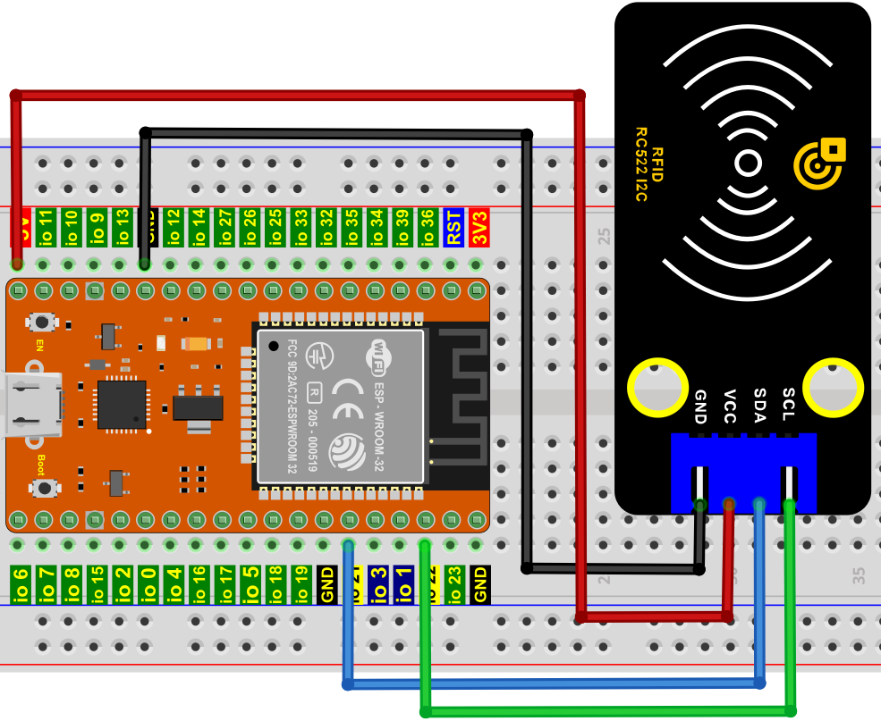
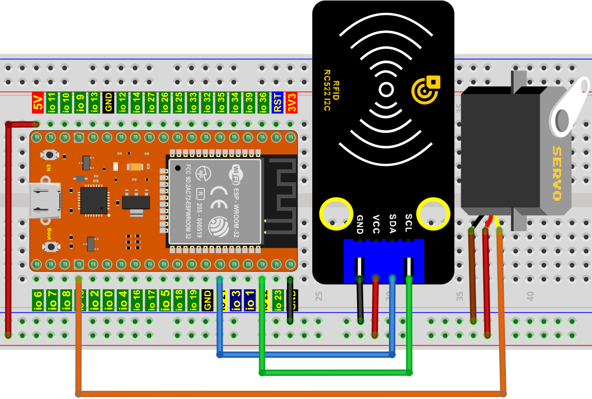

# 项目32 RFID

## 1.实验介绍：
现在很多小区的门使用了刷卡开门这个功能，非常的方便。这节课我们将学习使用RFID(射频识别)无线通信技术和对卡（钥匙扣/白卡）进行读、写操作及RFID-MFRC522模块控制舵机转动。   

## 2.实验元件：
||||||
| :--: | :--: | :--: | :--: | :--: |
|ESP32*1|面包板*1|RFID-RC522模块*1|舵机*1|白卡*1|
|||| | |
|4P转杜邦线公单*1|跳线若干|USB 线*1|钥匙扣*1 | |

## 3.元件知识：
**RFID：** 无线射频识别，读卡器由频射模块及高平磁场组成。Tag应答器为待感应设备，此设备不包含电池。他只包含微型集成电路芯片及存储数据的介质以及接收和发送信号的天线。读取tag中的数据，首先要放到读卡器的读取范围内。读卡器会产生一个磁场，因为磁能生电由楞次定律，RFID Tag就会供电，从而激活设备。

**RFID-RC522模块：** 采用Philips MFRC522原装芯片设计读卡电路，使用方便，成本低廉，适用于设备开发、读卡器开发等高级应用的用户、需要进行射频卡终端设计/生产的用户。本模块可直接装入各种读卡器模具。模块采用电压为5V,通过SPI接口简单的几条线就可以直接与用户任何CPU主板或单片机相连接通信。

**规格参数：**
- 工作电压：DC 5V
- 工作电流：13—100mA/DC 5V
- 空闲电流：10-13mA/DC 5V
- 休眠电流：<80uA
- 峰值电流：<100mA
- 工作频率：13.56MHz
- 最大功率：0.5W
- 支持的卡类型：mifare1 S50、mifare1 S70、mifare UltraLight、mifare Pro、mifare Desfire
- 环境工作温度：摄氏-20—80℃
- 环境储存温度：摄氏-40—85℃
- 环境相对湿度：相对湿度5%—95%
- 数据传输速率：最大10Mbit/s

## 4.RFID 读取 UID：
我们将读取RFID卡的唯一ID号(UID)，识别RFID卡的类型，并通过串口显示相关信息，其接线图如下所示：


本教程中使用的代码保存在：
“**..\Keyes ESP32 高级版学习套件\3. Python 教程\1. Windows 系统\2. 项目教程**”的路径中。

你可以把代码移到任何地方。例如，我们将代码保存在**D盘**中，<span style="color: rgb(0, 209, 0);">路径为D:\2. 项目教程</span>。


打开“Thonny”软件，点击“此电脑”→“D:”→“2. 项目教程”→“项目32 RFID”。分别选择“mfrc522_config.py”，“mfrc522_i2c.py”和“soft_iic.py”，右键单击鼠标选择 “上传到/”，等待“mfrc522_config.py”，“mfrc522_i2c.py”和“soft_iic.py”被上传到ESP32. 并鼠标左键双击“Project_32.1_RFID_Read_UID.py”。


```
import machine
import time
from mfrc522_i2c import mfrc522

#i2c配置
addr = 0x28
scl = 22
sda = 21
    
rc522 = mfrc522(scl, sda, addr)
rc522.PCD_Init()
rc522.ShowReaderDetails()            # 显示PCD - MFRC522读卡器详细信息

while True:
    if rc522.PICC_IsNewCardPresent():
        #print("Is new card present!")
        if rc522.PICC_ReadCardSerial() == True:
            print("Card UID:")
            print(rc522.uid.uidByte[0 : rc522.uid.size])
    #time.sleep(1)
```
确保ESP32已经连接到电脑上，单击。


单击，代码开始执行，你会看到的现象是：将门卡和钥匙扣分别靠近模块感应区，Thonny IDE下的”Shell”窗口将分别显示门卡和钥匙扣的卡号值，如下图所示。按“Ctrl+C”或单击退出程序。


<span style="color: rgb(255, 76, 65);">特别注意：对于不同的RFID-RC522的白卡和钥匙扣，其门白卡值和钥匙扣可能都不一样。</span>

## 5.RFID MFRC522的接线图：
现在使用RFID-RC522模块、白卡/钥匙扣和舵机模拟做一个智能门禁系统。当白卡/钥匙扣靠近RFID-RC522模块感应区舵机转动。按照下图进行接线。


## 6.项目代码：
本教程中使用的代码保存在：
“**..\Keyes ESP32 高级版学习套件\3. Python 教程\1. Windows 系统\2. 项目教程**”的路径中。

你可以把代码移到任何地方。例如，我们将代码保存在**D盘**中，<span style="color: rgb(0, 209, 0);">路径为D:\2. 项目教程</span>。


打开“Thonny”软件，点击“此电脑”→“D:”→“2. 项目教程”→“项目32 RFID”。分别选择“mfrc522_config.py”，“mfrc522_i2c.py”和“soft_iic.py”，右键单击鼠标选择 “上传到/”，等待“mfrc522_config.py”，“mfrc522_i2c.py”和“soft_iic.py”被上传到ESP32. 并鼠标左键双击“Project_32.2_RFID_Control_Servo.py”。


```
from machine import Pin, PWM
import time
from mfrc522_i2c import mfrc522

#定义GPIO15的输出频率为50Hz，分配给PWM
servoPin = PWM(Pin(15)) 
servoPin.freq(50)
servoPin.duty(256)

#i2c config
addr = 0x28
scl = 22
sda = 21
    
rc522 = mfrc522(scl, sda, addr)
rc522.PCD_Init()
rc522.ShowReaderDetails()            # 显示PCD - MFRC522读卡器详细信息

uid1 = [147, 173, 247, 32]
uid2 = [57, 182, 70, 194]

servoPin.duty_u16(1638)
time.sleep(1)

while True:
    if rc522.PICC_IsNewCardPresent():
        #print("Is new card present!")
        if rc522.PICC_ReadCardSerial() == True:
            print("Card UID:", end=' ')
            print(rc522.uid.uidByte[0 : rc522.uid.size])
            if rc522.uid.uidByte[0 : rc522.uid.size] == uid1 or rc522.uid.uidByte[0 : rc522.uid.size] == uid2:
                servoPin.duty_u16(8100)
                time.sleep(1)
            else :
                servoPin.duty_u16(1638)
                time.sleep(1)
```
<span style="color: rgb(255, 76, 65);">特别注意：</span>对于不同的RFID-RC522模块，白卡和钥匙扣，其RFID-RC522模块读取的白卡和钥匙扣的uid1值和uid2值可能都不一样。你们将自己的RFID-RC522模块读取的白卡和钥匙扣的uid1值和uid2值替换程序代码中对应的白卡和钥匙扣的uid1值和uid2值，要不然单击“Run current script”运行代码可能会导致你自己的白卡和钥匙扣控制不了舵机。
例如: 你把程序代码中的uid1值和uid2值替换成你自己的RFID-RC522模块读取的白卡和钥匙扣值。

## 7.项目现象：
确保ESP32已经连接到电脑上，单击。


单击，代码开始执行，你会看到的现象是：当使用白卡或者钥匙卡刷卡时，Thonny IDE下的”Shell”窗口将分别显示门卡和钥匙扣的卡号值，同时舵机转动到对应的角度模拟开门。按“Ctrl+C”或单击退出程序。


