# 项目33 密码锁

## 1.项目介绍：
常用的数字按钮传感器，一个按钮就使用一个IO口，而有时我们需要的按钮比较多时，就会占用过多的IO口，为了节省IO口的使用，把多个按钮做成了矩阵类型，通过行列线的控制，实现少IO口控制多个按钮。在本项目中，我们将来学习ESP32和薄膜4*4矩阵键盘控制舵机和蜂鸣器。

## 2.项目元件：
||||
| :--: | :--: | :--: | 
|ESP32*1|面包板*1|舵机*1|
||| |
|薄膜4×4矩阵键盘*1|USB 线*1| 跳线若干| 
|img-20230411163556.png)|||
|NPN型晶体管(S8050)*1|有源蜂鸣器*1|1KΩ电阻*1|

## 3.元件知识：
**4×4矩阵键盘：** 键盘是一种集成了许多键的设备。如下图所示，一个4x4键盘集成16个键。


与LED矩阵集成一样，在4x4键盘中，每排键都是用一根引脚连接，每一列键都是一样的。这样的连接可以减少处理器端口的占用。内部电路如下所示。
          
使用方法类似于矩阵LED，即使用行扫描或列扫描方法检测每列或每行上的键的状态。以列扫描法为例，向第4列(Pin4)发送低电平，检测第1、2、3、4行电平状态，判断A、B、C、D键是否按下。然后依次将低电平发送到列3、2、1，检测是否有其它键被按下。然后，你可以获得所有键的状态。

## 4.读取4*4矩阵键盘的键值：
我们首先使用一个简单的代码读取4*4矩阵键盘的键值并将其打印出来，其接线图如下所示：
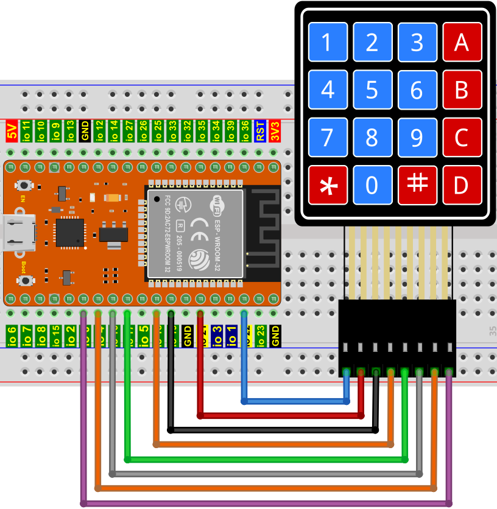

本教程中使用的代码保存在：
“**..\Keyes ESP32 高级版学习套件\3. Python 教程\1. Windows 系统\2. 项目教程**”的路径中。

你可以把代码移到任何地方。例如，我们将代码保存在**D盘**中，<span style="color: rgb(0, 209, 0);">路径为D:\2. 项目教程</span>。


打开“Thonny”软件，点击“此电脑”→“D:”→“2. 项目教程”→“项目33 密码锁”。选择“keypad\.py”，右键单击鼠标选择 “上传到/”，等待 “keypad\.py”被上传到ESP32. 并鼠标左键双击“Project_33.1_4x4_Matrix_Keypad_Display.py”。
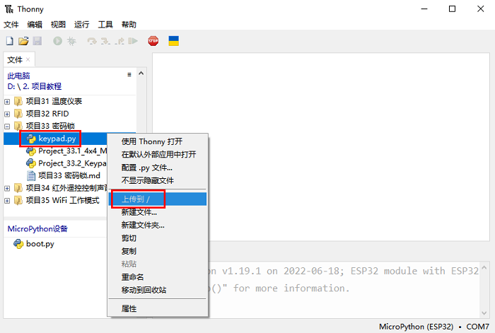
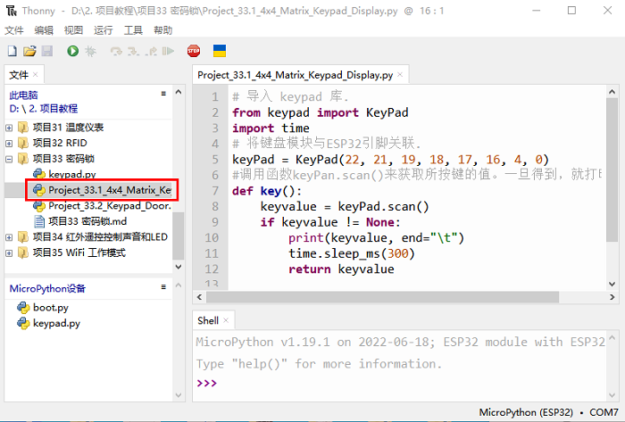

```
# 导入 keypad 库.
from keypad import KeyPad
import time
# 将键盘模块与ESP32引脚关联. 
keyPad = KeyPad(22, 21, 19, 18, 17, 16, 4, 0)
#调用函数keyPan.scan()来获取所按键的值。一旦得到，就打印出来. 
def key():
    keyvalue = keyPad.scan()
    if keyvalue != None:
        print(keyvalue, end="\t")
        time.sleep_ms(300)
        return keyvalue
            
while True:
    key()

```
确保ESP32已经连接到电脑上，单击。
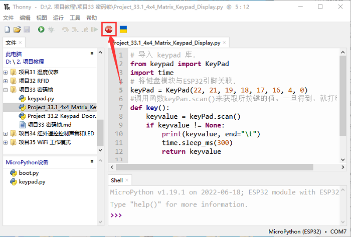

单击，代码开始执行，你会看到的现象是：按下键盘，Thonny IDE下的”Shell”窗口将打印对应的键值，如下图所示。按“Ctrl+C”或单击退出程序。
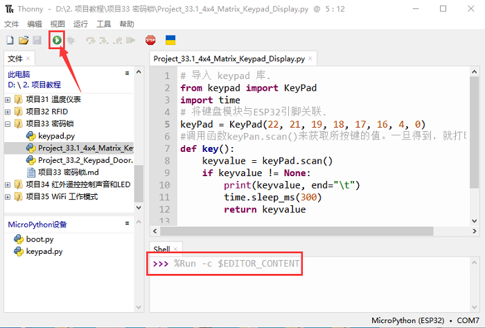
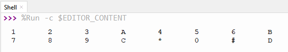

## 5.密码锁的接线图：
在上一实验中，我们已经知道了4×4矩阵键盘的键值，接下来，我们使用4×4矩阵键盘作为键盘来控制舵机和蜂鸣器。


## 6.项目代码：
本教程中使用的代码保存在：
“**..\Keyes ESP32 高级版学习套件\3. Python 教程\1. Windows 系统\2. 项目教程**”的路径中。

你可以把代码移到任何地方。例如，我们将代码保存在**D盘**中，<span style="color: rgb(0, 209, 0);">路径为D:\2. 项目教程</span>。


打开“Thonny”软件，点击“此电脑”→“D:”→“2. 项目教程”→“项目33 密码锁”。选择“keypad\.py”，右键单击鼠标选择 “上传到/”，等待 “keypad\.py”被上传到ESP32. 并鼠标左键双击“Project_33.2_Keypad_Door.py”。

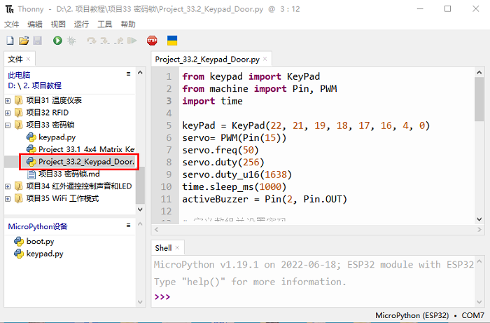

```
from keypad import KeyPad
from machine import Pin, PWM
import time

keyPad = KeyPad(22, 21, 19, 18, 17, 16, 4, 0)
servo= PWM(Pin(15)) 
servo.freq(50)
servo.duty(256)
servo.duty_u16(1638)
time.sleep_ms(1000)
activeBuzzer = Pin(2, Pin.OUT)

# 定义数组并设置密码. 
passWord = "1234"
keyIn = ""
def key():
    keyvalue = keyPad.scan()
    if keyvalue != None:
        print('Your input:', keyvalue)
        time.sleep_ms(200)
        return keyvalue

while True:
 # 每次按下一个键，蜂鸣器就会短促地鸣叫一声，
 # 键的键值将存储在keydata数组中. 
    keydata = key()
    if keydata != None:
        activeBuzzer.value(1)
        time.sleep_ms(100)
        activeBuzzer.value(0)
        keyIn += keydata 
# 当按下4个键时，判断密码是否正确。
# 如果正确，伺服将旋转90度，1秒后再转回来。
# 如果密码输入错误，蜂鸣器会长时间鸣叫一次，并清除keyInNum的值.        
    if len(keyIn) == 4:
        if keyIn == passWord:
            print("passWord right!")
            servo.duty_u16(4915) 
            time.sleep_ms(1000)
            servo.duty_u16(1638)
        else:
            print("passWord error!")
            activeBuzzer.value(1)
            time.sleep_ms(1000)
            activeBuzzer.value(0)
        keyIn = ""
```
## 7.项目现象：
确保ESP32已经连接到电脑上，单击。
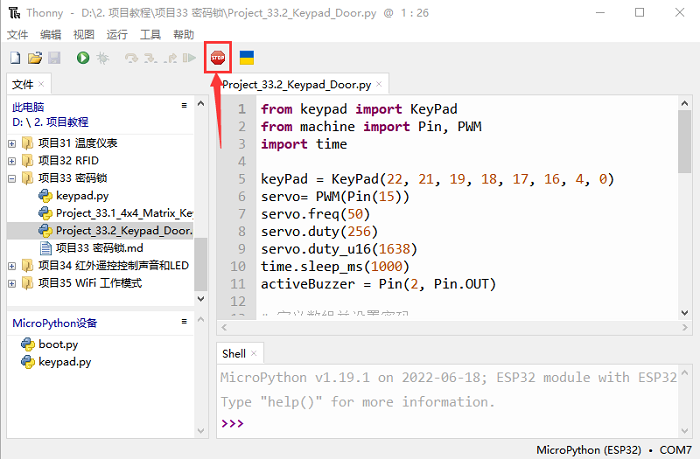

单击，代码开始执行，你会看到的现象是：按键盘输入4个字符的密码，如果输入正确（正确密码：1234），舵机会转动一定角度，然后回到原来的位置。如果输入错误，将发出输入错误警报。按“Ctrl+C”或单击退出程序。
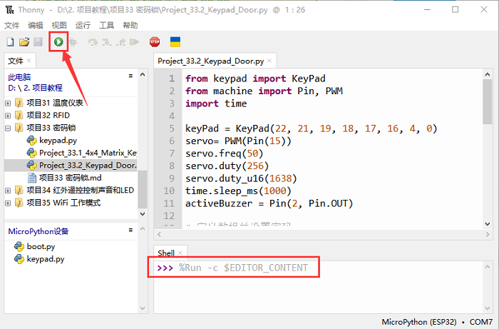
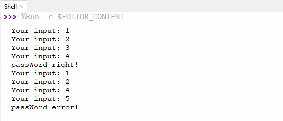
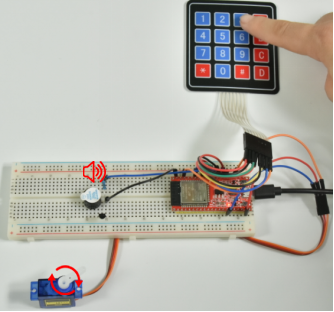

